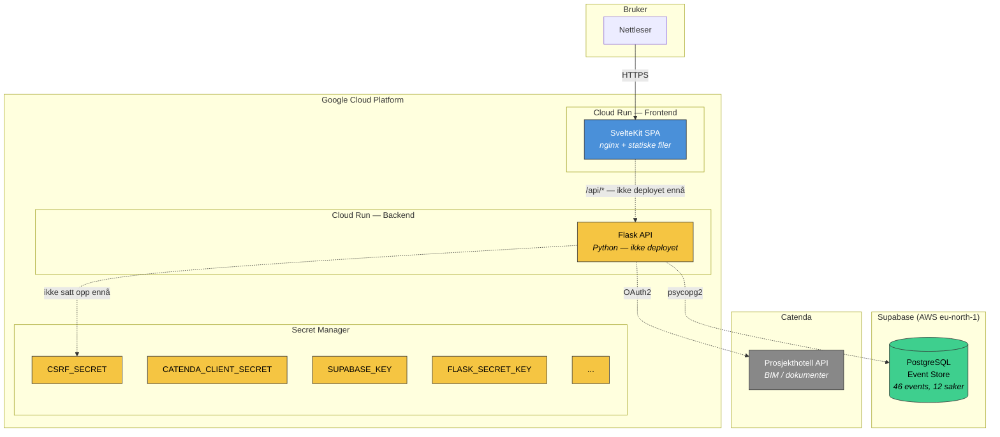
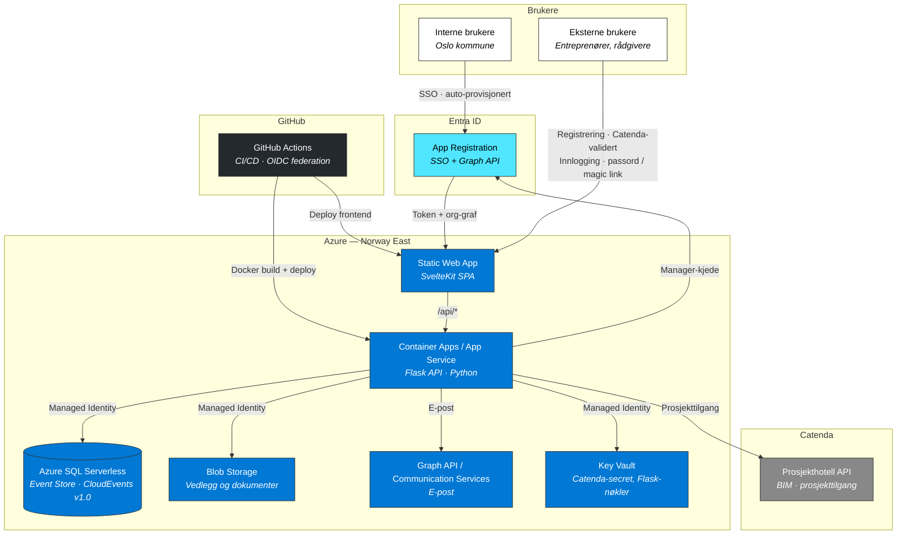

# Arkitekturdiagrammer — KOE (Krav om Endringsordre)

## 1. Dagens oppsett (Google Cloud Platform + Supabase)



**Status:** Kun frontend deployet. Backend, secrets og API-ruting er ikke konfigurert (stiplete linjer). Database hos Supabase (AWS), utenfor GCP-nettverket.

---

## 2. Tenkt oppsett — Azure (anbefalt)



---

## 3. Valgpunkter for IKT

Noen komponenter har alternativer. Anbefaling er markert med ✅.

### Valg A — Backend-hosting

| Alternativ | Beskrivelse | Pris (prototype) | Anbefaling |
|---|---|---|---|
| **Container Apps** | Kjører Docker-container. Scale to zero. | ~$0 ved lav trafikk | ✅ Anbefalt |
| **App Service** | Tradisjonell webapp-hosting. Alltid på. | ~$13/mnd (B1) | OK, enklere konsept |

Begge støtter Managed Identity, VNet, og custom domains. Container Apps er billigere (scale to zero), App Service er et mer kjent konsept for IKT.

### Valg B — E-posttjeneste

| Alternativ | Beskrivelse | Krav til IKT | Anbefaling |
|---|---|---|---|
| **Microsoft Graph API** | Send e-post fra eksisterende M365-postboks (f.eks. `noreply@foretaket.no`) | App permission: `Mail.Send` i Entra ID | ✅ Anbefalt — ingen ny tjeneste |
| **Azure Communication Services** | Dedikert e-posttjeneste fra Azure | Ny ACS-ressurs + domeneverifisering | Plan B |

Graph API er enklest hvis foretaket allerede har Exchange/M365 — da trengs kun en tillatelse i Entra ID, ingen ny tjeneste.

### Valg C — SQL-driver (teknisk, ingen IKT-beslutning)

| Alternativ | Beskrivelse | Docker-impact |
|---|---|---|
| **pymssql** | Pure Python SQL Server-driver | Ingen ekstra avhengigheter |
| **pyodbc + msodbcsql18** | Microsoft ODBC-driver | Krever ODBC-driver i Docker-image (Debian, ikke Alpine) |

Ikke synlig for IKT, men påvirker Docker-oppsett.

---

## 4. Datamodell (Azure SQL)

Event sourcing med CloudEvents v1.0. Hendelser er sannhetskilden — all tilstand beregnes ved å spille av hendelser.

### Event-tabeller (3 stk, identisk struktur)

```
┌──────────────────────────────────────────────────────────┐
│  koe_events / forsering_events / endringsordre_events    │
├──────────────────────────────────────────────────────────┤
│  event_id       UNIQUEIDENTIFIER    Unik hendelse        │
│  sak_id         NVARCHAR            Hvilken sak           │
│  versjon        INT                 Sekvensnr per sak     │
│  type           NVARCHAR            no.oslo.koe.{type}    │
│  source         NVARCHAR            /projects/X/cases/Y   │
│  actor          NVARCHAR            Hvem                  │
│  actorrole      NVARCHAR            TE eller BH           │
│  data           NVARCHAR(MAX)       Hendelsens payload    │
│  time           DATETIMEOFFSET      Når                   │
│  UNIQUE(sak_id, versjon)           Optimistisk låsing     │
└──────────────────────────────────────────────────────────┘
```

### Støttetabeller

| Tabell | Formål |
|---|---|
| `sak_metadata` | Cached nåtilstand per sak (tittel, status, beløp) |
| `sak_relations` | Koblinger mellom saker (forsering → KOE, EO → KOE) |
| `projects` | Multi-prosjekt-støtte |
| `sak_bim_links` | Kobling til BIM-modeller i Catenda |
| `users` | Eksterne brukere (passord-hash, magic link tokens) |

### Estimert volum

| Scenario | Events | Saker | Vurdering |
|---|---|---|---|
| Prototype (nå) | ~50 | ~12 | Trivielt |
| Produksjon (1 prosjekt) | ~1 500 | ~50 | Trivielt |
| Full skala (100 prosjekter/år) | ~150 000/år | ~5 000/år | Trivielt for Azure SQL |

---

## 5. Tilgangsstyring

### Prosjekttilgang — Catenda er master

Catenda prosjekthotell er eneste kilde for hvem som har tilgang til et prosjekt. Gjelder **begge brukertyper**. Ved innlogging sjekkes brukerens e-post mot Catenda — hvis den ikke lenger finnes i prosjektet, mister brukeren tilgang.

### Interne brukere (Oslo kommune)

```
Registrering: Automatisk ved første SSO-innlogging (auto-provisjonering)
Innlogging:   Entra ID SSO → token → appen
Tilgang:      Sjekkes mot Catenda prosjektmedlemmer
Org-graf:     Graph API gir manager-kjede for godkjenningsflyt
```

Entra ID gir identitet + organisasjonsstruktur. Catenda gir prosjekttilgang. Ingen manuell registrering — brukeren er inne ved første SSO.

**Godkjenningsflyt (Graph API):**
```
PL oppretter krav → "Send til godkjenning"
  → App slår opp PLs leder via Graph API (/users/{id}/manager)
  → Leder får varsel (e-post + i appen)
  → Leder godkjenner eller eskalerer til sin leder
  → Hvert steg lagres som hendelse i event store
```

### Eksterne brukere (entreprenører, rådgivere)

```
Registrering:
  1. Bruker oppgir e-post i appen
  2. Backend sjekker e-post mot Catenda prosjekthotell API
     → Finnes i prosjekt? Fortsett. Finnes ikke? Avvist.
  3. Valideringse-post sendes (via Graph API / ACS)
  4. Bruker klikker bekreftelseslenke
  5. Bruker velger passord → konto opprettet

Innlogging (senere):
  → Passord  (autofill, rett inn)
  → Magic link  (e-post med innloggingslenke, utløper etter 15 min)
  → Sesjon varer 30–90 dager (refresh token), så brukeren
    er "rett inne" ved daglig bruk
```

---

## 6. Bestillingsliste til IKT

| # | Ressurs | Azure-tjeneste | Hverdagsspråk | Valg? |
|---|---|---|---|---|
| 1 | Nettside | **Static Web App** (Standard) | Nettsiden, global CDN | Nei |
| 2 | Backend | **Container Apps** eller **App Service** | Programmet bak nettsiden | Ja — se valg A |
| 3 | Database | **Azure SQL** (Serverless) | Databasen | Nei |
| 4 | Fillagring | **Blob Storage** | Filområdet for vedlegg | Nei |
| 5 | Innlogging | **Entra ID App Registration** | SSO for interne + godkjenningsflyt | Nei |
| 6 | E-post | **Graph API** eller **Communication Services** | Valideringse-post, varsler | Ja — se valg B |
| 7 | Sikkerhet | **Managed Identity** | Backend-tilgang til DB/Blob uten passord | Nei |

### Entra ID App Registration — nødvendige tillatelser

| Graph API-tillatelse | Brukes til |
|---|---|
| `User.Read` | Lese innlogget brukers profil |
| `User.Read.All` | Slå opp manager-kjede for godkjenningsflyt |
| `Mail.Send` | Sende e-post (hvis Graph API velges for e-post) |

---

## 7. Kodeendringer for Azure-migrering

### Backend (Flask)

| Oppgave | Omfang | Beskrivelse |
|---|---|---|
| **Nytt repository-lag for Azure SQL** | Middels | Ny `AzureSqlEventRepository` med pymssql/pyodbc. Ingen JSON-queries å omskrive — all filtrering er på denormaliserte kolonner. |
| **SQL-migrasjoner i T-SQL** | Liten | Omskrive tabelldefinisjoner: `JSONB` → `NVARCHAR(MAX)`, `UUID` → `UNIQUEIDENTIFIER`, `TIMESTAMPTZ` → `DATETIMEOFFSET`. Fjerne Supabase RLS-policies. |
| **Blob Storage-integrasjon** | Liten | Azure SDK for fil-opp/nedlasting. Erstatter evt. lokal fillagring. |
| **Key Vault-integrasjon** | Liten | `azure-identity` + `azure-keyvault-secrets` for å hente Catenda-secret og Flask-nøkler. |
| **Entra ID SSO** | Middels | MSAL-integrasjon for token-validering. Auto-provisjonering av interne brukere. |
| **Ekstern brukerbase** | Middels | `users`-tabell, bcrypt passord-hash, magic link-tokens, sesjonshåndtering. |
| **Graph API-integrasjon** | Middels | Manager-oppslag for godkjenningsflyt. E-postutsending (hvis Graph velges). |
| **Catenda tilgangssjekk** | Liten | Sjekke prosjektmedlemskap ved innlogging (begge brukertyper). Finnes delvis. |
| **Dockerfile** | Liten | Bytte til `python:3.12-slim`, legge til ODBC-driver hvis pyodbc velges. |
| **Rute ineffektiv metode** | Liten | `find_sak_id_by_catenda_topic` — bruk `sak_metadata.catenda_topic_id` i stedet for å skanne `data`-feltet. |

### Frontend (SvelteKit)

| Oppgave | Omfang | Beskrivelse |
|---|---|---|
| **Innloggingsside** | Middels | SSO-knapp for interne, e-post/passord + magic link for eksterne. |
| **Registreringsflyt** | Middels | Skjema for eksterne: e-post → Catenda-validering → bekreftelse → passord. |
| **Godkjenningsflyt UI** | Middels | "Send til godkjenning"-knapp, statusvisning, varsler. |
| **VITE_API_BASE_URL** | Ingen | Ikke nødvendig — Static Web Apps proxyer `/api/*` automatisk. |

### CI/CD (GitHub Actions)

| Oppgave | Omfang | Beskrivelse |
|---|---|---|
| **Frontend workflow** | Liten | `npm run build` → deploy til Static Web App. |
| **Backend workflow** | Liten | Docker build → push til Azure Container Registry → deploy til Container Apps. |
| **OIDC federation** | Liten | Federated credential i Entra ID for secretless deploy. |

### Estimert månedskostnad

| Komponent | Prototype | Produksjon (100 prosjekter) |
|---|---|---|
| Static Web App (Standard) | $9/mnd | $9/mnd |
| Container Apps | ~$0 (scale to zero) | ~$20-50/mnd |
| Azure SQL Serverless | ~$5-15/mnd | ~$30-60/mnd |
| Blob Storage | ~$1/mnd | ~$5/mnd |
| E-post (Graph API) | $0 | $0 |
| Entra ID | $0 | $0 |
| **Totalt** | **~$15-25/mnd** | **~$65-125/mnd** |
