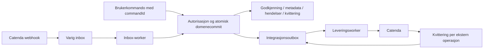

# Audit: godkjenningspanel, EO-utstedelse og varig levering

Dato: 2026-09-16. Gjennomgått endring: `93d630a` på `godkjenningspanel`, samt
tilgrensende hendelses-, persistens- og integrasjonskode. Design/UX er utenfor.
Appen er ikke i produksjon og har ingen reelle produksjonsdata. Dette er funn i
koden, ikke rapporter om inntrufne produksjonshendelser.

**Konklusjon:** nyttige forbedringer, men EO-godkjenningen kan omgås, og
utstedelsesgjenopprettingen er ikke så sterk som oppsummeringen tilsier.
Rett AP-01–04 før produksjon. Bygg deretter en felles transaksjonell inbox/outbox
for webhook, publisering, EO og dokumentlevering. Flere separate SQLite-køer
eller en ekstern meldingskø alene lukker ikke transaksjonsgapene.

## Oppfølging 2026-09-17

Videre [etterprøving av sikkerhetsarkitekturen](audit-sikkerhetsarkitektur-2026-09-17.md)
utvider masterplanen med OAuth-flaten, analytics-skjerming, databaseprivilegier,
CI og restore. Disse punktene kommer i tillegg til funnene her.

Funnene nedenfor beskriver den opprinnelige koden; linjereferansene er historiske.
AP-01, AP-02, AP-03 og AP-05 er nå rettet i arbeidskatalogen og har ordinære
regresjonstester. AP-04 er fortsatt åpen og har en eksplisitt `xfail`-reproduksjon.
Ingen database er endret. Se [arbeidsplanen](plans/2026-09-16-godkjenning-og-varig-levering.md)
og [forslaget til atomisk utstedelse og outbox](plans/2026-09-17-atomisk-utstedelse-og-outbox.md).

- EO-opprettelse og BH-endringer er sperret i generelle hendelsesruter når
  prosjektet har policy, inkludert alternative plasseringer av sakstype.
  Direkte KOE-kobling/frakobling sperres også. Godkjent revisjon er ennå ikke
  implementert; slike endringer kan derfor ikke gjøres direkte i disse prosjektene.
  TEs aksept/bestridelse og prosjekter uten policy beholder eksisterende flyt.
- Ikke-utstedte pakker kontrolleres mot gjeldende fullmakt ved retry og direkte
  utstedelse. Retur på grunn av endret policy persisteres også når den påfølgende
  kommandoen avvises. Allerede utstedte ordre gjenkjennes og kvitteres.
  Dette gir ikke atomisk vern mot policyendring etter at utstedelse har startet.
- Absolutt ny sluttdato gir uavklart fullmaktsgrunnlag og hele kjeden inntil
  serveren har en autoritativ datobaseline. Klientens dager eller konsekvensflagg
  kan ikke omgå dette. Ugyldige datoer og dagtall avvises før pakken lagres.
- BH-svar og EO bruker samme satsoppslag: eksplisitt `daily_rate`, også `null`,
  vinner; ellers brukes prosjektets `settings.contract.dagmulkt_sats`.

En delvis uavhengig gjennomgang fant alternative sakstypeinnganger som er rettet
og testet. Fullstendig uavhengig sluttaudit er ikke gjennomført.

Lokal kontroll av rettingene: 340 backendtester bestått og én forventet feil
(`xfail`, AP-04), for godkjenning, EO-tjenesten, ruter og unit-of-work. 41
målrettede frontendtester bestått. `npm run check:error` rapporterte null feil
og ni eksisterende advarsler. Ingen live Supabase-/Catenda-test er kjørt i denne
leveransen; dette verifiserer ikke den foreslåtte nye databasearkitekturen.

## Bekreftede funn

### AP-01 — Høy: generelle hendelsesruter omgår EO-godkjenning

`backend/routes/endringsordre_routes.py:80` sperrer `/api/endringsordre/opprett`
når prosjektet har policy. Men `backend/routes/event_routes.py:454` og `:688`
sperrer bare `respons_*`. `eo_utstedt` kan fortsatt sendes via både
`POST /api/events` og `POST /api/events/batch` av en BH-bruker med prosjektets
medlemstilgang, uten å være saksbehandler/godkjenner i policyen.

**Reproduksjon:** ekte Flask-ruter, autentiseringsdekoratører, parsing,
TimelineService og forretningsregler; medlemskapskilde og repositories erstattet.
Med aktiv policy og en eksisterende EO-sak uten utstedelse aksepterer begge ruter
`eo_utstedt` på 9 millioner med **201**. Ingen godkjenningspakke finnes.
Testene forventer 403 og feiler på nettopp statuskoden.

**Tiltak:** håndhev godkjenningskravet ved alle offentlige innganger som kan
opprette, utstede eller endre godkjenningspliktig EO-innhold. Avklar også
`eo_revidert` og endring av KOE-koblinger; ikke begrens rettingen til én URL.
Bruk felles serverregel med eksplisitt intern publiseringsvei. En klientoppgitt
pakke-ID eller et flagg om godkjenning er ikke autorisasjon.

### AP-02 — Høy: godkjent, men ikke utstedt EO ignorerer endret fullmakt

`backend/services/eo_approval_service.py:167` behandler `godkjent` og
`utstedelse_feilet` ved å se etter eksisterende hendelser, og hopper deretter
over policykontrollen. Denne gjelder bare `til_godkjenning`. `retry` og `issue`
kontrollerer ikke fullmaktsgrunnlaget på nytt før første offentlige commit.

**Reproduksjon:** saksbehandler med Prosjektleder-fullmakt sender 150 000 kroner
innen egen fullmakt. Utstedelsen feiler før opprettelse. Rollen endres til en
rolle uten fullmakt, men vedkommende er fortsatt konfigurert saksbehandler.
`retry` utsteder ordren uten den nye, påkrevde godkjenningskjeden.

**Tiltak:** samme policy som for svar på krav: returner en ennå ikke publisert
pakke når relevant fullmakt/rute er endret. Allerede publiserte hendelser skal
gjenkjennes og kvitteres, ikke forsøkes tilbakekalt. Kontrollen må også gjelde
en framtidig worker; den må ikke bare ligge i HTTP-ruten. Bruk versjonert
policy/fullmaktsgrunnlag fram til den autoritative publiseringstransaksjonen.

### AP-03 — Høy: absolutt sluttdato kan falle helt ut av fullmaktsgrunnlaget

`backend/services/eo_approval_service.py:61` leser `frist_dager` og klientens
`konsekvenser.fremdrift`, men aldri `ny_sluttdato`. Request-valideringen binder
ikke disse feltene sammen. Utstedelsestjenesten validerer datoformat, men
avviser ikke en oppgitt ny sluttdato uten tilsvarende fremdriftsflagg/dager.

**Reproduksjon:** `ny_sluttdato="2035-01-01"`, `frist_dager=None`,
`konsekvenser={}` og beløp 150 000 gir tom godkjenningskjede og umiddelbar
utstedelse i EOApprovalService. Ordretjenesten er en testdobbel i dette
scenarioet; aksept av denne feltkombinasjonen i den virkelige tjenesten er
kontrollert ved kodelesing, ikke live utstedelse.

**Tiltak:** beregn konsekvenser ut fra autoritative felter, ikke bare avkrysning.
Ny sluttdato må avledes til dager fra et kjent kontraktsgrunnlag eller behandles
som ukjent eksponering. Avvis selvmotsigende dag-/datofelter før pakken opprettes.
Test også `fremdrift=true`, null dager og dato, samt null dager oppgitt som 0.
Dette er vurdering av appens valgte fullmaktsregel, ikke en juridisk vurdering
av hvilken fullmaktsmatrise kontrakten bør bruke.

### AP-04 — Høy: gammel utstedelse kan slette metadata til vellykket utstedelse

`backend/services/endringsordre_service.py:398` gjør separat kontroll av
hendelser, leser metadata og sletter metadata dersom første lesing var tom.
Dette er en check-then-act-race. `TrackingUnitOfWork._default_rollback`
(`backend/core/unit_of_work.py:219`) sletter dessuten metadata uten å kunne
rulle tilbake hendelser.

**Reproduksjon med deterministisk fletting:**

1. Forsøk A leser versjon 0 for den reserverte saks-ID-en og stanser midlertidig.
2. Forsøk B fullfører metadata og tre EO-hendelser under samme ID.
3. A fortsetter med den gamle lesingen, finner metadata og sletter den.
4. A oppretter metadata på nytt, får versjonskonflikt ved append og kompenserer
   ved å slette metadata igjen.
5. Resultat: tre lagrede hendelser og **ingen metadata**.

Testen bruker ekte JSON-eventrepository, SakCreationService og TrackingUnitOfWork,
med et metadatarepository i minnet og kontrollert rekkefølge. Den simulerer
overlapp ved tjenestegrensen, ikke fem minutter veggklokke eller en live
PostgreSQL-konkurranse. Overlapp er mulig når en lease utløper mens gammel kode
fortsatt kjører. `issuingAttempt` beskytter sluttkvitteringen, ikke disse skrivene.

**Tiltak:** opprett metadata, hendelser, relasjoner og utstedelseskvittering i én
databasetransaksjon. Bruk unik domeneoperasjon og kontroller lease-/operasjonsversjon
i samme transaksjon dersom utførelsen er asynkron. Ikke slett metadata basert på
en eldre separat eventlesing. En lengre lease alene gir ikke korrekthet.

### AP-05 — Middels: ulik kilde til dagmulktssats i EO og svar

Svar-ruten henter sats fra prosjektinnstillingene når `daily_rate` mangler i
policy (`backend/routes/approval_routes.py:44`). EO-ruten sender den rå policyen
til tjenesten (`backend/routes/endringsordre_routes.py:253`). En sats konfigurert
i `settings.contract.dagmulkt_sats` blir dermed ignorert for EO.

Konsekvens: et ellers beregnbart tidsbeløp blir ukjent og krever hele EO-kjeden.
Dette er bekreftet ved kodelesing; ingen egen HTTP-regresjon er lagt til her.
Del én policy-/satsresolver mellom de to flytene, og test samme prosjekt i begge.

## Hva krasjbeskyttelsen faktisk gir

| Flyt | Hva som finnes | Hva som fortsatt mangler |
| --- | --- | --- |
| BH-svar | Private pakker i SQLite, event-ID-er lagret før publisering, atomisk batch i eventlageret, SQLite-outbox, forsøks-ID på kvitteringer | Publisering og outbox er ikke samme databasecommit som offentlige hendelser. Ingen selvstendig worker som fullfører arbeidet uten brukerhandling. |
| EO | Reservert saks-ID før utstedelse, gjenkjenning av eksisterende hendelser, femminutterslease, forsøks-ID på kvittering | AP-02/AP-04, ekte atomisk opprettelse, varig utgående Catenda-jobb og automatisk gjenopptakelse. |
| Ordinære krav/svar/forsering via hendelsesruter | Eventpersistens, leveringsstatus for enkelte kall, eksisterende manuelle retry-baner | En samlet transaksjonell jobb for alle påkrevde sideeffekter; statusregister er ikke arbeidskø. |
| Vedlegg | Privat staging, stabile referanser, opplastingskvittering før topic-kobling, lease | Automatisk worker, trygg håndtering av mistet eksternt svar, felles driftsmodell med brev og øvrig levering. |
| Catenda-webhook | Prosjektresolver og duplikatreservasjon i Redis/minne | Durable inbox, intern retry og atomisk sak/event/outbox-commit; allerede dokumentert i §8C. |

For BH-svar sender klienten først `approve`/`package`, deretter et separat
`publish`-kall (`ClaimApprovalView.svelte:232–248`). Lukkes klienten mellom kallene,
blir pakken godkjent, men upublisert. GET starter ikke automatisk publisering.
Etter offentlig event-commit kan eksplisitt publish gjenopprette kvitteringen.
`reconcile_policy` gjør slik gjenoppretting ved endret policy, men hopper over
pakken når policyen er uendret. Påstanden «neste lesing gjenoppretter alltid» er
derfor for sterk også for BH-svar.

EOs `read()` gjenoppretter kvittering når hendelser allerede finnes. Den utfører
ikke en ennå uutført utstedelse. Testen kalt
`test_crash_between_approval_and_issuance_is_recovered_on_read` legger selv inn
en utstedt sak før lesingen; den beviser kvitteringsgjenoppretting, ikke automatisk
utstedelse etter krasj. `issue()` kalles fra POST-kommandoen, ikke fra en worker.

EOs `_sync_to_catenda` er dessuten eksplisitt begrenset til `oslobygg` og
`catenda_project_registry_backend == "legacy"`. Supabase-register gir
`not_configured` i denne banen. Dette er en eksisterende begrensning, ikke
introdusert av `93d630a`, men en outbox må ha gyldig utgående prosjekt-/boardmapping
for å gjøre nytte. En jobb kan ikke reparere manglende ruting ved å prøve igjen.

## Anbefalt felles arkitektur

**Anbefaling: én modulær backend med PostgreSQL som transaksjonsgrense og en
separat workerprosess fra samme kodebase.** Ikke behov for nye mikrotjenester
eller Kafka for disse arbeidsflytene. Flytt godkjenningsaggregater, nødvendige
kvitteringer og utboks fra lokal SQLite til samme Postgres-database som
domenehendelsene før det loves atomisitet på tvers av dem.



Diagrammets DOM og OUT er skriv **i samme PostgreSQL-transaksjon**, ikke to
uavhengige nettverkskall. Inbox markeres ferdig i denne transaksjonen ved
webhookbehandling. Webhook-mottaket lagres først slik at HTTP kan kvitteres uten
å vente på hele domenebehandlingen. Ulagret mottak skal ikke få suksesskvittering.

### Transaksjonsgrenser og identitet

- Bruk domenespesifikke commit-operasjoner for saksopprettelse, BH-publisering
  og EO-utstedelse. De håndhever forventet stream-/pakkeversjon, prosjekt,
  fullmaktsgrunnlag, unike hendelses-ID-er og relasjoner sammen med outbox.
- Siste godkjenning kan publisere de lokale hendelsene i samme transaksjon og
  opprette leveringsjobbene. Dersom intern publisering må skilles ut, må siste
  godkjenning opprette en varig publiseringsjobb atomisk; jobbens utførelse må
  kontrollere fortsatt gyldig grunnlag før offentlig commit.
- Unik kommandoidentitet avgrenses til prosjekt, aktør og operasjon, med
  request-fingerprint og lagret resultat. Identisk retry returnerer kvitteringen;
  samme nøkkel med annet innhold avvises. Dagens commandId→actor-register
  sammenligner ikke payload.
- EO-nummer og eksklusiv tilknytning av KOE må håndheves ved commit, ikke bare
  ved å skanne eksisterende saker før skriving. Dette er en nødvendig invariant
  i ny arkitektur; parallelle ulike EO-ID-er er ikke testet i denne auditen.
- Send prosjekt, aktør, sak og integrasjonsmål eksplisitt til domenet og workeren.
  Dagens `get_project_id()` faller tilbake til `oslobygg` uten Flask-kontekst.
  Workeren må aldri arve dette som prosjektidentitet.

### Inbox, utboks og operasjoner

- Inbox: unik `(source, external_event_id)`, original payload og hash,
  rutingsresultat, status, forsøk, frist, feil og lease. Samme ID/annen payload
  parkeres. Definer også hva en forsinket/ute-av-rekkefølge webhook kan endre.
- Del felles claim/retry/kvitteringsmekanisme på tvers av jobbtyper, men behold
  egne domenebehandlere. En BH-godkjenningspakke er ikke en generisk kømelding.
- Utboks: unik logisk operasjonsnøkkel, prosjekt/sak, domeneversjon, avhengigheter,
  frosset payload eller varig artefaktreferanse, neste forsøk, lease-token,
  forsøksantall, ekstern ID og feilkode. Ikke lagre PDF kun i en midlertidig fil.
- Opprett egne operasjoner for topic, dokumentopplasting, dokumentreferanse,
  kommentar, relasjoner og status. Kvitter én vellykket del om gangen.
  Koble til tidligere opplastet dokument ved retry av referansen.
- Bevar godkjent brev og innholdshash. En retry skal ikke generere et nytt brev
  fra sakens nåværende tilstand. Statusoppdateringer trenger ordning per sak
  eller versjonskontroll slik at gammel retry ikke setter status bakover.
- Private notater, kladder og intern godkjenningsdialog skal ikke legges i
  Catenda-outbox. Behold eksisterende team-/prosjektgrenser også for vedlegg.

### Worker, feil og ekstern idempotens

- Hent arbeid i korte transaksjoner; `FOR UPDATE SKIP LOCKED` er egnet for
  flere konsumenter av en køtabell. Utfør nettverkskall utenfor transaksjonen,
  og godta lokal kvittering bare fra gjeldende forsøks-token.
  [PostgreSQLs låsedokumentasjon](https://www.postgresql.org/docs/current/sql-select.html)
  beskriver denne bruken av `SKIP LOCKED`.
- Utløpt lease gjør at arbeid kan overtas; den stopper ikke gammelt arbeid.
  Lokal domenecommit trenger transaksjonsvern/fencing. Catenda trenger
  idempotens eller avstemming mot ekstern tilstand i tillegg.
- Skill midlertidige feil (backoff/jitter), ugyldig eller manglende konfigurasjon
  (parkering), og ukjent resultat etter timeout. Etter mulig vellykket POST må
  workeren søke etter ekstern ID/deterministisk markør før den lager en ny
  kommentar/topic/fil. Hvis dette ikke kan avgjøres sikkert, krev avstemming
  framfor å love «exactly once» eller poste blindt på nytt.
- Worker må starte automatisk ved drift/restart og skanne forfalte jobber.
  Mål køalder, utløpte leases, antall forsøk, parkerte jobber og avvik mellom
  publisering og ekstern levering. Tilby kontrollert replay med samme nøkkel.
- Hold databasefunksjoner/køer backend-only. Bruk snevre funksjonsrettigheter,
  RLS/GRANT og eksplisitt prosjektvalidering. Et service_role-kall beviser ikke
  i seg selv at sluttbrukeren har fullmakt til den aktuelle handlingen.

[Supabase Queues](https://supabase.com/docs/guides/queues) er et mulig
Postgres-basert transportvalg. Jeg ville først bruke en eksplisitt outbox-tabell
for operasjonstilstand og kvitteringer. Valg av pgmq/Queues kan tas senere;
hverken visibility timeout eller en kø fjerner gapet dersom domeneskriv og
enqueue skjer i separate commits. Databaseoperasjoner kan eksponeres som
[RPC-funksjoner](https://supabase.com/docs/guides/database/functions).

### Avgrenset gjennomføringsrekkefølge

1. Rett AP-01–03 og AP-05 med serverregler og regresjoner. AP-04 må løses med
   reell atomisk saksopprettelse; ikke erklær den løst med lengre timeout.
2. Innfør felles Postgres-commit for metadata/hendelser/kvittering/outbox, og flytt
   de godkjenningsdataene som inngår i committen til samme lager. Ingen reelle
   produksjonsdata betyr at en kontrollert omlegging kan gjøres før lansering.
3. Koble BH-publisering og EO-utstedelse til dette først, inkludert gyldig
   utgående Catenda-mapping. Fjern avhengigheten av et ekstra nettleserkall for
   å fullføre en allerede besluttet sending.
4. Koble webhook-inbox, ordinære TE-krav, forsering og eksisterende vedleggsflyt
   til samme operasjons-/workermekanisme. Gjenbruk opplastingskvitteringer.
5. Verifiser krasj før/etter hver commit, to samtidige workers, utløpt lease med
   gammel worker fortsatt aktiv, mistet HTTP-svar, timeout etter ekstern suksess,
   endret policy før publisering, feil prosjekt og gjenoppretting uten åpne
   nettlesere. Test mot faktisk Postgres lokalt; live Catenda i avgrenset testprosjekt.

Vanlige lesinger, skjemaendringer og lokal kladdredigering trenger ikke outbox.
Bruk mønsteret når en bekreftet domenehandling medfører arbeid som må fullføres
senere eller hos en ekstern tjeneste. Ny bruker-/godkjennervarsling bør følge
samme mønster dersom den innføres; denne auditen hevder ikke at slik varsling finnes.

## Sammenheng med tidligere audits

- [Catenda-dataflyt §8C](catenda-dataflyt.md#8c-trinn-3--durable-webhook-inbox-og-outbox-planlagt):
  behold transaksjonskravet, men utvid til felles integrasjonsoutbox.
- [Persistens](audit-persistens-gjenoppretting-2026-09-14.md): skillet mellom
  forsøks-ID for kvitteringer og eksterne sideeffekter er fortsatt riktig.
  Samme-fil SQLite-korrekthet er ikke atomisitet mot Supabase.
- [Godkjenning/event sourcing](audit-godkjenning-event-sourcing-2026-09-14.md):
  tidligere policyretur for BH-svar er ikke tilsvarende gjennomført for
  godkjente, uutførte EO-pakker. AP-02 er et gap i den nye EO-flyten.
- [Backend-hendelsesflyt](audit-backend-hendelsesflyt-2026-09-15.md) og
  [PDF/Catenda](audit-pdf-catenda-2026-09-14.md): kvitteringer og grønn HTTP-test
  må ikke tolkes som varig, automatisk ende-til-ende-levering.
- [Vedleggsintegrasjon](audit-vedleggsintegrasjon-2026-09-16.md): bevar oppdeling
  mellom opplasting og topic-kobling; erstatt brukeravhengig retry med worker.
- [Utkast/samtidighet](audit-utkast-samtidighet-og-catenda-2026-09-15.md):
  utkastets samtidighetsregler er et separat ansvar; ingen grunn til å legge
  vanlige utkastskriv i integrasjonskøen.

## Verifikasjon

```sh
cd backend
venv/bin/python -m pytest tests/test_approval \
  tests/test_services/test_endringsordre_service.py \
  tests/test_routes/test_endringsordre_routes.py \
  tests/test_routes/test_event_security.py \
  tests/test_core/test_unit_of_work.py -q

# Se de fem konkrete bruddene på forventet sikkerhet/konsistens:
venv/bin/python -m pytest tests/test_approval/test_audit_20260916.py \
  --runxfail -q --tb=short
```

Resultat: **184 bestått, 5 forventet feilet (`xfail(strict=True)`)**. De fem
variantene representerer AP-01 (to HTTP-ruter), AP-02, AP-03 og AP-04.
Med `--runxfail` feiler alle fem på de dokumenterte assertions. Dette er
reproduksjoner av uløste feil, ikke fem godkjente regresjoner. Fjern xfail når
rettingene er implementert, og utvid testene til faktiske DB-transaksjoner.

Ruff er kjørt på den nye testfilen. Ingen frontendbygg eller visuell testing
er gjentatt, siden ingen frontendkode er endret. Ingen live Supabase-/Catenda-kall,
deploy, databaseendringer eller commit er gjort. Faktisk produksjonstopologi,
backup/restore og ende-til-ende-levering er ikke verifisert.
