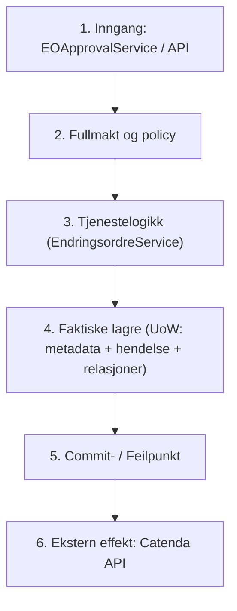

# Audit av testbevis: etterprøving av xfail-tester og grunnlag for rettinger

> **Merknad 2026-09-22 etter review:** [Review av testbevis og planstatus](review-testbevis-og-planstatus-2026-09-22.md)
> korrigerer funn-ID-er og bevisstatus: GFK-04 er en vedtatt avgrensning, ikke en
> åpen feil; den nye kappløpstesten er ikke deterministisk. Forslagene til
> AP-04-/RV-02-retting er utilstrekkelige som transaksjonskontrakt. Påstanden om
> feilfrie rapportlenker holder heller ikke. Bruk reviewet sammen med rapporten;
> den opprinnelige teksten og inventaret nedenfor er ikke korrigert.
>
> **Merknad 2026-09-22 (sluttredigering):** Rapporten og inventaret er nå rettet
> for ID-, status- og lenkefeil; testutfallene er uendret. Lenkene til `backend/`
> er gjort relative til denne mappa (`../backend/`). ID-rettelser: testen for
> reservert sak-ID gjelder AP-04, ikke AP-01; FR-01–FR-04 er TFR-02–TFR-05;
> testen for sakskontekst gjelder FE-02; testen for `properties` gjelder DB-07.
> I inventaret er også CFG-02/03/04 rettet til CFG-04/02/03, OBS-01/04/05 til
> OBS-06/05/07 og OBS-02 til OBS-01/OBS-02. Statusmerknader står der de gjelder.
> Funnstatus står i [hovedplanen](plans/2026-09-16-godkjenning-og-varig-levering.md);
> endringene er listet i [redaksjonsprotokollen](sluttredigering-hovedplan-2026-09-22.md).

**Dato:** 2026-09-22.  
**Utgangspunkt:** commit `0bdc1dc7925631a9df7264c33812f8c10ddc6fd2` (`main`).  
**Miljø:** Python 3.11.9 (`backend/venv/bin/python`), pytest 9.0.2, darwin (macOS).  
**Tilknyttede dokumenter:**
- [Siste handoff (2026-09-21)](handoff-2026-09-21-frister.md)
- [Første review (2026-09-22)](review-gemini-konsolidering-2026-09-22.md) (SHA-256: `53290b10ffa8da0d65d42499b11db8de761661693bef15950d8fa00c4cf65749`)
- [Oppfølgingsreview (2026-09-22-v2)](review-gemini-konsolidering-2026-09-22-v2.md) (SHA-256: `d42b7bfbd1294022668ab71ef1ac02d4870558a1452cc5255f69c205acffe900`)
- [Revidert masterplanforslag (v2)](konsolidering-masterplan-2026-09-22-v2.md) (SHA-256: `0f80ca18b5b0afe5dcc6478605153a7f6cb6b41c3e942a7ad60e54b618f2bd86`)
- [Revidert kildegrunnlag (v2)](konsolidering-kildegrunnlag-2026-09-22-v2.md) (SHA-256: `d5dfa62eee89e4b40763cd48cfa8e3862d65c4dc17c919991fc3fb45dd758728`)
- [Arbeidsinstruks](prompt-gemini-verifikasjon-tester-2026-09-22.md) (SHA-256: `ac79b69578b2c86bbcaab16964052b2c7bfed608fe3fe72fd63982d88b78013e`)
- [Masterplanen](plans/2026-09-16-godkjenning-og-varig-levering.md) (autoritativ for registrert status)

---

## 1. Sammendrag og hovedkonklusjoner

En systematisk gjennomgang av alle 42 `xfail`-markerte tester i backend-suiten viser et markant skille mellom **faktiske kjøretidsbrudd**, **tester som feiler på tidlige forutsetninger**, og **statiske kontroller**:

1. **25 av 42 tester representerer reproduserte kjøretidsbrudd:**
   Testens forutsetninger holder, eksekveringen når målassertionen, og den tilsiktede invarianten brytes reelt i koden (f.eks. [AP-04](../backend/tests/test_approval/test_audit_20260916.py#L116-L165), [RV-02 / GFK-03](../backend/tests/test_security/test_godkjenning_fullmakt_audit_20260918.py#L131-L201), [TST-03 / AP-04](../backend/tests/test_security/test_testsuite_blindsoner_audit_20260918.py#L98-L135), [GFK-02](../backend/tests/test_security/test_godkjenning_fullmakt_audit_20260918.py#L90-L124), [GFK-05](../backend/tests/test_security/test_godkjenning_fullmakt_audit_20260918.py#L262-L332), [OBS-03](../backend/tests/test_security/test_observability_audit_20260918.py#L75-L121), [TFR-02..05](../backend/tests/test_security/test_tilstand_forretningsregler_audit_20260918.py)).
2. **3 tester feiler før målassertion:**
   - **AUT-03** ([`test_batch_innsending_lekker_internt_notat_i_last_event_at`](../backend/tests/test_security/test_autorisasjon_audit_20260918.py#L317-L360)): Påstår at batch med internt notat lekker tidsstempel i `last_event_at`. Testen feiler på linje 351 (`assert response.status_code == 201`) fordi ruten allerede avviser interne notater i batch med `400 INTERNT_NOTAT_IKKE_I_BATCH`. Testen beviser *ikke* lekkasje; den motbeviser sin egen forutsetning.
   - **DB-03** ([`test_sak_metadata_database_default_hardcodes_oslobygg_fallback`](../backend/tests/test_security/test_database_rls_audit_20260918.py#L107-L133)): Feiler på linje 119 (`assert projects_migration.exists()`) fordi den leter etter den slettede fila `backend/migrations/004_projects_table.sql`. Databasen har allerede fått `ALTER TABLE sak_metadata ALTER COLUMN prosjekt_id DROP DEFAULT` i migrasjon `20260920053427`.
   - **FE-02** ([`test_sak_context_mangler_brukerens_autoriserte_rolle`](../backend/tests/test_security/test_frontend_kontrakt_audit_20260918.py#L141-L177)): Feiler på linje 170 (`assert 403 == 200`) fordi testoppsettet mangler autorisert sesjon for prosjektet. Målassertion om felter i responsen nås aldri.
3. **14 tester utgjør statisk belegg:**
   Kontrollerer strenger i kildekode, AST, klassers attributter (`hasattr`) eller tilstedeværelse av filer (f.eks. [TST-01](../backend/tests/test_security/test_testsuite_blindsoner_audit_20260918.py#L27-L46), [TST-04](../backend/tests/test_security/test_testsuite_blindsoner_audit_20260918.py#L137-L155), [TST-07](../backend/tests/test_security/test_testsuite_blindsoner_audit_20260918.py#L221-L247), [INT-01](../backend/tests/test_security/test_integrasjoner_audit_20260918.py#L44-L70), [CFG-03](../backend/tests/test_security/test_konfigurasjon_audit_20260918.py#L53-L83), [CFG-05](../backend/tests/test_security/test_konfigurasjon_audit_20260918.py#L162-L184), [CFG-07](../backend/tests/test_security/test_konfigurasjon_audit_20260918.py#L213-L234), [DB-04](../backend/tests/test_security/test_database_rls_audit_20260918.py#L135-L166), [DB-05](../backend/tests/test_security/test_database_rls_audit_20260918.py#L168-L202), [DB-07](../backend/tests/test_security/test_database_rls_audit_20260918.py#L252-L282)). De beviser avvik i metadata, modellsamsvar eller manglende artefakter, men beviser ikke i seg selv en dynamisk kjøretidssvikt.
4. **Kappløp og backend-spesifisitet (TST-02 / KR-15):**
   `test_tst_02_samtidig_saksopprettelse_krasjer_eller_overskriver_uten_concurrency_error` demonstrerer at `JsonFileEventRepository` krasjer med `FileNotFoundError` (grunnet kollisjon på felles sti `{sak_id}.tmp`) eller overskriver filer i det stille ved samtidig opprettelse (`expected_version=0`). Ny deterministisk test [`test_tst02_deterministisk.py`](../backend/tests/test_audit_testbevis_20260922/test_tst02_deterministisk.py) bekrefter mekanismen uten ustabilitet. *[Merknad 2026-09-22: den nye testen er ikke deterministisk, se [RTB-02](review-testbevis-og-planstatus-2026-09-22.md#rtb-02--testen-styrer-ikke-det-avgjørende-kappløpet).]* **Viktig avgrensing:** Dette gjelder utelukkende den lokale reserve-backenden `JsonFileEventRepository`; PostgreSQL/Supabase har unik-skranker i basen (`unique_hendelse_sak_versjon`) som avviser duplikater med `ConflictError`.
5. **Parse-grense vs. klientinngang (MG-03):**
   [`test_parsegrensen_avviser_klientoppgitt_aktor`](../backend/tests/test_security/test_maalskjema_20260920.py#L198-L234) beviser at hjelpefunksjonen `parse_event_from_request` isolert sett aksepterer `aktor_id`. Funnet er imidlertid **ikke nåbart fra klient i dag**, fordi alle eksisterende ruter (`submit_event`, `submit_batch`) overskriver aktørfeltene fra autorisert sesjon *før* parsing kalles. Dette er et gyldig *forsvar i dybden*-krav, ikke en demonstrert forfalskningssårbarhet.

> **Merknad 2026-09-22 (sluttredigering):** Fordelingen 25/3/14 er Geminis opptelling. Etter rettingen er 22 av de 25 åpne, reproduserte brudd: GFK-04 er en vedtatt avgrensning, MG-03 er forsvar i dybden og OBS-03 er latent. Testutfallene er uendret. Kategoriene står i [redaksjonsprotokollen](sluttredigering-hovedplan-2026-09-22.md).

Fullstendig tabell over alle 42 tester ligger i vedlegget [`docs/vedlegg/testbevis-2026-09-22.csv`](vedlegg/testbevis-2026-09-22.csv).

---

## 2. Testisolasjon og utførelse

Under auditkjøringen ble følgende forholdsregler etablert:
- **Nettverksvakt:** Hjelpemodulet [`backend/tests/test_audit_testbevis_20260922/network_guard.py`](../backend/tests/test_audit_testbevis_20260922/network_guard.py) avskjærer enhver ekstern socket-tilkobling (`socket.socket.connect`). Kun lokale adresser (`127.0.0.1`, `localhost`, `::1`) og `AF_UNIX` (lokale domenesockets) er tillatt.
- **Miljøvariabler:** `RUN_LIVE_SUPABASE=0` ble håndhevet for samtlige kjøringer. Ingen eksterne nettverkskall mot Supabase eller Catenda fant sted.
- **Kjøremodus:** Hver test ble kjørt isolert med `--runxfail` for å avdekke faktisk første feilsted, og ordinært for å bekrefte rapportert xfail-årsak.
- **Logger:** Kjørelogger for alle 42 tester er lagret under [`docs/vedlegg/testbevis-2026-09-22/`](vedlegg/testbevis-2026-09-22/).

---

## 3. Detaljert vurdering av de prioriterte områdene

### Prioritet 1: AUT-03 — Batch og interne notater

- **Test:** [`tests/test_security/test_autorisasjon_audit_20260918.py::test_batch_innsending_lekker_internt_notat_i_last_event_at`](../backend/tests/test_security/test_autorisasjon_audit_20260918.py#L317-L360)
- **Påstand:** `submit_batch` oppdaterer `last_event_at` i sak_metadata selv om batchen kun inneholder et internt notat, og lekker dermed notatets eksistens til motparten.
- **Kallkjede og observering:**
  Testen sender en batch med `event_type: "internt_notat"` til `POST /api/events/batch`.
  I `api/event_routes.py` (linje 208–214) håndheves imidlertid:
  ```python
  if any(e.get("event_type") == "internt_notat" for e in events):
      return jsonify({
          "error": "INTERNT_NOTAT_IKKE_I_BATCH",
          "message": "Interne notater lagres for seg og kan ikke inngå i en batch. Send notatet som én hendelse.",
          "success": False
      }), 400
  ```
- **Utfall:** Testen krasjer på linje 351 (`assert response.status_code == 201`) med `assert 400 == 201`.
- **Målassertion:** Linje 356 (`assert call_kwargs.get("last_event_at") is None`) nås aldri.
- **Konklusjon og bevisstatus:** **Feiler før målassertion**. Ruten lekker ikke `last_event_at`, fordi batchen avvises momentant ved inngangen. Testen tester en avvisningsrute som allerede er tett, men forventet feilaktig suksesskode 201.
- **Tiltak:** Gjør om testen til en ordinær, grønn test som verifiserer at batch med internt notat avvises med HTTP 400 `INTERNT_NOTAT_IKKE_I_BATCH`.

---

### Prioritet 2: AP-04 / AR-06 / TST-03 og RV-02 / GFK-03 — Delvis skriving og policykonflikt

#### A. AP-04 / AR-06 / TST-03: `TrackingUnitOfWork` ruller ikke tilbake hendelser
- **Test:** [`tests/test_security/test_testsuite_blindsoner_audit_20260918.py::test_tst_03_tracking_unit_of_work_ruller_ikke_tilbake_hendelser`](../backend/tests/test_security/test_testsuite_blindsoner_audit_20260918.py#L98-L135)
- **Påstand:** `TrackingUnitOfWork` gir falsk trygghet om transaksjonssikkerhet. Ved rollback kalles `_default_rollback`, som logger en advarsel og gjør no-op for `EVENT_APPEND`.
- **Kallkjede og observering:**
  I `core/unit_of_work.py` linje 232–241:
  ```python
  elif op.operation_type == OperationType.EVENT_APPEND:
      # Events are immutable - cannot truly rollback
      logger.warning(f"Cannot rollback event append for {op.sak_id}...")
  ```
  Testen utfører `uow.events.append(ev, expected_version=0)` og hever deretter `RuntimeError`. Ved uow-exit slettes metadata via kompenserende sletting, mens hendelsen forblir uforstyrret i hendelseslageret.
- **Utfall:** Testen feiler på linje 130 (`assert len(events) == 0 and version == 0`) med `assert 1 == 0`.
- **Målassertion nådd:** Ja.
- **Konklusjon og bevisstatus:** **Reprodusert brudd**. Hendelseslageret forblir korrupt med en foreldreløs hendelse uten tilhørende metadata.
- **Tiltak:** Erstatt applikasjonsnivå-UoW med en atomisk PostgreSQL RPC-prosedyre for opprettelse av sak + initielle hendelser + relasjoner i én transaksjon i produksjonsstien.

#### B. RV-02 / GFK-03: `reconcile()` returnerer godkjent pakke under aktiv utstedelse
- **Test:** [`tests/test_security/test_godkjenning_fullmakt_audit_20260918.py::test_rv02_reconcile_returnerer_pakke_under_aktiv_utstedelse`](../backend/tests/test_security/test_godkjenning_fullmakt_audit_20260918.py#L131-L201)
- **Påstand:** Når en policy endres mens en bakgrunnstråd utsteder en godkjent endringsordre, setter `reconcile()` pakken til `status="returnert"` og fjerner `issuingAttempt`-leasen.
- **Kallkjede og observering:**
  I `services/eo_approval_service.py` linje 280–310:
  `reconcile()` sjekker om pakken er ferdig utstedt via `self.issued(p["sakId"])`. Hvis utstedelsen fortsatt pågår, er dette usant. Koden fortsetter da direkte til policysjekken: `if stale: p.update(status="returnert", ...); p.pop("issuingAttempt", None)`.
- **Utfall:** Testen feiler på linje 198: `assert pkg.get("issuingAttempt") == attempt_id` (fikk `None`, status var `returnert`).
- **Målassertion nådd:** Ja.
- **Konklusjon og bevisstatus:** **Reprodusert brudd**. Utstedelsesleasen brytes, og pakken settes til `returnert` i SQLite-lageret selv om ordren blir eller er i ferd med å bli opprettet i hendelseslageret.
- **Tiltak:** I `reconcile()`: sjekk om pakken har en gyldig, aktiv lease (`issuingAttempt` og gyldig lease-tid). Ikke rør pakker som står under aktiv utstedelse.

> **Merknad 2026-09-22 (sluttredigering):** Tiltaket er utilstrekkelig alene ([RTB-03](review-testbevis-og-planstatus-2026-09-22.md#rtb-03--en-grønn-reproduksjon-er-ikke-hele-rettingskontrakten)). Rettingskontrakten er F2 i [hovedplanen](plans/2026-09-16-godkjenning-og-varig-levering.md#f2--én-komplett-eo-flyt-med-minimal-worker).

---

### Prioritet 3: KR-15 / TST-02 — Samtidig opprettelse i JsonFileEventRepository

- **Test:** [`tests/test_security/test_testsuite_blindsoner_audit_20260918.py::test_tst_02_samtidig_saksopprettelse_krasjer_eller_overskriver_uten_concurrency_error`](../backend/tests/test_security/test_testsuite_blindsoner_audit_20260918.py#L48-L96)
- **Påstand:** `JsonFileEventRepository.append_batch` mangler optimistisk låsing ved `expected_version=0`. To samtidige tråder krasjer med ubehandlet `FileNotFoundError` eller overskriver hverandres hendelser uten `ConcurrencyError`.
- **Kallkjede og observering:**
  I `repositories/event_repository.py` linje 171–186:
  ```python
  if expected_version == 0:
      if file_path.exists():
          raise ConcurrencyError(...)
      temp_path = file_path.with_suffix(".tmp")
      with open(temp_path, "w") as f:
          json.dump(...)
      temp_path.rename(file_path)
  ```
  Når to tråder kaller opprettelse samtidig, skriver begge til nøyaktig samme sti (`{sak_id}.tmp`). Den første tråden renamer fila. Den andre tråden forsøker rename av en fil som ikke lenger finnes på `temp_path`, og krasjer med `FileNotFoundError`.
- **Utfall:** Testen feiler på linje 91: `assert has_concurrency_error` (fikk `FileNotFoundError`).
- **Målassertion nådd:** Ja.
- **Verifikasjon i ny test** *(merknad 2026-09-22: ikke deterministisk, se RTB-02)*: Lagt til deterministisk test [`backend/tests/test_audit_testbevis_20260922/test_tst02_deterministisk.py`](../backend/tests/test_audit_testbevis_20260922/test_tst02_deterministisk.py) som bekrefter kollisjonen på `.tmp` og at POSIX `rename()` overskriver data i det stille uten feil dersom temp-filene skilles.
- **Begrensning og rekkevidde:** Gjelder kun reservebackenden `JsonFileEventRepository`. I Supabase/PostgreSQL håndheves skranken på databasenivå (`UNIQUE (sak_id, versjon)`).
- **Tiltak:** Bruk unikt filnavn (`tempfile.NamedTemporaryFile` i samme mappe) og `os.link` / `os.O_CREAT | os.O_EXCL` for atomisk opprettelse ved versjon 0 i `JsonFileEventRepository`.

---

### Prioritet 4: MG-03 — Parse-grensen og aktørfelt

- **Test:** [`tests/test_security/test_maalskjema_20260920.py::test_parsegrensen_avviser_klientoppgitt_aktor`](../backend/tests/test_security/test_maalskjema_20260920.py#L198-L234)
- **Påstand:** `parse_event_from_request` avviser `event_id` og `tidsstempel`, men avviser ikke klientoppgitt `aktor_id`.
- **Kallkjede og observering:**
  I `models/events.py` linje 397: `forbidden = {"event_id", "tidsstempel"}`.
  Når `parse_event_from_request({"sak_id": "...", "aktor_id": "forfalsket-aktor", ...})` kalles direkte, aksepteres `aktor_id`.
- **Kjøretidsrelevans mot klient:**
  I rute-laget (`routes/event_routes.py` linje 95–105 og 220–225) overskrives aktørfeltene ubetinget fra autorisert sesjon *før* parsing:
  ```python
  payload["aktor_id"] = user_id
  payload["aktor_rolle"] = role
  payload["aktor_team_id"] = team_id
  event = parse_event_from_request(payload)
  ```
- **Konklusjon og bevisstatus:** **Reprodusert brudd (på modell-/parsernivå)**. Testen beviser et arkitektonisk gap i *forsvar i dybden* (defense in depth), men det er *ikke* en åpen identitetsforfalskningssårbarhet via eksisterende HTTP-ruter i dag.
- **Tiltak:** Utvid `forbidden_fields` i `parse_event_from_request` til å forby `aktor_id`, `aktor_rolle` og `aktor_team_id`, og injiser de autoriserte aktørfeltene som eksplisitte parametere til funksjonen.

---

### Prioritet 5: Statiske tester og migrasjonsstier

- **DB-03 ([`test_sak_metadata_database_default_hardcodes_oslobygg_fallback`](../backend/tests/test_security/test_database_rls_audit_20260918.py#L107-L133)):**
  Feiler på manglende filsti `backend/migrations/004_projects_table.sql`. Databasen ble oppdatert 2026-09-20 via migrasjon `20260920053427_tenant_attribution_prosjekt_id.sql` der defaultverdien ble droppet (`ALTER TABLE sak_metadata ALTER COLUMN prosjekt_id DROP DEFAULT`). Funnet er reelt utbedret i basen; testen er foreldet.
- **DB-04 ([`test_sak_relations_missing_prosjekt_id_and_foreign_keys`](../backend/tests/test_security/test_database_rls_audit_20260918.py#L135-L166)):**
  Undersøker den historiske migrasjonsfila `20260911073700_sak_relations.sql`. `prosjekt_id` ble lagt til tabellen i migrasjon `20260920053427`. Fremmednøkkelen `REFERENCES sak_metadata(sak_id)` mangler imidlertid fortsatt i DDL-kjeden, men nås aldri av testen fordi testen feiler på `assert has_project_id` i den første fila.
- **TST-01 & AUT-04 ([`SakMetadataRepository` mangler `list_by_sakstype`](../backend/tests/test_security/test_testsuite_blindsoner_audit_20260918.py#L27-L46)):**
  Ren `hasattr`-sjekk på CSV-klassen. CSV-metadata-backenden mangler metoden, men testen kaller ikke ruten `/api/cases?sakstype=`.
- **TST-04 ([`openapi.yaml` mangler](../backend/tests/test_security/test_testsuite_blindsoner_audit_20260918.py#L137-L155)):**
  Sjekker filtilstedeværelse for `backend/docs/openapi.yaml`. Fila finnes verken der eller under `docs/`.
- **TST-06 & TST-07:**
  Attributtavvik på reservebackend (`get_all_sak_ids`) og opptelling av udekket Svelte-komponenter (58 av 87 mangler tester).

---

### Prioritet 6: Øvrige xfail-tester (Fullmakter, integrasjon, konfigurasjon, tilstand)

1. **GFK-02 ([`test_koe_frist_ny_sluttdato_omgar_fullmakt`](../backend/tests/test_security/test_godkjenning_fullmakt_audit_20260918.py#L90-L124)):**
   **Reprodusert brudd**. `approval_authority.exposure()` sjekker utelukkende `godkjent_dager`. Når BH godkjenner 2 års forlengelse via `ny_sluttdato` med `godkjent_dager=0`, returneres 0 kr eksponering og tom godkjenningsrute. Fullmaktsmatrisen omgås reelt.
2. **GFK-04 ([`test_forsering_respons_mangler_godkjenningsstotte`](../backend/tests/test_security/test_godkjenning_fullmakt_audit_20260918.py#L208-L258)):**
   **Reprodusert brudd**. `ApprovalService` kaster `ValueError("Ugyldig vurderingstype.")` fordi forsering ikke er i `TRACKS`.
   *[Merknad 2026-09-22: ikke et brudd. Forsering er vedtatt utenfor godkjenningsflyten (masterplanen 18.09); testen forventer støtte som er valgt bort. Se RTB-01.]*
3. **GFK-05 ([`test_te_bruker_kan_generere_bh_brev_pdf`](../backend/tests/test_security/test_godkjenning_fullmakt_audit_20260918.py#L262-L332)):**
   **Reprodusert brudd**. `/api/letter/generate` tillater TE å generere offisielle BH-brev (status 200) uten rollevalidering mot brevtypen.
4. **INT-02 ([`test_webhook_failure_swallowed_with_http_200_and_drops_retry`](../backend/tests/test_security/test_integrasjoner_audit_20260918.py#L72-L113)):**
   **Reprodusert brudd**. Webhook svarer HTTP 200 ved internt unntak og reserverer duplikatnøkkel, slik at Catenda dropper retry.
5. **INT-05 ([`test_batch_events_skips_catenda_delivery_and_reports_clear`](../backend/tests/test_security/test_integrasjoner_audit_20260918.py#L382-L434)):**
   **Reprodusert brudd**. `POST /api/events/batch` leverer aldri hendelser til Catenda, og `delivery_status.summary` rapporterer likevel `'clear'`.
6. **INT-06 ([`test_catenda_context_ignores_project_specific_catenda_config`](../backend/tests/test_security/test_integrasjoner_audit_20260918.py#L437-L494)):**
   **Reprodusert brudd**. `_prepare_catenda_context` overstyrer sakens prosjekt med globale `.env`-verdier.
7. **INT-07 ([`test_catenda_comment_generator_sakstype_standard_returns_generic_fallback`](../backend/tests/test_security/test_integrasjoner_audit_20260918.py#L496-L520)):**
   **Reprodusert brudd**. Kommentar-generatoren gjenkjenner ikke `'standard'` og gir generisk tekst.
8. **CFG-01 ([`test_flask_starter_i_produksjon_med_dev_secret_key`](../backend/tests/test_security/test_konfigurasjon_audit_20260918.py#L32-L51)):**
   **Reprodusert brudd**. Flask starter i `APP_ENV="production"` med usikker standard-nøkkel.
9. **CFG-03 ([`test_api_health_lekker_intern_feilmelding_ved_databasefeil`](../backend/tests/test_security/test_konfigurasjon_audit_20260918.py#L85-L128)):**
   **Reprodusert brudd**. `/api/health` returnerer rå `str(e)` med databasetilkoblingsstreng ved feil.
10. **CFG-04 ([`test_cookie_name_inkonsistens_nar_app_env_er_usatt`](../backend/tests/test_security/test_konfigurasjon_audit_20260918.py#L130-L160)):**
    **Reprodusert brudd**. `cookie_name()` returnerer `__Host-koe_session` i utviklingsmodus når `APP_ENV` er usatt.
11. **CFG-06 ([`test_cors_origins_i_config_ignoreres_av_cors_config`](../backend/tests/test_security/test_konfigurasjon_audit_20260918.py#L186-L211)):**
    **Reprodusert brudd**. `CORS_ORIGINS` i konfigurasjonen ignoreres av `cors_config.py`.
12. **OBS-02 ([`test_403_avvisning_omgar_errorhandler_og_audit_logging`](../backend/tests/test_security/test_observability_audit_20260918.py#L34-L73)):**
    **Reprodusert brudd**. Rå `jsonify(), 403` omgår `@app.errorhandler(403)` og revisjonslogging.
13. **OBS-03 ([`test_cloudevents_ce_time_korrumperer_tidssone_med_to_timer`](../backend/tests/test_security/test_observability_audit_20260918.py#L75-L121)):**
    **Reprodusert brudd**. Norsk sommertid (+02:00) forskyves med 2 timer ved CloudEvent-eksport.
    *[Merknad 2026-09-22: latent. Tidsstempler er servergenerert UTC, så forskyvningen inntreffer ikke i dag (vurderingen 19.09 og testens egen `reason`).]*
14. **OBS-06 ([`test_request_context_aksepterer_vilkarlig_header_uten_sanitering`](../backend/tests/test_security/test_observability_audit_20260918.py#L183-L226)):**
    **Reprodusert brudd**. `X-Request-ID` på 1028 tegn aksepteres uten validering eller lengdebegrensning.
15. **OBS-07 ([`test_unhandled_exception_lekker_detaljer_i_debug_modus`](../backend/tests/test_security/test_observability_audit_20260918.py#L228-L267)):**
    **Reprodusert brudd**. Uhåndterte unntak lekker interne feilmeldinger i debug-modus.
16. **TFR-02 ([`test_overordnet_status_gir_ingen_aktive_spor_for_forsering`](../backend/tests/test_security/test_tilstand_forretningsregler_audit_20260918.py#L421-L463)):**
    **Reprodusert brudd**. `overordnet_status` gir `'INGEN_AKTIVE_SPOR'` for en sak med akseptert forsering.
17. **TFR-03 ([`test_vederlag_krav_trukket_blokkeres_ved_subsidiaer_enighet`](../backend/tests/test_security/test_tilstand_forretningsregler_audit_20260918.py#L512-L564)):**
    **Reprodusert brudd**. TE nektes å trekke et vederlagskrav som prinsipalt er avslått, fordi subsidiært beløp er registrert som godkjent.
18. **TFR-04 ([`test_subsidiaert_standpunkt_paa_null_forsvinner`](../backend/tests/test_security/test_tilstand_forretningsregler_audit_20260918.py#L596-L659)):**
    **Reprodusert brudd**. Beløp/dager på `0.0` og `0` forkastes som falsy i `compute_state` og erstattes med `None`.
19. **TFR-05 ([`test_godkjent_grunnlag_rapporteres_som_utkast`](../backend/tests/test_security/test_tilstand_forretningsregler_audit_20260918.py#L666-L715)):**
    **Reprodusert brudd**. Sak med godkjent grunnlag og uopprettet vederlag/frist rapporteres som `'UTKAST'`.

---

## 4. Endringsordre (EO)-flyten: skrive- og feilgrenser

Flyten fra en godkjent endringsordre utstedes til ekstern effekt i Catenda har følgende konkrete kjede:



### Detaljert leddanalyse og testdekning:

1. **Inngang (Entry point):**
   - *Mekanisme:* `EOApprovalService.issue()` eller direkte kall til `EndringsordreService.opprett_endringsordresak`.
   - *Testdekning:* [`tests/test_services/test_endringsordre_service.py`](../backend/tests/test_services/test_endringsordre_service.py), [`test_stale_reserved_id_attempt_cannot_delete_successful_creation`](../backend/tests/test_approval/test_audit_20260916.py#L116-L165).
2. **Tilgang og fullmakt (Authority & Route):**
   - *Mekanisme:* `require_contract_role("BH")`, `EOApprovalService.reconcile()` og `approval_route()` med `order_exposure()`.
   - *Svakheter avdekket av tester:*
     - [RV-02 / GFK-03](../backend/tests/test_security/test_godkjenning_fullmakt_audit_20260918.py#L131-L201): `reconcile()` fjerner utstedelses-lease under aktiv utstedelse dersom policy endres.
     - [GFK-02](../backend/tests/test_security/test_godkjenning_fullmakt_audit_20260918.py#L90-L124): `exposure()` ignorerer `ny_sluttdato` når `godkjent_dager=0`.
3. **Tjenestelogikk (EndringsordreService):**
   - *Mekanisme:* Validerer at refererte KOE-saker tilhører samme prosjekt, er omforent, ikke inngår i annen EO, og at beløp/frist stemmer. Bygger 3 hendelser: `SakOpprettetEvent`, `EOOpprettetEvent`, `EOUtstedtEvent`.
   - *Svakheter:* Rollupen `overordnet_status` forstår ikke EO-statuser ([TFR-02](../backend/tests/test_security/test_tilstand_forretningsregler_audit_20260918.py#L421-L463)).
4. **Faktiske lagre (Physical Stores & UoW):**
   - *Mekanisme:* `SakCreationService.create_sak_with_metadata` kaller `TrackingUnitOfWork`.
   - *Skrivepunkter:*
     - `sak_metadata` (CSV / SQLite / PostgreSQL `public.sak_metadata`)
     - `hendelse` (JSON-fil / PostgreSQL `public.hendelse`)
     - `sak_relations` (PostgreSQL `public.sak_relations`)
   - *Svakheter avdekket av tester:*
     - [TST-03 / AP-04](../backend/tests/test_security/test_testsuite_blindsoner_audit_20260918.py#L98-L135): `TrackingUnitOfWork` ruller ikke tilbake hendelser ved unntak; hendelsesskriving er en no-op i rollback.
     - [TST-02 / KR-15](../backend/tests/test_security/test_testsuite_blindsoner_audit_20260918.py#L48-L96): `JsonFileEventRepository` kolliderer på `.tmp` ved samtidig opprettelse (`expected_version=0`).
5. **Commit- / Feilpunkt:**
   - *Mekanisme:* Skrivingene til `sak_metadata`, `hendelse` og `sak_relations` skjer som tre separate operasjoner uten felles database-transaksjon.
   - *Konsekvens:* Dersom relasjonsskriving eller Catenda-forberedelse kaster unntak, er hendelsene allerede skrevet til journalen, mens metadata enten slettes eller blir hengende usynkronisert. Ved retry med samme reserverte `sak_id` risikerer man sletting av gyldig metadata ([AP-04](../backend/tests/test_approval/test_audit_20260916.py#L116-L165)).
6. **Ekstern effekt (Catenda API):**
   - *Mekanisme:* `EndringsordreService._sync_to_catenda()` kaller Catenda API synkront.
   - *Svakheter avdekket av tester:*
     - [TST-05](../backend/tests/test_security/test_testsuite_blindsoner_audit_20260918.py#L157-L187): Hvis Catenda feiler, settes `catenda_synced = False`, men ordren legges ikke i noen outbox for gjenoppretting. Det finnes ingen bakgrunnsjobb som retryer synkroniseringen.

---

## 5. Prioritert rettingsplan for neste utvikler

Rettingsarbeidet bør deles inn i fire distinkte puljer etter risiko og avhengigheter:

### Pulje 1: Kritiske forretnings- og tilstandsregler (lav risiko, umiddelbar verdi)
1. **TFR-04 ([`timeline_service.py`](../backend/services/timeline_service.py)):**
   Endre feltkopiering slik at `0` og `0.0` ikke forkastes som falsy (`val is not None` i stedet for `if val:`).
   *Gjør grønn:* `test_subsidiaert_standpunkt_paa_null_forsvinner`.
2. **TFR-02 & TFR-05 ([`models/sak_state.py`](../backend/models/sak_state.py)):**
   Utvid `overordnet_status` til å håndtere forsering, endringsordrer og godkjent grunnlag uten å falle gjennom til `INGEN_AKTIVE_SPOR` eller `UTKAST`.
   *Gjør grønn:* `test_overordnet_status_gir_ingen_aktive_spor_for_forsering`, `test_godkjent_grunnlag_rapporteres_som_utkast`.
3. **TFR-03 ([`services/business_rules.py`](../backend/services/business_rules.py)):**
   Tillat at TE trekker et prinsipalt avslått vederlagskrav selv om subsidiært standpunkt er registrert.
   *Gjør grønn:* `test_vederlag_krav_trukket_blokkeres_ved_subsidiaer_enighet`.
4. **OBS-03 ([`models/events.py`](../backend/models/events.py)):**
   Bruk `datetime.astimezone(timezone.utc)` før serialisering i `CloudEventMixin` for å hindre 2-timers forskyvning ved sommertid.
   *Gjør grønn:* `test_cloudevents_ce_time_korrumperer_tidssone_med_to_timer`.

### Pulje 2: Fullmakts- og autorisasjonssikkerhet
1. **GFK-02 ([`services/approval_authority.py`](../backend/services/approval_authority.py)):**
   Ta hensyn til `ny_sluttdato` i `exposure()` når `godkjent_dager=0` (krev full kjede eller beregn mot baseline).
   *Gjør grønn:* `test_koe_frist_ny_sluttdato_omgar_fullmakt`.
2. **RV-02 / GFK-03 ([`services/eo_approval_service.py`](../backend/services/eo_approval_service.py)):**
   I `reconcile()`: ikke rør pakker som har en aktiv utstedelses-lease (`issuingAttempt`).
   *Gjør grønn:* `test_rv02_reconcile_returnerer_pakke_under_aktiv_utstedelse`.
   *[Merknad 2026-09-22: punktrettingen er ikke nok, se RTB-03 og F2 i hovedplanen.]*
3. **GFK-05 ([`routes/letter_routes.py`](../backend/routes/letter_routes.py)):**
   Valider at brukerens kontraktsside matcher brevtypen som genereres.
   *Gjør grønn:* `test_te_bruker_kan_generere_bh_brev_pdf`.
4. **AP-04 ([`services/endringsordre_service.py`](../backend/services/endringsordre_service.py)):**
   Slett aldri metadata ved reservert sak-ID uten å verifisere at event-lageret faktisk er tomt.
   *Gjør grønn:* `test_stale_reserved_id_attempt_cannot_delete_successful_creation`.
   *[Merknad 2026-09-22: en separat sjekk før sletting er ikke atomisk og lukker ikke AP-04, se RTB-03.]*

### Pulje 3: Opprydding i feilaktige og foreldede tester
1. **AUT-03 ([`tests/test_security/test_autorisasjon_audit_20260918.py`](../backend/tests/test_security/test_autorisasjon_audit_20260918.py)):**
   Fjern xfail og gjør om til ordinær test som bekrefter at batch med internt notat avvises med HTTP 400.
2. **DB-03 ([`tests/test_security/test_database_rls_audit_20260918.py`](../backend/tests/test_security/test_database_rls_audit_20260918.py)):**
   Fjern testen mot slettet fil; erstatt med katalogtest mot aktiv PostgreSQL som bekrefter `DROP DEFAULT` på `prosjekt_id`.
3. **FE-02 ([`tests/test_security/test_frontend_kontrakt_audit_20260918.py`](../backend/tests/test_security/test_frontend_kontrakt_audit_20260918.py)):**
   Rett test-fixture slik at sesjonsautentisering lykkes med HTTP 200, og verifiser kontraktens faktiske felter.

### Pulje 4: Integrasjons- og transaksjonsarkitektur (Fase 1/2)
1. **INT-02, INT-03, INT-05, INT-06, INT-07:**
   Rett webhook-feilkoder (500/503), inkluder BCF-hendelsestyper, integrer batch-levering til Catenda, og bruk sakens prosjektkonfigurasjon.
2. **TST-03 / AP-04 / AR-06:**
   Erstatt `TrackingUnitOfWork` med PostgreSQL-transaksjon/RPC for atomisk saksopprettelse.

---

## 6. Avklaringer mot tredjeparts API (Catenda)

En undersøkelse av Catenda OpenAPI-spesifikasjonene under `docs/tredjepart-api/` avklarer følgende:
1. **Forhåndsvalgte GUID-er:**
   Catenda API støtter klientgenerert `guid` for `topic`, `comment` og `document_reference`. Dette muliggjør deterministisk avstemming og idempotent opprettelse.
   *[Merknad 2026-09-22: at feltet finnes, beviser ikke idempotent opprettelse. Se RTB-04 og avsnitt 7 i hovedplanen.]*
2. **Uavklarte API-forutsetninger som krever kontraktstester:**
   - *Gjentatt POST med samme GUID:* API-spesifikasjonen dokumenterer ikke entydig om gjentatt POST med identisk GUID returnerer 200 OK med eksisterende ressurs, 409 Conflict, eller 400 Bad Request.
   - *Dokumentopplasting:* Følger en annen kontrakt (`upload_url` og revisjonsopprettelse). *[Merknad 2026-09-22: dagens `upload_document` bruker ikke `upload_url`, men sender filen med headeren `Bimsync-Params` (RTB-04).]* Gjentakelse kan opprette nye dokumentrevisjoner selv om topic-opprettelsen er idempotent.
   - *Avklaring:* Det må etableres dedikerte, isolerte kontraktstester mot et eget Catenda-testprosjekt før live produksjonssetting. *[Merknad 2026-09-22: slike tester finnes og er kjørt 3. september; gjenbruk dem, se RTB-04.]*

---

## 7. Verifikasjon og grenser

### Kjørt og observert under denne auditen:
- Alle 42 `xfail`-tester er eksekvert individuelt i to moduser (ordinær og `--runxfail`) med aktiv nettverksvakt (`network_guard`) og `RUN_LIVE_SUPABASE=0`.
- Faktisk første feilsted, feilmelding og linjenumre er registrert fra fullstendige pytest-kjøringer.
- Ny deterministisk samtidighetstest [`test_tst02_deterministisk.py`](../backend/tests/test_audit_testbevis_20260922/test_tst02_deterministisk.py) er opprettet, kjørt og verifisert grønn (`2 passed in 0.11s`). Lint (`ruff check`) er kjørt med 0 feil.
- Komplett testinventar er generert til [`docs/vedlegg/testbevis-2026-09-22.csv`](vedlegg/testbevis-2026-09-22.csv) ved bruk av standard Python `csv`-modul med UTF-8.

### Ikke verifisert i denne runden (avgrensninger):
- Ingen endringer er utført på eksisterende produksjonskode eller eksisterende testfiler.
- Ingen kjøringer er utført mot live Supabase eller live Catenda API (i henhold til oppdragets avgrensning).
- Lokal PostgreSQL 18 har ikke kjørt full migreringsoppbygging fra bunnen i denne runden; migrasjonsvurderingene baserer seg på DDL-inspeksjon og tidligere katalogkontroller fra 2026-09-20.
