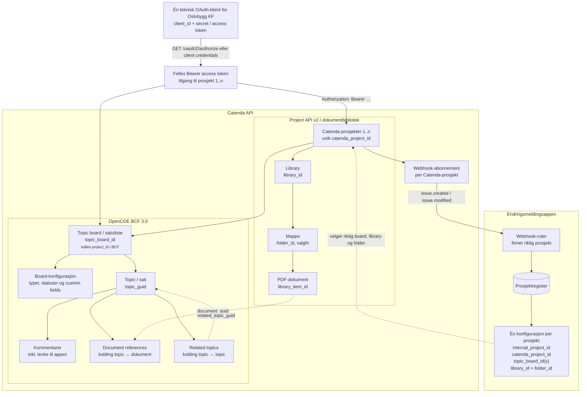
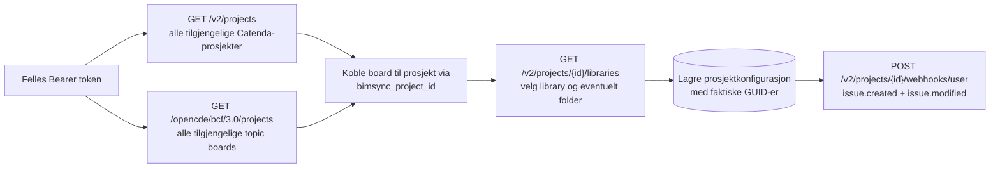
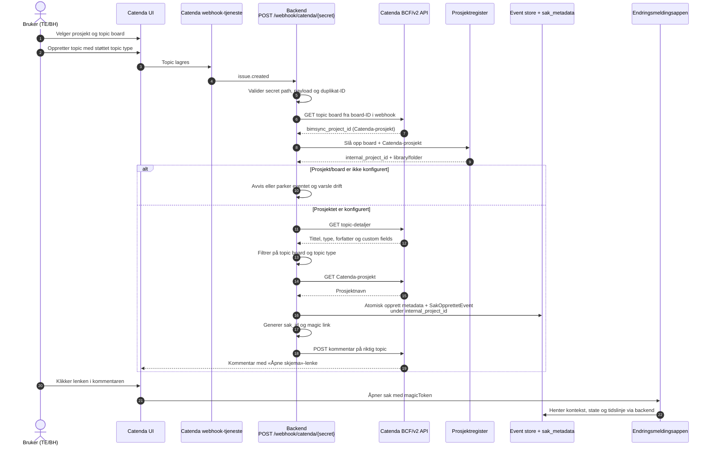
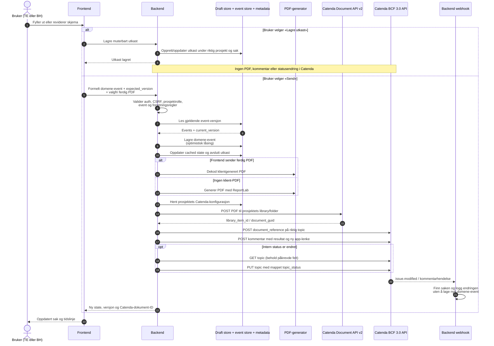
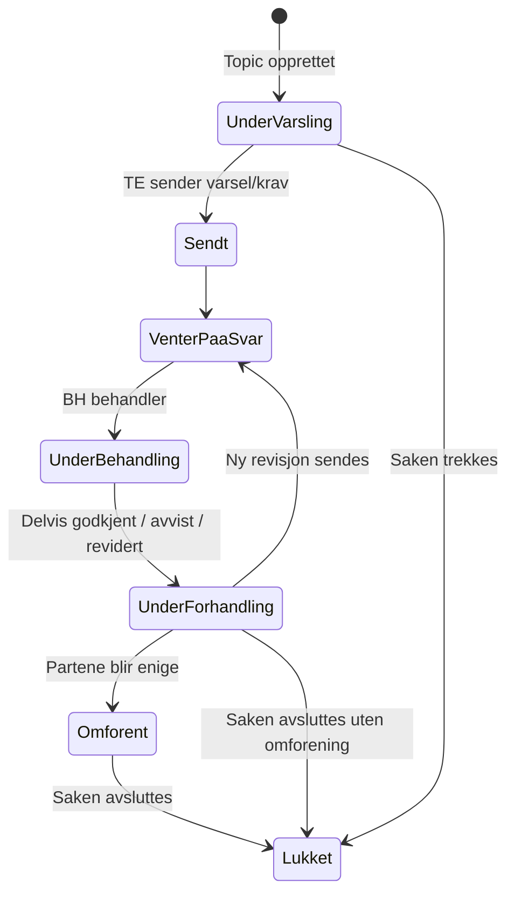
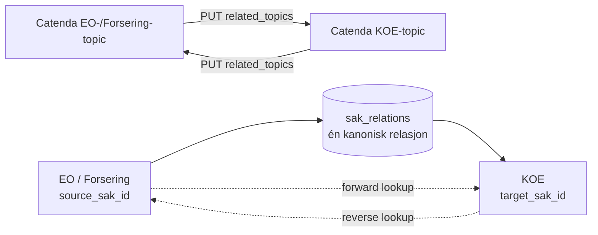

# Dataflyt mellom Catenda og endringsmeldingsappen

Dette dokumentet beskriver både målarkitekturen og avvik fra dagens kode, med
`backend/scripts/test_full_flow.py` som utgangspunkt. Diagrammene skiller mellom
Catenda Project API v2, OpenCDE/BCF API-et og appen sitt eget API.

> Viktig begrepsskille: Catenda bruker `project_id` om det ordinære
> Catenda-prosjektet i v2-API-et. I BCF API-et heter et topic board også
> `project` og identifiseres med et eget `project_id`. I dette dokumentet
> brukes derfor `catenda_project_id` og `topic_board_id`.

## 1. Ressurshierarki og API-grenser

Den viktigste koblingen mellom de to API-familiene er at topic board-detaljene
inneholder `bimsync_project_id`. Dokumentet lastes opp under dette v2-prosjektet,
mens referansen til dokumentet opprettes under topic-et i BCF API-et.

Det interne `prosjekt_id` bør ikke være det samme feltet som Catendas ID.
Prosjektregisteret kobler appens stabile prosjekt-ID til Catendas prosjekt,
ett eller flere godkjente topic boards og målbibliotek/mappe. Navnekonvensjoner
kan brukes ved onboarding og validering, men flyten bør bruke lagrede GUID-er
etter at prosjektet er konfigurert.

### Oppsett og synkronisering av prosjektregisteret

Dette kan kjøres som en kontrollert onboarding/synkronisering. Navn brukes til
å foreslå riktig topic board, library og mappe, men en administrator bør kunne
bekrefte valgene. Den ordinære webhook- og sendeflyten bruker deretter GUID-ene
fra prosjektregisteret og er ikke avhengig av at navn forblir uendret.

## 2. Opprettelse og første lenke til appen

Dette er produksjonsflyten i webhook-ruten. Catenda-brukeren oppretter topic-et
i Catenda UI; appen oppretter ikke topic-et i denne delen av flyten.

Webhook-eventet heter `issue.created` i dagens oppsett. Backend aksepterer også
`bcf.issue.created`.

## 3. Innsending, PDF og synkronisering tilbake til Catenda

Samme sendeløkke gjentas for TE og BH. Appens eventlogg er sannhetskilden for
saksstatus. Endringer som bare utføres direkte i Catenda logges av webhooken,
men endrer ikke appens domenetilstand. Et utkast er app-intern arbeidsdata og
skal ikke fremstå som en formell meddelelse i hendelsesforløpet.

## 4. Statusflyt

Intern status mappes til Catenda-statusene `Under varsling`, `Sendt`,
`Venter på svar`, `Under behandling`, `Under forhandling`, `Omforent` og
`Lukket`.

«Enighet om uenighet» trenger ikke egen status. Utfallet kan beskrives i det
avsluttende eventet, PDF-en og Catenda-kommentaren, mens Catenda-status settes
til `Lukket`. `Omforent` brukes når partene faktisk er enige.

## 5. Toveis synlige saksrelasjoner

Den kanoniske relasjonen i appen går fra en Endringsordre eller Forsering til
de underliggende KOE-sakene. Reverse oppslag gjør at relasjonen også vises fra
KOE-siden. I Catenda opprettes relasjonen begge veier fordi BCF-endepunktet
arbeider på ett topic om gangen.

## 6. Catenda-endepunkter brukt i denne flyten

Alle endepunkter har base URL `https://api.catenda.com`.

| Formål | Metode og endepunkt |
|---|---|
| OAuth-dialog | `GET /oauth2/authorize` |
| Hent/veksle token | `POST /oauth2/token` |
| Valider innlogget Catenda-bruker | `GET /opencde/foundation/1.0/current-user` |
| List brukerens Catenda-prosjekter | `GET /v2/projects` |
| Hent Catenda-prosjekt | `GET /v2/projects/{catenda_project_id}` |
| List topic boards | `GET /opencde/bcf/3.0/projects` |
| Hent topic board | `GET /opencde/bcf/3.0/projects/{topic_board_id}` |
| Hent typer og statuser | `GET /opencde/bcf/3.0/projects/{topic_board_id}/extensions` |
| Hent board + custom fields | `GET /v2/projects/{catenda_project_id}/issues/boards/{topic_board_id}?include=customFields,customFieldInstances` |
| List/opprett topics | `GET/POST /opencde/bcf/3.0/projects/{topic_board_id}/topics` |
| Hent/oppdater topic | `GET/PUT /opencde/bcf/3.0/projects/{topic_board_id}/topics/{topic_guid}` |
| List/opprett kommentarer | `GET/POST /opencde/bcf/3.0/projects/{topic_board_id}/topics/{topic_guid}/comments` |
| List biblioteker | `GET /v2/projects/{catenda_project_id}/libraries` |
| List mapper / last opp dokument | `GET/POST /v2/projects/{catenda_project_id}/libraries/{library_id}/items` |
| List/opprett dokumentreferanser | `GET/POST /opencde/bcf/3.0/projects/{topic_board_id}/topics/{topic_guid}/document_references` |
| List/opprett topic-relasjoner | `GET/PUT /opencde/bcf/3.0/projects/{topic_board_id}/topics/{topic_guid}/related_topics` |
| List/opprett webhooks | `GET/POST /v2/projects/{catenda_project_id}/webhooks/user` |
| Slett webhook | `DELETE /v2/projects/{catenda_project_id}/webhooks/user/{webhook_id}` |

## 7. Hvordan `test_full_flow.py` avviker fra produksjonsflyten

Testscriptet verifiserer autentisering, prosjekt, library/folder, topic board,
board-oppsett, webhooks, kommentarer, statuser, PDF-referanser og relasjoner mot
Catenda. Topic-et opprettes også via BCF API-et.

Selve opprettelsen av app-saken går imidlertid direkte til repository- og
eventlaget i `_create_case_directly()`. Scriptet lager `sak_metadata`, lagrer
`SakOpprettetEvent`, genererer magic link og poster første kommentar selv. Det
tester dermed resultatet webhooken skal produsere, men går ikke gjennom
`POST /webhook/catenda/{secret}`. En separat ende-til-ende-test bør opprette
topic-et og vente på at Catenda faktisk leverer `issue.created`.

## 8. Besluttet målarkitektur og nødvendige kodeendringer

| Område | Beslutning | Avvik i dagens kode |
|---|---|---|
| Catenda-identitet | Én teknisk OAuth-klient med tilgang til alle relevante Oslobygg-prosjekter | Tokenet er allerede globalt, men prosjektressursene er også globale |
| Prosjektruting | Webhooken utleder Catenda-prosjekt fra boardet og slår opp intern prosjektkonfigurasjon | Webhooken bruker globale innstillinger og `ALLOWED_BOARD_IDS` er hardkodet |
| Prosjektkonfigurasjon | Hvert internt prosjekt lagrer egne `catenda_project_id`, `topic_board_id(s)`, `library_id` og `folder_id` | `Settings` har bare ett sett med ID-er for hele backend-instansen |
| Utkast | Lagres kun i appen og kan endres uten Catenda-synk | Egen utkastflyt finnes ikke i den undersøkte event-ruten |
| Send | Oppretter formelt event, PDF, dokumentreferanse, kommentar og eventuell statusendring | `POST /api/events` forsøker Catenda/PDF ved hvert event |
| Status | Appens eventlogg er autoritativ; Catenda-endringer importeres ikke | Samsvarer i hovedsak med dagens webhook-håndtering |
| Avslutning uten enighet | Bruk eksisterende `Lukket`; beskriv utfallet i event/PDF/kommentar | Krever et tydelig avslutnings-event eller avslutningsårsak |
| Saksrelasjoner | Lagres én gang kanonisk i appen, vises begge veier og opprettes begge veier i Catenda | Intern reverse-indeks finnes; Catenda-kallene må være konsekvent toveis |

Prosjektets eksisterende `projects.settings` kan teknisk lagre Catenda-ID-ene,
men en egen, validert `catenda_project_config`-modell/tabell vil gi sikrere
oppslag og unikhetskrav. Minstekravet er unik indeks på `catenda_project_id` og
`topic_board_id`, slik at et webhook-event aldri kan rutes til mer enn ett
internt prosjekt.
