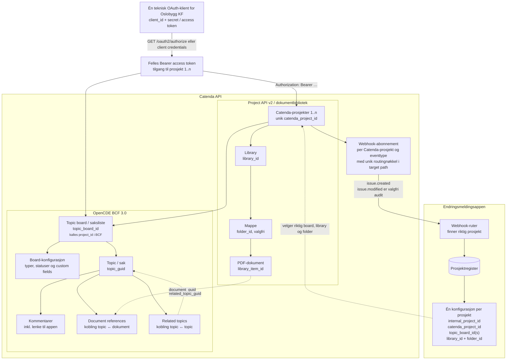
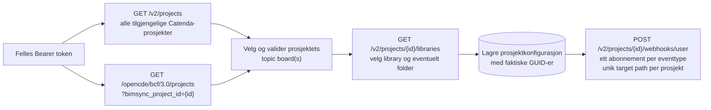
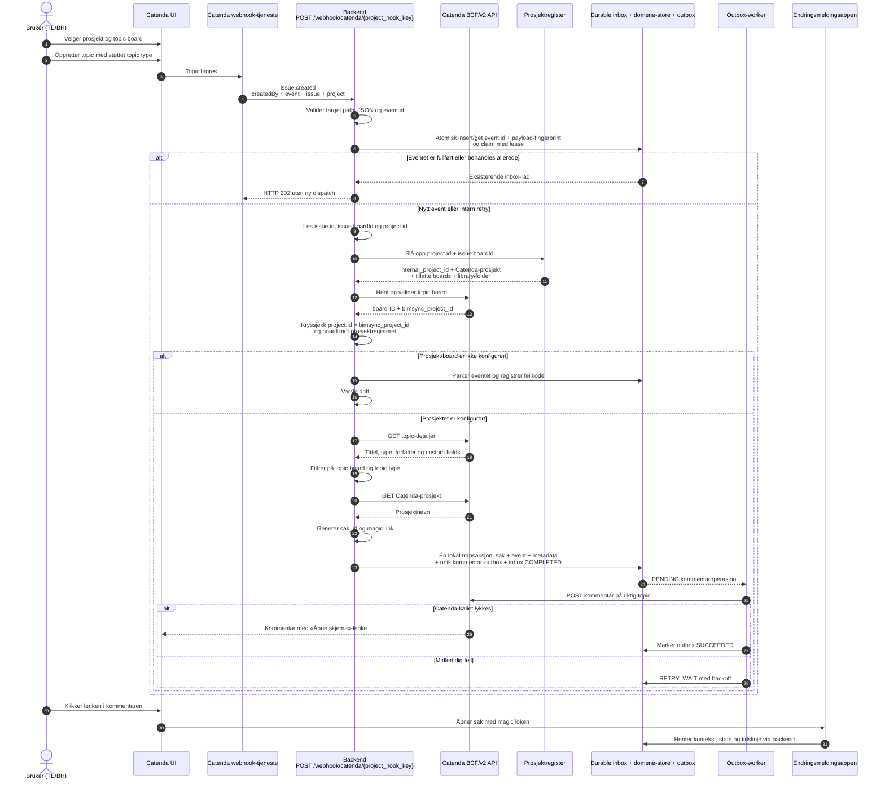
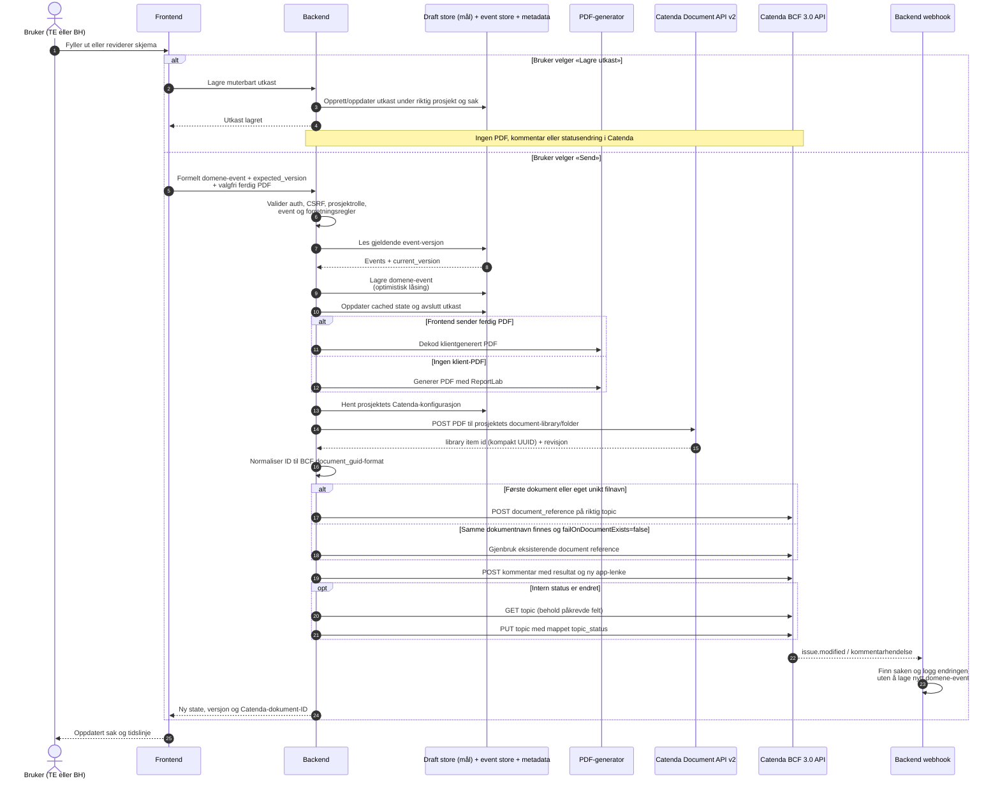
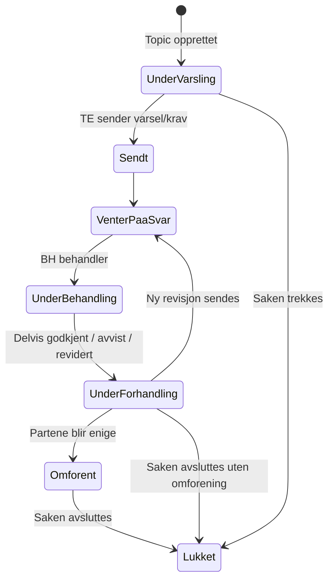
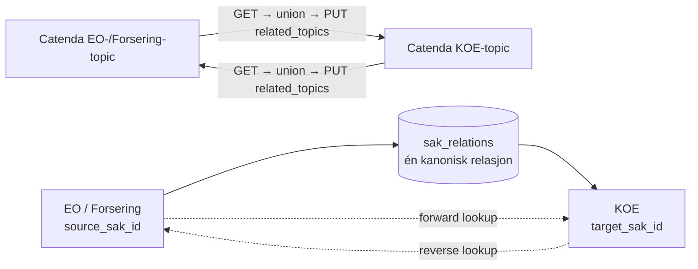

# Dataflyt mellom Catenda og endringsmeldingsappen

Dette dokumentet beskriver både målarkitekturen og avvik fra dagens kode, med
`backend/scripts/test_full_flow.py` som utgangspunkt. Diagrammene skiller mellom
Catenda Project API v2, OpenCDE/BCF API-et og appen sitt eget API.

> Viktig begrepsskille: Catenda bruker `project_id` om det ordinære
> Catenda-prosjektet i v2-API-et. I BCF API-et heter et topic board også
> `project` og identifiseres med et eget `project_id`. I dette dokumentet
> brukes derfor `catenda_project_id` og `topic_board_id`.

## 1. Ressurshierarki og API-grenser



Den viktigste koblingen mellom de to API-familiene er at topic board-detaljene
inneholder `bimsync_project_id`. Dokumentet lastes opp under dette v2-prosjektet,
mens referansen til dokumentet opprettes under topic-et i BCF API-et.

Det interne `prosjekt_id` bør ikke være det samme feltet som Catendas ID.
Prosjektregisteret kobler appens stabile prosjekt-ID til Catendas prosjekt,
ett eller flere godkjente topic boards og målbibliotek/mappe. Navnekonvensjoner
kan brukes ved onboarding og validering, men flyten bør bruke lagrede GUID-er
etter at prosjektet er konfigurert.

### Oppsett og synkronisering av prosjektregisteret



Dette kan kjøres som en kontrollert onboarding/synkronisering. Navn brukes til
å foreslå riktig topic board, library og mappe, men en administrator bør kunne
bekrefte valgene. Den ordinære webhook- og sendeflyten bruker deretter GUID-ene
fra prosjektregisteret og er ikke avhengig av at navn forblir uendret.

## 2. Opprettelse og første lenke til appen

Dette er målbildet for produksjonsflyten i webhook-ruten. Catenda-brukeren
oppretter topic-et i Catenda UI; appen oppretter ikke topic-et i denne delen av
flyten. Prosjektresolveren er implementert, mens durable inbox/outbox i
diagrammet fortsatt er planlagt arbeid.



Webhook-eventet heter `issue.created`. `bcf.issue.created` og
`bcf.comment.created` er ikke dokumenterte abonnementsevents. Dagens route har
aliaser for dem, men strukturvalidatoren avviser dem før dispatch.

Den lokale OpenAPI-filen dokumenterer opprettelse og administrasjon av
abonnementer, men ikke JSON-kontrakten Catenda sender til callback-URL-en.
Kontrakten ble derfor fanget i en reell, manuell test 2. september 2026 og
lagret som en [anonymisert fixture](../backend/tests/fixtures/catenda_issue_created_anonymized.json)
med et tilhørende [kontraktnotat](../backend/tests/fixtures/catenda_issue_created_contract.md).

Den observerte `issue.created`-payloaden har disse toppnivåfeltene og ID-ene:

| Betydning | Observert felt |
|---|---|
| Oppretter | `createdBy` |
| Eventtype og unik event-ID | `event.type` og `event.id` |
| Topic og topic board | `issue.id` og `issue.boardId` |
| Fysisk Catenda-prosjekt | `project.id` |

Det finnes ikke et toppnivåfelt kalt `project_id`. Direkte ruting med
`payload["project_id"]` er derfor ikke mulig for den observerte kontrakten.
Implementert resolver leser nå `project.id` direkte, slår opp prosjekt og board
i det foreløpige registeret og kryssjekker verdien mot boardets
`bimsync_project_id`. En unik prosjektbundet routingnøkkel i target path kan
brukes som et ekstra kontrollag, men erstatter ikke payload- og
registervalideringen.

Den samme manuelle testen bekreftet HTTP 200 ved første levering, nøyaktig én
lokal CSV/JSON-sak og én Catenda-kommentar. Ny levering med samme `event.id` ga
HTTP 202 med `already_processed`, uten ekstra sak eller kommentar. Dette
bekrefter den vellykkede idempotensbanen, men ikke retry etter delvis feil.

Ved lokal testing er webhookens registrerte target URL i Catenda den
autoritative adressen. En ngrok-adresse er flyktig og kan avvike fra
`NGROK_URL` i `.env`; aktiv tunnel og registrert webhook må derfor sammenlignes
før hver ende-til-ende-test, og abonnementet må oppdateres hvis adressen er
rotert.

## 3. Innsending, PDF og synkronisering tilbake til Catenda



Samme sendeløkke gjentas for TE og BH. Appens eventlogg er sannhetskilden for
saksstatus. Endringer som bare utføres direkte i Catenda logges av webhooken,
men endrer ikke appens domenetilstand. Et utkast er app-intern arbeidsdata og
skal ikke fremstå som en formell meddelelse i hendelsesforløpet.

Dagens implementasjon har ikke en eksplisitt «Lagre utkast»-knapp eller et
backend-endepunkt for utkast. Skjemaene autosaver i nettleserens `localStorage`
via `src/lib/utils/draft.ts`. Denne flyten gjør ingen nettverkskall og utløser
dermed verken domene-event, PDF eller Catenda-kall. Diagrammets draft store er
målbildet dersom utkast senere skal kunne deles mellom enheter eller brukere.

## 4. Statusflyt



Intern status mappes til Catenda-statusene `Under varsling`, `Sendt`,
`Venter på svar`, `Under behandling`, `Under forhandling`, `Omforent` og
`Lukket`.

«Enighet om uenighet» trenger ikke egen status. Utfallet kan beskrives i det
avsluttende eventet, PDF-en og Catenda-kommentaren, mens Catenda-status settes
til `Lukket`. `Omforent` brukes når partene faktisk er enige.

## 5. Toveis synlige saksrelasjoner

Den kanoniske relasjonen i appen går fra en Endringsordre eller Forsering til
de underliggende KOE-sakene. Reverse oppslag gjør at relasjonen også vises fra
KOE-siden. Catenda-spesifikasjonen garanterer ikke at en relasjon blir synlig
fra begge topics. Inntil dette er kontrakttestet, opprettes den eksplisitt fra
begge sider for å oppfylle brukerkravet.



`related_topic_guid` skal alltid være Catendas topic GUID, aldri appens
`sak_id`. Catendas OpenAPI sier ikke eksplisitt om `PUT related_topics` legger
til eller erstatter samlingen. GET–union–PUT hindrer tap av eksisterende
relasjoner dersom PUT følger BCF-semantikken for full samlingsoppdatering.

## 6. Catenda-endepunkter brukt i denne flyten

Alle endepunkter har base URL `https://api.catenda.com`.

| Formål | Metode og endepunkt |
|---|---|
| OAuth-dialog | `GET /oauth2/authorize` |
| Hent/veksle token | `POST /oauth2/token` |
| Valider innlogget Catenda-bruker | `GET /opencde/foundation/1.0/current-user` |
| List brukerens Catenda-prosjekter | `GET /v2/projects` |
| Hent Catenda-prosjekt | `GET /v2/projects/{catenda_project_id}` |
| List topic boards | `GET /opencde/bcf/3.0/projects?bimsync_project_id={catenda_project_id}` |
| Hent topic board | `GET /opencde/bcf/3.0/projects/{topic_board_id}` |
| Hent typer og statuser | `GET /opencde/bcf/3.0/projects/{topic_board_id}/extensions` |
| Hent board + custom fields | `GET /v2/projects/{catenda_project_id}/issues/boards/{topic_board_id}?include=customFields,customFieldInstances` |
| List/opprett topics | `GET/POST /opencde/bcf/3.0/projects/{topic_board_id}/topics` |
| List topics på tvers av boards i prosjekt | `GET /opencde/bcf/3.0/bimsync-projects/{catenda_project_id}/topics` |
| Hent/oppdater topic | `GET/PUT /opencde/bcf/3.0/projects/{topic_board_id}/topics/{topic_guid}` |
| List/opprett kommentarer | `GET/POST /opencde/bcf/3.0/projects/{topic_board_id}/topics/{topic_guid}/comments` |
| List biblioteker | `GET /v2/projects/{catenda_project_id}/libraries` |
| List mapper / last opp dokument | `GET/POST /v2/projects/{catenda_project_id}/libraries/{library_id}/items` |
| List/opprett dokumentreferanser | `GET/POST /opencde/bcf/3.0/projects/{topic_board_id}/topics/{topic_guid}/document_references` |
| List/opprett topic-relasjoner | `GET/PUT /opencde/bcf/3.0/projects/{topic_board_id}/topics/{topic_guid}/related_topics` |
| List/opprett webhooks | `GET/POST /v2/projects/{catenda_project_id}/webhooks/user` |
| Slett webhook | `DELETE /v2/projects/{catenda_project_id}/webhooks/user/{webhook_id}` |

## 7. Hvordan `test_full_flow.py` avviker fra produksjonsflyten

Testscriptet verifiserer autentisering, prosjekt, library/folder, topic board,
board-oppsett, webhooks, kommentarer, statuser, PDF-referanser og relasjoner mot
Catenda. Topic-et opprettes også via BCF API-et.

Selve opprettelsen av app-saken går imidlertid direkte til repository- og
eventlaget i `_create_case_directly()`. Scriptet lager `sak_metadata`, lagrer
`SakOpprettetEvent`, genererer magic link og poster første kommentar selv. Det
tester dermed resultatet webhooken skal produsere, men går ikke gjennom
`POST /webhook/catenda/{secret}`. En separat ende-til-ende-test bør opprette
topic-et og vente på at Catenda faktisk leverer `issue.created`.

En slik webhookleveranse er nå verifisert manuelt for ett prosjekt, inkludert
første kommentar og duplikatleveranse. Den er foreløpig ikke en automatisert
variant av `test_full_flow.py`, og den dekket ikke Send/PDF-flyten.

## 8. Besluttet målarkitektur og nødvendige kodeendringer

| Område | Beslutning | Avvik i dagens kode |
|---|---|---|
| Catenda-identitet | Én teknisk OAuth-klient med tilgang til alle relevante Oslobygg-prosjekter | Tokenet er allerede globalt, men prosjektressursene er også globale |
| Prosjektruting | Webhooken leser `project.id` og `issue.boardId`, slår opp intern prosjektkonfigurasjon og kryssjekker boardets `bimsync_project_id` | Resolveren er implementert; runtime bruker foreløpig en fail-closed legacy-adapter for ett `.env`-konfigurert prosjekt |
| Prosjektkonfigurasjon | Hvert internt prosjekt lagrer egne `catenda_project_id`, `topic_board_id(s)`, `library_id` og `folder_id` | `Settings` har bare ett sett med ID-er for hele backend-instansen |
| Utkast | Lagres kun i appen og kan endres uten Catenda-synk | Dagens skjema autosaver lokalt i nettleserens `localStorage`; eksplisitt knapp og backend-draftstore finnes ikke |
| Send | Oppretter formelt event, PDF, dokumentreferanse, kommentar og eventuell statusendring | `POST /api/events` forsøker Catenda/PDF ved hvert event |
| Status | Appens eventlogg er autoritativ; Catenda-endringer importeres ikke | Samsvarer i hovedsak med dagens webhook-håndtering |
| Avslutning uten enighet | Bruk eksisterende `Lukket`; beskriv utfallet i event/PDF/kommentar | Krever et tydelig avslutnings-event eller avslutningsårsak |
| Saksrelasjoner | Lagres én gang kanonisk i appen, vises begge veier og opprettes begge veier i Catenda | Intern reverse-indeks finnes; Catenda-kallene må være konsekvent toveis |

Prosjektets eksisterende `projects.settings` kan teknisk lagre Catenda-ID-ene,
men en egen, validert `catenda_project_config`-modell/tabell vil gi sikrere
oppslag og unikhetskrav. Minstekravet er unik indeks på `catenda_project_id` og
`topic_board_id`, slik at et webhook-event aldri kan rutes til mer enn ett
internt prosjekt.

## 8A. Trinn 2A – prosjekt-resolveren (implementert)

Webhook-tjenesten ruter nå alle `issue.created`/`bcf.issue.created`-events
gjennom en obligatorisk `CatendaProjectResolver` **før** domene-sideeffekter
(sak og kommentar) utføres. Ruten har imidlertid allerede reservert
`event.id` i dagens idempotenslager før resolveren kalles. Resolverfeil kan
derfor fortsatt miste en senere retry frem til en varig inbox er implementert.

### Komponenter

| Komponent | Fil | Rolle |
|---|---|---|
| `CatendaProjectConfig` | `backend/models/catenda_project_config.py` | Validert konfigurasjon med ikke-tom intern ID, minst ett unikt board og kanoniske UUID-er for eksterne ID-er |
| `CatendaProjectConfigRepository` (Protocol) | `backend/repositories/catenda_project_config_repository.py` | Injiserbart oppslag-grensesnitt |
| `InMemoryCatendaProjectConfigRepository` | samme | In-memory-implementasjon for tester/utvikling |
| `CatendaProjectResolver` | `backend/services/catenda_project_resolver.py` | Leser `project.id` + `issue.boardId`, normaliserer GUID-er, slår opp konfig og kryssjekker boardets `bimsync_project_id` |
| `ResolvedProjectContext` | samme | Levert til webhook-tjenesten: `internal_project_id`, `catenda_project_id`, `board_id`, `topic_id`, `library_id`, `folder_id` |
| `build_legacy_project_resolver` | `backend/services/catenda_project_resolver_factory.py` | Fail-closed legacy-adapter over dagens ene `.env`-konfig; krever klient, prosjekt-, board- og library-ID (internt prosjekt-ID `oslobygg`) |

### Hva webhook-tjenesten bruker fra resolved kontekst

- `internal_project_id` → appens `prosjekt_id` (lagres i `SakOpprettetEvent` og
  `create_sak`).
- `catenda_project_id` → fysisk Catenda-prosjekt (Catenda-metadata/API-kall).
- `board_id` / `topic_id` → normaliserte GUID-er fra payload/resolved board.
  **Aldri** et globalt board som overstyring.

Catenda-credentialsen forblir globale (én teknisk OAuth-klient). Ruten holder
seg tynn: den bygger service + resolver, og all resolving skjer i tjenesten.
`WebhookService` kan ikke lenger konstrueres uten resolver, og har ingen global
prosjektfallback. Boardet kontrolleres mot det lokale registeret før Catenda
kalles. Etter resolving brukes `resolved.catenda_project_id` direkte; tjenesten
henter ikke board-detaljene en gang til.

### Feilklassifisering (uten HTTP-status)

Resolveren kaster typede feil. Webhook-tjenesten bevarer dem som stabile
`error_code`- og `retryable`-felt. Eksakt HTTP-status for parkering/retry
utsettes til inbox-designet i trinn 3; ruten returnerer fortsatt HTTP 200 for et
tjenesteresultat med `success:false`.

| Feil | Betydning |
|---|---|
| `MissingInputIdError` (`missing_input_id`, ikke retriable) | `project.id`, `issue.boardId` eller `issue.id` mangler |
| `InvalidInputIdError` (`invalid_input_id`, ikke retriable) | En av payload-ID-ene er ikke en gyldig UUID |
| `UnknownProjectError` (`unknown_project`, ikke retriable) | Ingen registerkonfig for `catenda_project_id`, eller payload peker på et prosjekt som ikke finnes i registeret |
| `ProjectBoardMismatchError` (`project_board_mismatch`, ikke retriable) | `project.id` ≠ boardets `bimsync_project_id` (motstrid) |
| `UnknownBoardError` (`unknown_board`, ikke retriable) | Boardet er ikke registrert for prosjektet, eller finnes ikke i Catenda |
| `TemporaryCatendaError` (`temporary_catenda_error`, retriable) | Midlertidig Catenda-feil ved board-oppslag |

Felles konsekvens nå (trinn 2A): ingen domene-sideeffekter (verken sak eller
kommentar) oppstår ved noen av feilene. Den tidlige idempotensreservasjonen er
det kjente unntaket. `ALLOWED_BOARD_IDS` i
`utils/filtering_config.py` er satt til `None` fordi board-godkjenning nå gjøres
per-prosjekt i resolveren, ikke globalt.

## 8B. Trinn 2B – permanent lagring (skjema skal presenteres før implementasjon)

Trinn 2A bruker et in-memory-register og en legacy-adapter over dagens `.env`.
Permanent lagring implementeres separat i trinn 2B. **Skjemaet presenteres og
godkjennes før koden skrives.** Anbefalt mål er dedikerte, normaliserte tabeller
for prosjektkonfigurasjon og boards med unike constraints, fremfor
`projects.settings`.

Foreslått skjema (ikke migrert eller implementert):

```text
catenda_project_configs
- internal_project_id TEXT PRIMARY KEY
  FOREIGN KEY -> projects(id)
- catenda_project_id UUID NOT NULL UNIQUE
- library_id UUID NOT NULL
- folder_id UUID NULL
- is_active BOOLEAN NOT NULL
- created_at TIMESTAMPTZ NOT NULL
- updated_at TIMESTAMPTZ NOT NULL

catenda_topic_board_configs
- topic_board_id UUID PRIMARY KEY
- internal_project_id TEXT NOT NULL
  FOREIGN KEY -> catenda_project_configs(internal_project_id)
- is_active BOOLEAN NOT NULL
```

`internal_project_id` er `TEXT` i begge tabeller for å samsvare med eksisterende
`projects.id`. `catenda_project_id` lagres bare i prosjekttabellen og utledes via
FK-en for boards, slik at to kopier ikke kan komme i utakt. Boardets primærnøkkel
gir i seg selv unikhet; en ekstra `UNIQUE(topic_board_id)` er ikke nødvendig.

## 8C. Trinn 3 – durable webhook inbox og outbox (planlagt)

Dagens Redis-/minnelager reserverer `event.id` før behandlingen og er ikke en
durable korrekthetsmekanisme. Det har TTL, mister data ved prosessrestart uten
Redis og skiller ikke mottatt, pågående, feilet og fullført behandling.
Målarkitekturen flytter derfor idempotens til en durable inbox:

```text
webhook_inbox
- source + external_event_id (unik idempotensnøkkel)
- payload_json + payload_sha256
- project_id + board_id + topic_id
- status: RECEIVED | PROCESSING | RETRY_WAIT | COMPLETED | PARKED | DEAD_LETTER
- attempt_count + lease_until + next_attempt_at
- last_error_code + last_error_message
- resolved_internal_project_id + resolved_sak_id
- received_at + processed_at
```

Samme event-ID med en annen payload-fingerprint parkeres som identitetskonflikt.
En aktiv `PROCESSING`-lease hindrer parallell behandling; en utløpt lease kan
overtas. Catendas callback-retry er ikke beskrevet i lokal OpenAPI, så appen må
kunne retry internt etter at mottaket er lagret. HTTP 503 brukes bare når
mottaket ikke kunne lagres durable. Permanente payload-/routingfeil parkeres og
varsles, mens midlertidige feil går til `RETRY_WAIT`.

Catenda-sideeffekter lagres som outbox-operasjoner i samme lokale commit som
saken, eventet og metadata:

```text
webhook_outbox
- operation_key UNIQUE + inbox_id + kind
- internal_project_id + catenda_project_id + board_id + topic_id
- request_payload_json
- status: PENDING | PROCESSING | RETRY_WAIT | SUCCEEDED | DEAD_LETTER
- attempt_count + lease_until + next_attempt_at
- last_error_code + last_error_message
- created_at + completed_at
```

Første kommentar kan for eksempel bruke den stabile nøkkelen
`catenda-comment:v1:{internal_project_id}:{board_id}:{topic_id}:creation`.
Kommentar-, dokument-, referanse- og statusfeil retrie-es da uten å opprette
saken på nytt. Catenda dokumenterer ingen idempotency-header for kommentarer;
ved timeout etter mulig vellykket POST må workeren derfor hente kommentarer og
lete etter en deterministisk markør før en ny kommentar postes.

Nåværende `TrackingUnitOfWork` er ikke en database-transaksjon: repository-
operasjonene utføres umiddelbart, og event-append kan ikke rulles tilbake. En
Supabase-implementasjon må derfor bruke én PostgreSQL/RPC-transaksjon for
metadata, event, inbox og outbox. Lokal CSV/JSON-støtte kan gi crash recovery
med en låst fil og atomisk rename, men skal ikke omtales som cross-file ACID.
Som ekstra vern må `(prosjekt_id, catenda_topic_id)` være unikt når
`catenda_topic_id` finnes, og alle topic-oppslag må være prosjektavgrenset.

Redis kan fortsatt brukes til rate limiting og korte worker-locker, men ikke
som sannhetskilde for webhook-idempotens. Dette er målarkitektur; tabeller,
worker, RPC og unikhetsconstraint er ikke implementert ennå.

## 9. Funn fra kontroll mot lokal Catenda OpenAPI

Disse punktene bør håndteres før integrasjonen brukes med flere prosjekter:

| Prioritet | Funn | Konsekvens / anbefaling |
|---|---|---|
| Høy | Callback-payloaden er ikke beskrevet i webhook-OpenAPI; én levende kontrakt er fanget, og den har `project.id` i stedet for toppnivå `project_id` | Behold fixturen som regresjonskontrakt, les `project.id` eksplisitt og gjenta testen i et prosjekt nummer to før flerprosjektruting låses |
| Kritisk | Topic `PUT` nullstiller utelatte BCF-felter | Klienten gjør nå GET med eksplisitt `$select` og PUT av en writable allowlist; `$select`/`priority` må fortsatt verifiseres levende |
| Kritisk | Webhooken reserverer event-ID før behandling og returnerer HTTP 200 også ved `{success:false}` | Erstatt Redis-reservasjonen med durable inbox. Nåværende UoW er ikke en ekte transaksjon; bruk database/RPC-transaksjon og outbox for Catenda-sideeffekter |
| Høy | Dagens sendeflyt henter `project_id`, `library_id` og `folder_id` globalt | Slå opp alle tre fra saken sitt interne prosjekt |
| Høy | Samme PDF-navn med `failOnDocumentExists=false` lager ny revisjon | Åpent ADR-valg: samlet saksdokument eller separate brev med revisjonsløp per part og spor; lagre uansett library item-ID og document-reference-GUID |
| Høy | `POST document_references` returnerer dokumentert en liste | Klienten normaliserer nå en-elements liste og defensivt objektsvar og avviser tom/malformed respons |
| Høy | EO-/Forseringstjenestene sender flere steder interne `sak_id`-er som `related_topic_guid` | Lavnivåklienten avviser nå ikke-UUID-er; tjenestene må fortsatt slå opp Catenda topic GUID fra metadata før Catenda-kallet |
| Middels | Library fallback kan velge første bibliotek uansett type | Tillat bare library med `type=document`; håndter paginering |
| Middels | Revisjonens `document.filename` ble satt til tilfeldig tempfilnavn | Klienten bruker nå ønsket PDF-navn for både library item og revisjon; verifiser levende ved ny revisjon |
| Middels | Mappeoppretting mangler top-level `type: folder` fra skjemaet | Send både top-level type og `document.type` |
| Lav | DELETE webhook er dokumentert med HTTP 200, mens mixinen bare godtar 204 | Godta dokumentert 200-respons, eventuelt også 204 defensivt |
| Lav | Klienten sender udokumentert `name` ved opprettelse av webhook | Fjern feltet eller bekreft det i en kontrakttest |

To forhold må kontrakttestes mot et testprosjekt fordi OpenAPI-en ikke er
entydig: om `PUT related_topics` er additiv eller erstatter hele samlingen, og
om en enkelt relasjon automatisk blir synlig fra begge topics.

## 10. Tester før produksjonsimplementasjon

### P0 – kontrakttester mot Catenda-testprosjekter

1. **Webhookkontrakt for første prosjekt – utført manuelt:** Behold den
   anonymiserte fixturen som regresjonsgrunnlag. Følgende er bekreftet:
   `event.id`, `issue.id`, `issue.boardId`, `project.id`, HTTP 200 ved første
   levering og HTTP 202 uten duplikate sideeffekter ved ny levering.
2. **Andre prosjekt og routing:** Opprett et topic i et annet Catenda-prosjekt,
   lagre en ny anonymisert fixture og verifiser at `project.id`,
   `issue.boardId` og boardets `bimsync_project_id` peker entydig på samme
   interne prosjekt. Test både compact og dashed GUID-format.
3. **Webhook-leveranse ved feil:** Mål timeout og retry ved 500/timeout,
   kontroller om samme event-ID gjenbrukes, og verifiser når abonnementets
   `failureCount` og state endres. Test også eventuell unik target path som
   ekstra prosjektbinding.
4. **Topic-status uten datatap:** Opprett et topic med type, labels, prioritet,
   ansvarlig, stage, beskrivelse og due date. Oppdater bare appstatus og
   kontroller at samtlige øvrige felt er uendret.
5. **Dokumentkontrakt:** Last opp første PDF og samme filnavn på nytt. Registrer
   faktisk responsform, library item-ID, revisjons-ID og antall document
   references. Gjenta med unikt filnavn. Dette gir faktagrunnlaget for ADR-et
   om samlet dokument kontra separate brev.
6. **Related topics:** Opprett A→B, les relasjoner fra både A og B, legg deretter
   til A→C og kontroller at A→B ikke forsvinner. Gjenta på tvers av to boards i
   samme Catenda-prosjekt. Bruk bare Catenda topic GUID-er.
7. **Teknisk identitet:** For hvert prosjekt, verifiser tilgang til konfigurert
   board og document-library samt rettighetene createComment, update,
   updateDocumentReferences og updateRelatedTopics.

### P0 – integrasjons- og robusthetstester i appen

1. **Automatisert webhook-regresjon – implementert:** Den anonymiserte fixturen
   testes gjennom rute, service, resolver og legacy-factory. Testene dekker
   første levering, duplikat, manglende/ugyldige ID-er, ukjent prosjekt/board,
   prosjekt–board-mismatch, GUID-normalisering, fail-closed-konfigurasjon og
   fravær av domene-sideeffekter ved resolverfeil. Den relevante pakken har 95
   grønne tester. Retry-testene dokumenterer fortsatt dagens kjente tap av
   retry; de beviser ikke en implementert inbox.
2. **Fixture gjennom framtidig inbox:** POST den anonymiserte fixturen til
   Flask-ruten med kontrollerte Catenda-svar. Verifiser én sak, korrekt lagrede
   topic-/board-/prosjekt-ID-er og én unik kommentar-outbox; post samme
   `event.id` igjen og krev samme inbox-rad uten nye sideeffekter.
3. **Flerprosjektisolasjon:** Lever samtidige webhooks fra minst to prosjekter.
   Kontroller at sak, eventer, metadata, kommentar, status, PDF, library og
   folder alltid havner i riktig prosjekt.
4. **Durable webhook inbox:** Simuler feil etter mottak, under databasecommit og
   under Catenda-kall. Retry skal gi nøyaktig én appsak, men fortsatt fullføre
   manglende sideeffekter.
5. **Outbox for Catenda:** Simuler feil separat for PDF-upload,
   document-reference, kommentar og status. Operasjonene skal kunne retries
   idempotent uten duplikate brev, referanser eller kommentarer.
6. **Utkast kontra Send – delvis verifisert:** Fire frontendtester bekrefter at
   dagens `localStorage`-autosave kan lagre, laste og slette utkast uten
   nettverkskall. En komplett ende-til-ende-test er blokkert til eksplisitt
   «Lagre utkast»-UI/backendkontrakt og dokument-/brev-ADR er besluttet. Merk at
   dagens opprettelse av ny sak sender både `sak_opprettet` og
   `grunnlag_opprettet`; «ett klikk = ett event» gjelder derfor ikke denne
   flyten uten en egen beslutning.
7. **Ekko fra egne Catenda-kall:** `issue.modified` og eventuelle
   status-webhooks utløst av appens kommentar/status skal ikke lage nye
   domene-events eller starte en synkroniseringsløkke.
8. **ID-kollisjon og samtidighet:** Lever to `issue.created` i samme sekund og
   verifiser unike `sak_id`-er. Dagens sekundbaserte ID må erstattes eller
   sikres med UUID/unik databaseconstraint.
9. **Relasjonsoppslag:** Verifiser EO/Forsering→KOE og reverse KOE→EO/Forsering
   både i appen og Catenda, inkludert flere relasjoner på samme KOE.

### Automatiserte mock-kontrakter for Catenda-mutasjoner

`backend/tests/test_integrations/test_catenda_mutation_contracts.py` kjører mot
de virkelige klientmetodene med mockede HTTP-kall og lokal OpenAPI som kontrakt.
Ingen levende Catenda-data eller credentials brukes.

| Kontrakt | Status |
|---|---|
| Document upload normaliserer dokumentert en-elements listerespons og støtter objektsvar defensivt; prosjekt, library, folder og dokumentnavn sendes korrekt | Grønn |
| Status-`PUT` henter topic med `$select` og bevarer writable BCF-felt, inkludert tomme verdier | Grønn i mock-kontrakten; levende `$select`/`priority` gjenstår |
| `document.filename` bruker ønsket revisjonsnavn og ikke tilfeldig tempfilnavn | Grønn i mock-kontrakten; levende revisjonstest gjenstår |
| Opprettelse av document reference normaliserer dokumentert en-elements listerespons og avviser malformed respons | Grønn |
| Related topics validerer Catenda topic-UUID-er og gjør GET–normalisering–union–PUT uten tap | Grønn i mock-kontrakten; levende replacement-/toveissemantikk gjenstår |

Alle kontraktene er nå ordinært grønne. Levende tester må fortsatt bekrefte de
tre Catenda-egenskapene som ikke kan avgjøres av lokal OpenAPI og mocks:
topic-`$select` med hele allowlisten, revisjonsopprettelse ved samme dokumentnavn
og `related_topics`-semantikk på tvers av boards.

### Eksisterende test som må strammes inn

`test_full_flow.py` bør få en egen ekte webhook-variant. Dagens
`_create_case_directly()` omgår webhook-ruten, og `verify_pdf_upload()` avslutter
med suksess selv om ingen document reference finnes. Den nye testen må vente
med avgrenset timeout og feile hvis sak, kommentar, dokument, referanse eller
prosjektruting mangler. Opprettede topics, dokumenter og webhook-abonnement må
registreres under testen og ryddes deterministisk etterpå.

## 11. Åpent ADR: dokument- og brevmodell

Før dokumentflyten implementeres ferdig må ett av disse alternativene velges:

| Alternativ | Catenda-modell | Viktigste konsekvens |
|---|---|---|
| Samlet saksdokument | Ett library item per KOE, ny revisjon ved hver formelle sending | Enkel dokumentliste, men mindre tydelig hvilket brev/revisjon som tilhører part og spor |
| Separate brev | Ett library item per formelle meddelelse; revisjoner bare av det aktuelle brevet | Tydelig korrespondanse og revisjonshistorikk, men flere dokumenter og referanser per topic |
| Separate brev per part og spor | Stabilt library item per kombinasjon av TE/BH og grunnlag/vederlag/frist | Strukturert revisjonsløp, men krever eksplisitt dokumentnøkkel og streng navnestandard |

Valget påvirker filnavn, unik dokumentnøkkel, når document references opprettes,
PDF-innhold, kommentarformat og hvordan appen kobler domene-event til Catenda
library item og revisjon. Det bør derfor besluttes i et ADR før kodeendringene
for PDF-upload gjennomføres.
