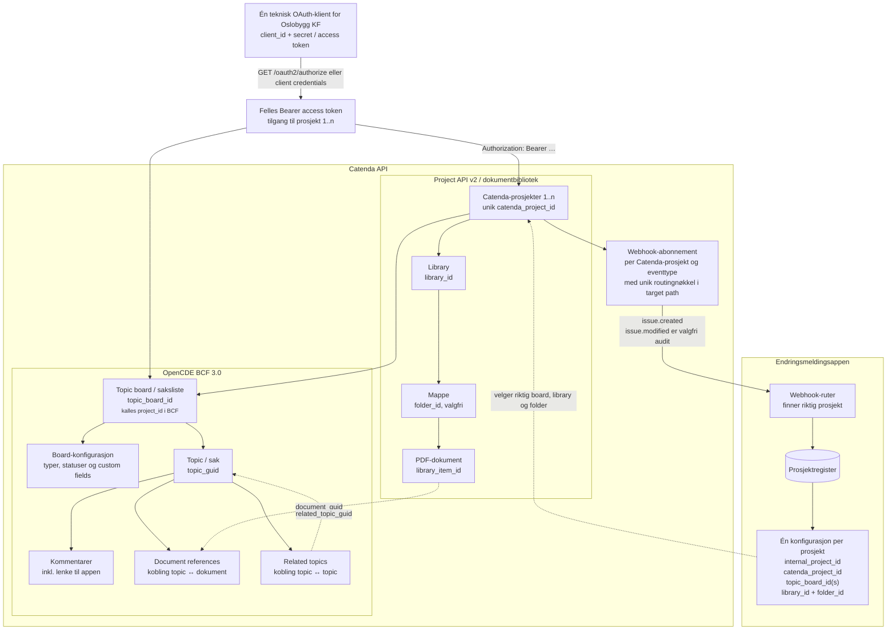
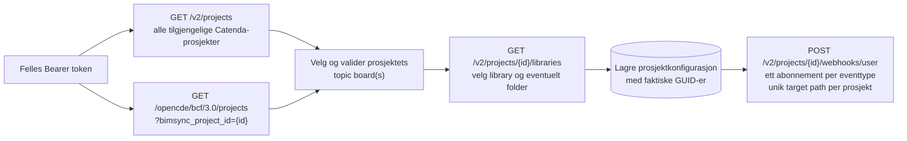
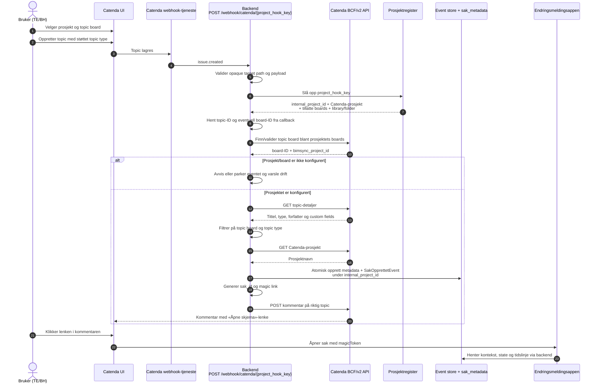
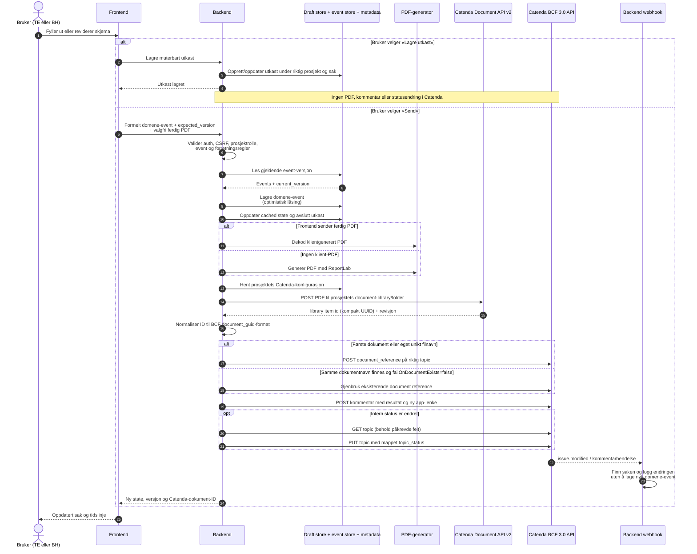
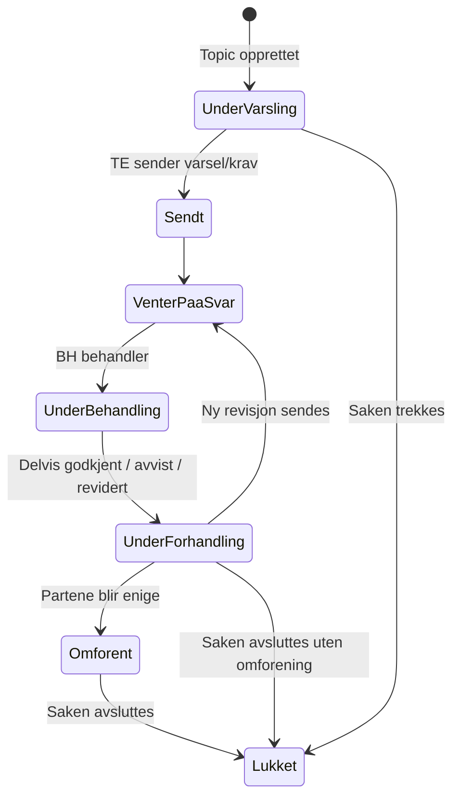
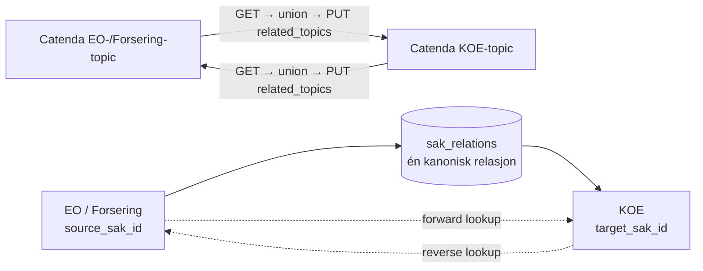

# Dataflyt mellom Catenda og endringsmeldingsappen

Dette dokumentet beskriver både målarkitekturen og avvik fra dagens kode, med
`backend/scripts/test_full_flow.py` som utgangspunkt. Diagrammene skiller mellom
Catenda Project API v2, OpenCDE/BCF API-et og appen sitt eget API.

> Viktig begrepsskille: Catenda bruker `project_id` om det ordinære
> Catenda-prosjektet i v2-API-et. I BCF API-et heter et topic board også
> `project` og identifiseres med et eget `project_id`. I dette dokumentet
> brukes derfor `catenda_project_id` og `topic_board_id`.

## 1. Ressurshierarki og API-grenser

Den viktigste koblingen mellom de to API-familiene er at topic board-detaljene
inneholder `bimsync_project_id`. Dokumentet lastes opp under dette v2-prosjektet,
mens referansen til dokumentet opprettes under topic-et i BCF API-et.

Det interne `prosjekt_id` bør ikke være det samme feltet som Catendas ID.
Prosjektregisteret kobler appens stabile prosjekt-ID til Catendas prosjekt,
ett eller flere godkjente topic boards og målbibliotek/mappe. Navnekonvensjoner
kan brukes ved onboarding og validering, men flyten bør bruke lagrede GUID-er
etter at prosjektet er konfigurert.

### Oppsett og synkronisering av prosjektregisteret

Dette kan kjøres som en kontrollert onboarding/synkronisering. Navn brukes til
å foreslå riktig topic board, library og mappe, men en administrator bør kunne
bekrefte valgene. Den ordinære webhook- og sendeflyten bruker deretter GUID-ene
fra prosjektregisteret og er ikke avhengig av at navn forblir uendret.

## 2. Opprettelse og første lenke til appen

Dette er produksjonsflyten i webhook-ruten. Catenda-brukeren oppretter topic-et
i Catenda UI; appen oppretter ikke topic-et i denne delen av flyten.

Webhook-eventet heter `issue.created`. `bcf.issue.created` og
`bcf.comment.created` er ikke dokumenterte abonnementsevents. Dagens route har
aliaser for dem, men strukturvalidatoren avviser dem før dispatch.

Den lokale OpenAPI-filen dokumenterer opprettelse og administrasjon av
abonnementer, men ikke JSON-kontrakten Catenda sender til callback-URL-en. En
ekte `issue.created` må derfor fanges og lagres som test-fixture før feltnavnene
for topic, board, prosjekt og event-ID låses. Den unike routingnøkkelen i
abonnementets target path gjør at fysisk prosjekt kan identifiseres uten å
stole på et udokumentert payload-felt. Board fra payload/API kryssjekkes alltid
mot prosjektregisteret.

## 3. Innsending, PDF og synkronisering tilbake til Catenda

Samme sendeløkke gjentas for TE og BH. Appens eventlogg er sannhetskilden for
saksstatus. Endringer som bare utføres direkte i Catenda logges av webhooken,
men endrer ikke appens domenetilstand. Et utkast er app-intern arbeidsdata og
skal ikke fremstå som en formell meddelelse i hendelsesforløpet.

## 4. Statusflyt

Intern status mappes til Catenda-statusene `Under varsling`, `Sendt`,
`Venter på svar`, `Under behandling`, `Under forhandling`, `Omforent` og
`Lukket`.

«Enighet om uenighet» trenger ikke egen status. Utfallet kan beskrives i det
avsluttende eventet, PDF-en og Catenda-kommentaren, mens Catenda-status settes
til `Lukket`. `Omforent` brukes når partene faktisk er enige.

## 5. Toveis synlige saksrelasjoner

Den kanoniske relasjonen i appen går fra en Endringsordre eller Forsering til
de underliggende KOE-sakene. Reverse oppslag gjør at relasjonen også vises fra
KOE-siden. Catenda-spesifikasjonen garanterer ikke at en relasjon blir synlig
fra begge topics. Inntil dette er kontrakttestet, opprettes den eksplisitt fra
begge sider for å oppfylle brukerkravet.

`related_topic_guid` skal alltid være Catendas topic GUID, aldri appens
`sak_id`. Catendas OpenAPI sier ikke eksplisitt om `PUT related_topics` legger
til eller erstatter samlingen. GET–union–PUT hindrer tap av eksisterende
relasjoner dersom PUT følger BCF-semantikken for full samlingsoppdatering.

## 6. Catenda-endepunkter brukt i denne flyten

Alle endepunkter har base URL `https://api.catenda.com`.

| Formål | Metode og endepunkt |
|---|---|
| OAuth-dialog | `GET /oauth2/authorize` |
| Hent/veksle token | `POST /oauth2/token` |
| Valider innlogget Catenda-bruker | `GET /opencde/foundation/1.0/current-user` |
| List brukerens Catenda-prosjekter | `GET /v2/projects` |
| Hent Catenda-prosjekt | `GET /v2/projects/{catenda_project_id}` |
| List topic boards | `GET /opencde/bcf/3.0/projects?bimsync_project_id={catenda_project_id}` |
| Hent topic board | `GET /opencde/bcf/3.0/projects/{topic_board_id}` |
| Hent typer og statuser | `GET /opencde/bcf/3.0/projects/{topic_board_id}/extensions` |
| Hent board + custom fields | `GET /v2/projects/{catenda_project_id}/issues/boards/{topic_board_id}?include=customFields,customFieldInstances` |
| List/opprett topics | `GET/POST /opencde/bcf/3.0/projects/{topic_board_id}/topics` |
| List topics på tvers av boards i prosjekt | `GET /opencde/bcf/3.0/bimsync-projects/{catenda_project_id}/topics` |
| Hent/oppdater topic | `GET/PUT /opencde/bcf/3.0/projects/{topic_board_id}/topics/{topic_guid}` |
| List/opprett kommentarer | `GET/POST /opencde/bcf/3.0/projects/{topic_board_id}/topics/{topic_guid}/comments` |
| List biblioteker | `GET /v2/projects/{catenda_project_id}/libraries` |
| List mapper / last opp dokument | `GET/POST /v2/projects/{catenda_project_id}/libraries/{library_id}/items` |
| List/opprett dokumentreferanser | `GET/POST /opencde/bcf/3.0/projects/{topic_board_id}/topics/{topic_guid}/document_references` |
| List/opprett topic-relasjoner | `GET/PUT /opencde/bcf/3.0/projects/{topic_board_id}/topics/{topic_guid}/related_topics` |
| List/opprett webhooks | `GET/POST /v2/projects/{catenda_project_id}/webhooks/user` |
| Slett webhook | `DELETE /v2/projects/{catenda_project_id}/webhooks/user/{webhook_id}` |

## 7. Hvordan `test_full_flow.py` avviker fra produksjonsflyten

Testscriptet verifiserer autentisering, prosjekt, library/folder, topic board,
board-oppsett, webhooks, kommentarer, statuser, PDF-referanser og relasjoner mot
Catenda. Topic-et opprettes også via BCF API-et.

Selve opprettelsen av app-saken går imidlertid direkte til repository- og
eventlaget i `_create_case_directly()`. Scriptet lager `sak_metadata`, lagrer
`SakOpprettetEvent`, genererer magic link og poster første kommentar selv. Det
tester dermed resultatet webhooken skal produsere, men går ikke gjennom
`POST /webhook/catenda/{secret}`. En separat ende-til-ende-test bør opprette
topic-et og vente på at Catenda faktisk leverer `issue.created`.

## 8. Besluttet målarkitektur og nødvendige kodeendringer

| Område | Beslutning | Avvik i dagens kode |
|---|---|---|
| Catenda-identitet | Én teknisk OAuth-klient med tilgang til alle relevante Oslobygg-prosjekter | Tokenet er allerede globalt, men prosjektressursene er også globale |
| Prosjektruting | Webhooken utleder Catenda-prosjekt fra boardet og slår opp intern prosjektkonfigurasjon | Webhooken bruker globale innstillinger og `ALLOWED_BOARD_IDS` er hardkodet |
| Prosjektkonfigurasjon | Hvert internt prosjekt lagrer egne `catenda_project_id`, `topic_board_id(s)`, `library_id` og `folder_id` | `Settings` har bare ett sett med ID-er for hele backend-instansen |
| Utkast | Lagres kun i appen og kan endres uten Catenda-synk | Egen utkastflyt finnes ikke i den undersøkte event-ruten |
| Send | Oppretter formelt event, PDF, dokumentreferanse, kommentar og eventuell statusendring | `POST /api/events` forsøker Catenda/PDF ved hvert event |
| Status | Appens eventlogg er autoritativ; Catenda-endringer importeres ikke | Samsvarer i hovedsak med dagens webhook-håndtering |
| Avslutning uten enighet | Bruk eksisterende `Lukket`; beskriv utfallet i event/PDF/kommentar | Krever et tydelig avslutnings-event eller avslutningsårsak |
| Saksrelasjoner | Lagres én gang kanonisk i appen, vises begge veier og opprettes begge veier i Catenda | Intern reverse-indeks finnes; Catenda-kallene må være konsekvent toveis |

Prosjektets eksisterende `projects.settings` kan teknisk lagre Catenda-ID-ene,
men en egen, validert `catenda_project_config`-modell/tabell vil gi sikrere
oppslag og unikhetskrav. Minstekravet er unik indeks på `catenda_project_id` og
`topic_board_id`, slik at et webhook-event aldri kan rutes til mer enn ett
internt prosjekt.

## 9. Funn fra kontroll mot lokal Catenda OpenAPI

Disse punktene bør håndteres før integrasjonen brukes med flere prosjekter:

| Prioritet | Funn | Konsekvens / anbefaling |
|---|---|---|
| Kritisk | Callback-payloaden er ikke beskrevet i webhook-OpenAPI | Fang et ekte `issue.created`, opprett fixture og bruk unik prosjekt-routingnøkkel i target path |
| Kritisk | Topic `PUT` nullstiller utelatte BCF-felter | Statusoppdatering må hente og bevare blant annet type, labels, priority, assigned_to, stage og due_date |
| Kritisk | Webhooken reserverer event-ID før behandling og returnerer HTTP 200 også ved `{success:false}` | Bruk en varig inbox/UoW, marker event fullført etter suksess og skill permanente avvisninger fra retriable feil |
| Høy | Dagens sendeflyt henter `project_id`, `library_id` og `folder_id` globalt | Slå opp alle tre fra saken sitt interne prosjekt |
| Høy | Samme PDF-navn med `failOnDocumentExists=false` lager ny revisjon | Åpent ADR-valg: samlet saksdokument eller separate brev med revisjonsløp per part og spor; lagre uansett library item-ID og document-reference-GUID |
| Høy | Klienten antar at `POST document_references` returnerer objekt, mens OpenAPI viser liste | Normaliser både liste- og objektrespons defensivt |
| Høy | EO-/Forseringstjenestene sender flere steder interne `sak_id`-er som `related_topic_guid` | Slå alltid opp Catenda topic GUID fra metadata før Catenda-kallet |
| Middels | Library fallback kan velge første bibliotek uansett type | Tillat bare library med `type=document`; håndter paginering |
| Middels | Revisjonens `document.filename` settes til tilfeldig tempfilnavn | Sett både dokumentnavn og revisjonsfilnavn til ønsket PDF-navn |
| Middels | Mappeoppretting mangler top-level `type: folder` fra skjemaet | Send både top-level type og `document.type` |
| Lav | DELETE webhook er dokumentert med HTTP 200, mens mixinen bare godtar 204 | Godta dokumentert 200-respons, eventuelt også 204 defensivt |
| Lav | Klienten sender udokumentert `name` ved opprettelse av webhook | Fjern feltet eller bekreft det i en kontrakttest |

To forhold må kontrakttestes mot et testprosjekt fordi OpenAPI-en ikke er
entydig: om `PUT related_topics` er additiv eller erstatter hele samlingen, og
om en enkelt relasjon automatisk blir synlig fra begge topics.

## 10. Tester før produksjonsimplementasjon

### P0 – kontrakttester mot Catenda-testprosjekter

1. **Fang reell webhook-payload:** Opprett topic i to ulike Catenda-prosjekter
   og lagre komplette, anonymiserte `issue.created`-payloads som fixtures.
   Verifiser topic-, board-, prosjekt- og event-ID-feltene samt compact/dashed
   GUID-format.
2. **Webhook-leveranse:** Mål timeout og retry ved 500/timeout, kontroller om
   samme event-ID gjenbrukes, og verifiser når abonnementets `failureCount` og
   state endres. Test at unik target path faktisk identifiserer prosjektet.
3. **Topic-status uten datatap:** Opprett et topic med type, labels, prioritet,
   ansvarlig, stage, beskrivelse og due date. Oppdater bare appstatus og
   kontroller at samtlige øvrige felt er uendret.
4. **Dokumentkontrakt:** Last opp første PDF og samme filnavn på nytt. Registrer
   faktisk responsform, library item-ID, revisjons-ID og antall document
   references. Gjenta med unikt filnavn. Dette gir faktagrunnlaget for ADR-et
   om samlet dokument kontra separate brev.
5. **Related topics:** Opprett A→B, les relasjoner fra både A og B, legg deretter
   til A→C og kontroller at A→B ikke forsvinner. Gjenta på tvers av to boards i
   samme Catenda-prosjekt. Bruk bare Catenda topic GUID-er.
6. **Teknisk identitet:** For hvert prosjekt, verifiser tilgang til konfigurert
   board og document-library samt rettighetene createComment, update,
   updateDocumentReferences og updateRelatedTopics.

### P0 – integrasjons- og robusthetstester i appen

1. **Flerprosjektisolasjon:** Lever samtidige webhooks fra minst to prosjekter.
   Kontroller at sak, eventer, metadata, kommentar, status, PDF, library og
   folder alltid havner i riktig prosjekt.
2. **Durable webhook inbox:** Simuler feil etter mottak, under databasecommit og
   under Catenda-kall. Retry skal gi nøyaktig én appsak, men fortsatt fullføre
   manglende sideeffekter.
3. **Outbox for Catenda:** Simuler feil separat for PDF-upload,
   document-reference, kommentar og status. Operasjonene skal kunne retries
   idempotent uten duplikate brev, referanser eller kommentarer.
4. **Utkast kontra Send:** `Lagre utkast` skal ikke utføre Catenda-kall eller
   opprette formell meddelelse. Ett klikk på `Send` skal opprette nøyaktig ett
   domene-event og de avtalte Catenda-sideeffektene.
5. **Ekko fra egne Catenda-kall:** `issue.modified` og eventuelle
   status-webhooks utløst av appens kommentar/status skal ikke lage nye
   domene-events eller starte en synkroniseringsløkke.
6. **ID-kollisjon og samtidighet:** Lever to `issue.created` i samme sekund og
   verifiser unike `sak_id`-er. Dagens sekundbaserte ID må erstattes eller
   sikres med UUID/unik databaseconstraint.
7. **Relasjonsoppslag:** Verifiser EO/Forsering→KOE og reverse KOE→EO/Forsering
   både i appen og Catenda, inkludert flere relasjoner på samme KOE.

### Eksisterende test som må strammes inn

`test_full_flow.py` bør få en egen ekte webhook-variant. Dagens
`_create_case_directly()` omgår webhook-ruten, og `verify_pdf_upload()` avslutter
med suksess selv om ingen document reference finnes. Den nye testen må vente
med avgrenset timeout og feile hvis sak, kommentar, dokument, referanse eller
prosjektruting mangler. Opprettede topics, dokumenter og webhook-abonnement må
registreres under testen og ryddes deterministisk etterpå.

## 11. Åpent ADR: dokument- og brevmodell

Før dokumentflyten implementeres ferdig må ett av disse alternativene velges:

| Alternativ | Catenda-modell | Viktigste konsekvens |
|---|---|---|
| Samlet saksdokument | Ett library item per KOE, ny revisjon ved hver formelle sending | Enkel dokumentliste, men mindre tydelig hvilket brev/revisjon som tilhører part og spor |
| Separate brev | Ett library item per formelle meddelelse; revisjoner bare av det aktuelle brevet | Tydelig korrespondanse og revisjonshistorikk, men flere dokumenter og referanser per topic |
| Separate brev per part og spor | Stabilt library item per kombinasjon av TE/BH og grunnlag/vederlag/frist | Strukturert revisjonsløp, men krever eksplisitt dokumentnøkkel og streng navnestandard |

Valget påvirker filnavn, unik dokumentnøkkel, når document references opprettes,
PDF-innhold, kommentarformat og hvordan appen kobler domene-event til Catenda
library item og revisjon. Det bør derfor besluttes i et ADR før kodeendringene
for PDF-upload gjennomføres.
