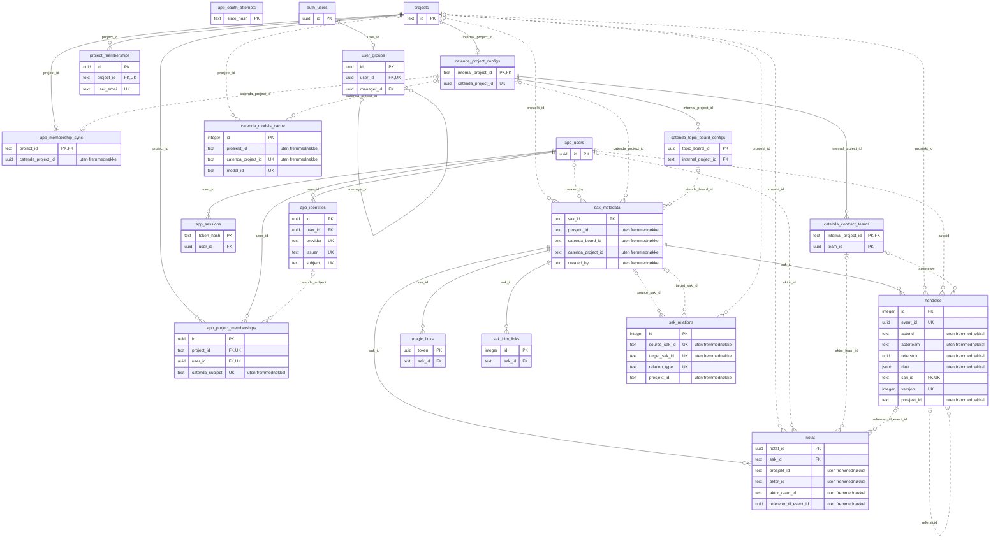
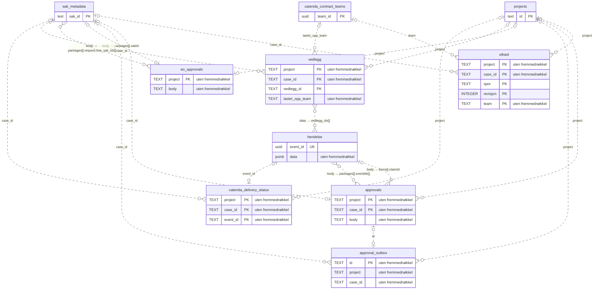
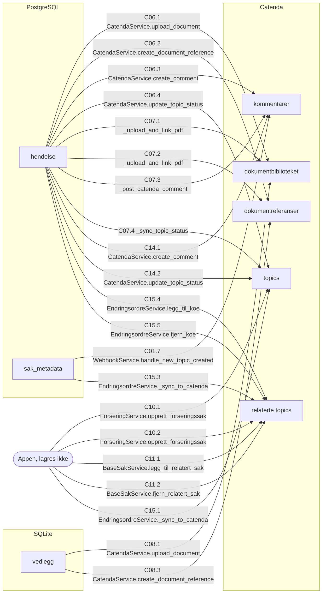
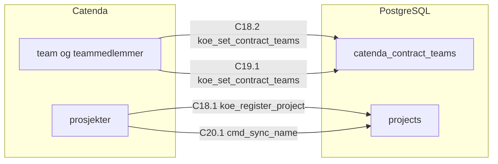

# Relasjoner og dataflyt

> Generert fra docs/datamodell/relasjoner.toml, dataflyt.toml og katalog.json av docs/verktoy/datamodell.py. Rett i registrene, ikke her.

Hvordan tabellene henger sammen, og hvilke av dem som henter fra eller sender til Catenda. Nøklene og fremmednøklene er lest fra databasekatalogen ([`katalog.json`](katalog.json)); koblingene uten fremmednøkkel og dataflyten er lest ut av koden. Tabellene er beskrevet i [tabellregisteret](tabeller.md). Registeret bygges i runder; «ikke kontrollert» betyr det det sier.

## ER-diagram: PostgreSQL

Heltrukken linje er en fremmednøkkel. Stiplet linje er en kobling uten fremmednøkkel, som basen ikke håndhever. `auth_users` er tabellen `auth.users` i Supabase-plattformen.

## ER-diagram: SQLite

De seks tabellene i fila `BH_APPROVAL_DB`, og tabellene i PostgreSQL de viser til. Ingen av koblingene kan håndheves av en base, fordi de går mellom to lagre.

## Relasjonene

| Fra | Til | Art | Antall | Beskrivelse | Funn | Belegg |
| --- | --- | --- | --- | --- | --- | --- |
| `hendelse.sak_id` | `sak_metadata.sak_id` | fremmednøkkel, ON DELETE CASCADE | mange til én | Saken hendelsen hører til. Slettes saken i saksregisteret, sletter basen journalen med (ON DELETE CASCADE); basen verner ikke journalen (MS-02). | MS-02 | K 29.09: katalogen. |
| `notat.sak_id` | `sak_metadata.sak_id` | fremmednøkkel, ON DELETE CASCADE | mange til én | Saken notatet er skrevet i. | — | K 29.09: katalogen. |
| `sak_bim_links.sak_id` | `sak_metadata.sak_id` | fremmednøkkel, ON DELETE CASCADE | mange til én | Saken BIM-objektet er koblet til. | — | K 29.09: katalogen. |
| `magic_links.sak_id` | `sak_metadata.sak_id` | fremmednøkkel, ON DELETE CASCADE | mange til én | Saken lenken gjaldt. Tabellen er en rest (MS-15). | MS-15 | K 29.09: katalogen. |
| `catenda_project_configs.internal_project_id` | `projects.id` | fremmednøkkel, ON DELETE CASCADE | én til én | Prosjektet koblingen til Catenda gjelder. Én konfigurasjon per prosjekt. | MS-12 | K 29.09: katalogen. `internal_project_id` er også primærnøkkel. |
| `catenda_topic_board_configs.internal_project_id` | `catenda_project_configs.internal_project_id` | fremmednøkkel, ON DELETE CASCADE | mange til én | Prosjektet topic boardet hører til. Et prosjekt kan ha flere boards. | — | K 29.09: katalogen. |
| `catenda_contract_teams.internal_project_id` | `catenda_project_configs.internal_project_id` | fremmednøkkel, ON DELETE CASCADE | mange til én | Prosjektet teamet representerer TE eller BH i. | — | K 29.09: katalogen. |
| `app_identities.user_id` | `app_users.id` | fremmednøkkel, ON DELETE CASCADE | mange til én | Brukeren den eksterne identiteten tilhører. | — | K 29.09: katalogen. |
| `app_sessions.user_id` | `app_users.id` | fremmednøkkel, ON DELETE CASCADE | mange til én | Brukeren som er logget inn. | — | K 29.09: katalogen. |
| `app_project_memberships.project_id` | `projects.id` | fremmednøkkel, ON DELETE CASCADE | mange til én | Prosjektet medlemskapet gjelder. | — | K 29.09: katalogen. |
| `app_project_memberships.user_id` | `app_users.id` | fremmednøkkel, ON DELETE CASCADE | mange til én | Brukeren som er medlem. Én rad per prosjekt og bruker (UNIQUE). | — | K 29.09: katalogen. |
| `app_membership_sync.project_id` | `projects.id` | fremmednøkkel, ON DELETE CASCADE | én til én | Prosjektet synkroniseringen gjelder. Én rad per prosjekt. | — | K 29.09: katalogen. `project_id` er også primærnøkkel. |
| `project_memberships.project_id` | `projects.id` | fremmednøkkel, ON DELETE CASCADE | mange til én | Prosjektet i den eldre medlemslisten. Tabellen er en rest (MS-15). | MS-15 | K 29.09: katalogen. |
| `user_groups.manager_id` | `user_groups.id` | fremmednøkkel, ON DELETE SET NULL | mange til én | Lederen i brukergruppen. Tabellen er en rest (MS-15). | MS-15 | K 29.09: katalogen. Ved sletting settes verdien til NULL. |
| `user_groups.user_id` | `auth.users.id` | fremmednøkkel, ON DELETE CASCADE | én til én | Brukeren i Supabase-plattformens egen tabell, ikke `app_users`. Må løses om basen flyttes fra Supabase (B-12). Tabellen er en rest (MS-15). | MS-15 | K 29.09: katalogen. `user_id` er også unik. |
| `hendelse.prosjekt_id` | `projects.id` | uten fremmednøkkel | mange til én | Prosjektet hendelsen er skrevet i. Stemples av serveren fra autorisert kontekst, uten default (AGENTS.md, sikkerhetsinvariantene). | — | K 29.09: NOT NULL uten default i katalogen. L 29.09: lageret. |
| `hendelse.actorid` | `app_users.id` | uten fremmednøkkel | mange til én | Den som sendte hendelsen. Verdien er `app_users.id` og aldri et navn (AGENTS.md). Kolonnen er `text`, `id` er `uuid`. | MG-02 | L 29.09: rutene og webhooken setter `aktor_id` fra `app_users.id`. |
| `hendelse.actorteam` | `catenda_contract_teams.team_id` | uten fremmednøkkel | mange til én | Teamet avsenderen satt i, utledet fra teammedlemskapet i Catenda da hendelsen ble skrevet. Tom når teamet ikke var entydig. Lagres som 32 heksadesimaler uten bindestreker (`catenda_id`), mens `team_id` er `uuid`; en sammenstilling må normalisere. | — | L 29.09: `contract_membership_for_subject` og lageret. |
| `hendelse.referstoid` | `hendelse.event_id` | uten fremmednøkkel | mange til én | Kravet et svar gjelder (`refererer_til_event_id`), i samme sak. Forretningsreglene for svar sammenlikner den med sporets gjeldende krav. | — | L 29.09: `business_rules.py` og `approval_service.py`. |
| `hendelse.data → vedlegg_ids[]` | `vedlegg.vedlegg_id` | uten fremmednøkkel | mange til mange | Vedleggene hendelsen sender. Leveringen til Catenda starter fra disse referansene etter at hendelsen er lagret. Sammenlikningen normaliserer med `catenda_id`. Går på tvers av lagene: journalen i PostgreSQL, registeret i SQLite. | AR-03 | L 29.09: `lever_vedlegg_for_hendelser`. |
| `notat.prosjekt_id` | `projects.id` | uten fremmednøkkel | mange til én | Prosjektet notatet er skrevet i. | — | L 29.09: lageret. |
| `notat.aktor_id` | `app_users.id` | uten fremmednøkkel | mange til én | Forfatteren. | — | L 29.09: hendelsesruta. |
| `notat.aktor_team_id` | `catenda_contract_teams.team_id` | uten fremmednøkkel | mange til én | Teamet som kan lese notatet. Skjermingen går på denne verdien; uten den vises notatet til ingen (AGENTS.md). Samme verdiform som `hendelse.actorteam`. | — | L 29.09: hendelsesruta og `event_visibility.py`. |
| `notat.refererer_til_event_id` | `hendelse.event_id` | uten fremmednøkkel | mange til én | Hendelsen notatet kommenterer, om noen. | — | L 29.09: modellen og lageret. |
| `sak_metadata.prosjekt_id` | `projects.id` | uten fremmednøkkel | mange til én | Prosjektet saken tilhører. Tilgangskontrollen holder hver forespørsel mot denne verdien. | DB-03 | K 29.09: NOT NULL uten default i katalogen. L 29.09: `require_project_access`. |
| `sak_metadata.created_by` | `app_users.id` | uten fremmednøkkel | mange til én | Den som opprettet saken. Bare delvis en kobling: verdien har tre former, og bare én av dem er `app_users.id` (MG-04). | MG-04 | L 29.09: webhooken setter `app_users.id`. De andre formene: H, målskjemagjennomgangen 21.09. |
| `sak_metadata.catenda_project_id` | `catenda_project_configs.catenda_project_id` | uten fremmednøkkel | mange til én | Catenda-prosjektet saken ble opprettet i. Kolonnen er `text`, målet er `uuid`. Levering til Catenda bruker i dag den globale innstillingen, ikke denne verdien (INT-06). | INT-06 | L 29.09: webhooken og `_prepare_catenda_context`. |
| `sak_metadata.catenda_board_id` | `catenda_topic_board_configs.topic_board_id` | uten fremmednøkkel | mange til én | Topic boardet sakens topic ligger på. Kolonnen er `text`, målet er `uuid`. Levering til Catenda leser boardet herfra. | — | L 29.09: webhooken og `_prepare_catenda_context`. |
| `sak_relations.source_sak_id` | `sak_metadata.sak_id` | uten fremmednøkkel | mange til én | Forseringen eller endringsordren som omfatter en annen sak. Fremmednøkkelen mangler (DB-04); hvordan relasjoner skal lagres, er B-01. Opprettes en forsering gjennom `/api/forsering/opprett`, er verdien topicens GUID, og saken har da ingen rad i `sak_metadata`. | DB-04, DA-13, MS-08 | K 29.09: ingen fremmednøkkel i katalogen. L 29.09: forsering- og endringsordretjenesten. |
| `sak_relations.target_sak_id` | `sak_metadata.sak_id` | uten fremmednøkkel | mange til én | KOE-saken som inngår i forseringen eller endringsordren. | DB-04 | K 29.09: ingen fremmednøkkel i katalogen. |
| `sak_relations.prosjekt_id` | `projects.id` | uten fremmednøkkel | mange til én | Prosjektet relasjonen er skrevet i, stemplet fra autorisert kontekst. | — | K 29.09: NOT NULL uten default i katalogen. L 29.09: `krev_autorisert_prosjekt`. |
| `app_project_memberships.catenda_subject` | `app_identities.subject` | uten fremmednøkkel | mange til én | Personen i Catenda. `koe_reconcile_memberships` løser subjektet til `user_id` gjennom `koe_resolve_identity`, så de to kolonnene peker på samme person. Kontraktssiden slås opp med subjektet. | — | L 29.09: funksjonene i migrasjonene og `contract_membership`. |
| `app_membership_sync.catenda_project_id` | `catenda_project_configs.catenda_project_id` | uten fremmednøkkel | én til én | Catenda-prosjektet synkroniseringen hentet fra. `ensure_fresh` godtar bare en synkronisering av prosjektets nåværende Catenda-prosjekt. | — | L 29.09: `AuthService.ensure_fresh`. |
| `catenda_models_cache.prosjekt_id` | `projects.id` | uten fremmednøkkel | mange til én | Prosjektet modellene gjelder. BIM-rutene slår opp på denne. Tabellen fylles ikke (DM-02). | DM-02 | L 29.09: BIM-rutene. |
| `catenda_models_cache.catenda_project_id` | `catenda_project_configs.catenda_project_id` | uten fremmednøkkel | mange til én | Catenda-prosjektet modellene ligger i. Kolonnen er `text`, målet er `uuid`. | DM-02 | L 29.09: BIM-rutene. |
| `utkast.project` | `projects.id` | uten fremmednøkkel | mange til én | Prosjektet utkastet er skrevet i. | AR-03 | L 29.09: `utkast_routes.py`. |
| `utkast.case_id` | `sak_metadata.sak_id` | uten fremmednøkkel | mange til én | Saken utkastet gjelder. | AR-03 | L 29.09: `utkast_routes.py`. |
| `utkast.team` | `catenda_contract_teams.team_id` | uten fremmednøkkel | mange til én | Teamet som eier utkastet. Uten entydig team finnes det ikke noe utkast. Samme verdiform som `hendelse.actorteam`. | — | L 29.09: `utkast_routes._team_eller_avvis`. |
| `approvals.project` | `projects.id` | uten fremmednøkkel | mange til én | Prosjektet godkjenningen hører til. | AR-03 | L 29.09: `ApprovalService`. |
| `approvals.case_id` | `sak_metadata.sak_id` | uten fremmednøkkel | én til én | Saken. Ett dokument per prosjekt og sak. | AR-03 | L 29.09: tabelldefinisjonen. |
| `approvals.body → items[].claimId` | `hendelse.event_id` | uten fremmednøkkel | mange til én | Kravet en forberedt svarpost gjelder. Posten er ugyldig om et nyere krav eller en tilbaketrekking er kommet i sporet. Ved publisering blir verdien `refererer_til_event_id` i svaret. | — | L 29.09: `ApprovalService`. |
| `approvals.body → packages[].eventIds[]` | `hendelse.event_id` | uten fremmednøkkel | mange til mange | Hendelsene en publisert pakke ble til i journalen. | — | L 29.09: `ApprovalService.publish` og levering i `approval_routes.py`. |
| `approval_outbox.id` | `approvals.body → packages[].id` | uten fremmednøkkel | én til én | Pakken varslingsjobben gjelder. Én jobb per pakke. | AR-03 | L 29.09: `ApprovalService.publish` og `deliver`. |
| `approval_outbox.project` | `projects.id` | uten fremmednøkkel | mange til én | Prosjektet. | — | L 29.09: tabelldefinisjonen. |
| `approval_outbox.case_id` | `sak_metadata.sak_id` | uten fremmednøkkel | mange til én | Saken. | — | L 29.09: tabelldefinisjonen. |
| `eo_approvals.project` | `projects.id` | uten fremmednøkkel | én til én | Prosjektet. Ett dokument per prosjekt med alle endringsordrene til godkjenning. | AR-03 | L 29.09: tabelldefinisjonen. |
| `eo_approvals.body → packages[].sakId` | `sak_metadata.sak_id` | uten fremmednøkkel | én til én | Saks-ID-en endringsordren er reservert under. Saken finnes først når ordren er utstedt; fram til da peker verdien på en sak som ikke finnes. | — | L 29.09: `EOApprovalService` og `new_eo_sak_id`. |
| `eo_approvals.body → packages[].request.koe_sak_ids[]` | `sak_metadata.sak_id` | uten fremmednøkkel | mange til mange | KOE-sakene endringsordren skal omfatte. | — | L 29.09: `order_request`. |
| `vedlegg.project` | `projects.id` | uten fremmednøkkel | mange til én | Prosjektet. | AR-03 | L 29.09: `VedleggRegistry`. |
| `vedlegg.case_id` | `sak_metadata.sak_id` | uten fremmednøkkel | mange til én | Saken vedlegget er lastet opp i. Nedlasting krever at vedlegget står på nøyaktig denne saken. | AR-03 | L 29.09: `last_ned_vedlegg`. |
| `vedlegg.lastet_opp_team` | `catenda_contract_teams.team_id` | uten fremmednøkkel | mange til én | Teamet som lastet opp. Et vedlegg som ikke er sendt, er synlig bare for dette teamet. Samme verdiform som `hendelse.actorteam`. | — | L 29.09: `VedleggRegistry.visible`. |
| `catenda_delivery_status.project` | `projects.id` | uten fremmednøkkel | mange til én | Prosjektet. | — | L 29.09: tabelldefinisjonen. |
| `catenda_delivery_status.case_id` | `sak_metadata.sak_id` | uten fremmednøkkel | mange til én | Saken banneret vises på. | — | L 29.09: `get_case_context`. |
| `catenda_delivery_status.event_id` | `hendelse.event_id` | uten fremmednøkkel | én til én | Hendelsen kvitteringen gjelder. Kvitteringen skrives før hendelsen lagres; ved lesing teller bare kvitteringer for hendelser som finnes i journalen. | — | L 29.09: `submit_event`. |

## Nøkkelkolonner uten relasjon

Kolonner som ser ut som en nøkkel eller en personreferanse, men som ikke viser til en tabell i appen. Testen krever en begrunnelse for hver.

| Kolonne | Begrunnelse |
| --- | --- |
| `sak_metadata.catenda_topic_id` | ID-en til topicen i Catenda. Se dataflyten. |
| `catenda_project_configs.library_id` | Dokumentbiblioteket i Catenda. Leses av prosjektresolveren, men leveringen bruker den globale innstillingen (INT-06). |
| `catenda_project_configs.folder_id` | Mappen i Catenda. Samme som `library_id`. |
| `catenda_models_cache.model_id` | ID-en til modellen i Catenda. |
| `sak_bim_links.model_id` | ID-en til modellen i Catenda. Samme ID-rom som `catenda_models_cache.model_id`, men koden slår ikke opp mellom dem. |
| `sak_bim_links.object_id` | ID-en til objektet i modellen i Catenda. |
| `sak_bim_links.object_global_id` | IFC-GUID-en til objektet. |
| `vedlegg.catenda_item_id` | ID-en til dokumentet i Catendas bibliotek etter opplasting. |
| `projects.organisasjon_id` | Virksomheten prosjektet tilhører. Det finnes ingen tabell for virksomheter (MS-10). |
| `projects.created_by` | `admin_cli` når drift registrerer prosjektet, ellers e-posten til den som opprettet det i utviklingsmodus. Ikke en brukeridentitet (DM-08). |
| `sak_bim_links.linked_by` | E-posten til den som koblet, eller `unknown`. Ikke en brukeridentitet (DM-08). |
| `utkast.oppdatert_av` | E-post, navn eller ID, i den rekkefølgen. Ikke en brukeridentitet (DM-08). |
| `vedlegg.lastet_opp_av` | Navn, e-post eller ID, i den rekkefølgen. Ikke en brukeridentitet (DM-08). |
| `project_memberships.external_id` | Rest (MS-15). Ingen leser tabellen (DA-10). |
| `project_memberships.invited_by` | Rest (MS-15). E-post. |

## Dataflyt mot Catenda

Hver pil er nummerert med flyten og steget, og viser siste ledd i kallkjeden: koden som gjør kallet, eller databasefunksjonen som skriver. Hele kjeden og endepunktet står i flytene under. «Appen, lagres ikke» betyr at dataene brukes eller vises uten å bli lagret.

### Inn fra Catenda

```mermaid
flowchart LR
    subgraph g0["Catenda"]
        c_webhook["webhook-varsel"]
        c_token["OAuth-token"]
        c_bruker["innlogget bruker"]
        c_prosjekt["prosjekter"]
        c_medlemmer["prosjektmedlemmer"]
        c_team["team og teammedlemmer"]
        c_board["topic board"]
        c_topic["topics"]
        c_relasjon["relaterte topics"]
        c_dokument["dokumentbiblioteket"]
        c_ifc["BIM-modeller (IFC)"]
        c_svar["svar på kallene"]
    end
    subgraph g1["PostgreSQL"]
        t_app_identities["app_identities"]
        t_app_membership_sync["app_membership_sync"]
        t_app_project_memberships["app_project_memberships"]
        t_app_users["app_users"]
        t_hendelse["hendelse"]
        t_notat["notat"]
        t_sak_metadata["sak_metadata"]
        t_sak_relations["sak_relations"]
    end
    subgraph g2["SQLite"]
        t_approval_outbox["approval_outbox"]
        t_catenda_delivery_status["catenda_delivery_status"]
        t_utkast["utkast"]
        t_vedlegg["vedlegg"]
    end
    subgraph g3["Utenfor databasene"]
        t_Webhook_reservasjon["Webhook-reservasjon"]
    end
    t_appen(["Appen, lagres ikke"])
    c_webhook -->|"C01.1 is_duplicate_event"| t_Webhook_reservasjon
    c_board -->|"C01.2 _make_bimsync_lookup.lookup"| t_appen
    c_topic -->|"C01.3 SakCreationService.create_sak"| t_sak_metadata
    c_topic -->|"C01.3 SakCreationService.create_sak"| t_hendelse
    c_topic -->|"C01.4 koe_resolve_identity"| t_app_users
    c_topic -->|"C01.4 koe_resolve_identity"| t_app_identities
    c_team -->|"C01.5 CatendaOAuth.team_members"| t_hendelse
    c_prosjekt -->|"C01.6 WebhookService.handle_new_topic_created"| t_appen
    c_webhook -->|"C02.1 is_duplicate_event"| t_Webhook_reservasjon
    c_webhook -->|"C02.2 WebhookService.handle_topic_modification"| t_appen
    c_token -->|"C03.1 CatendaOAuth.exchange"| t_appen
    c_bruker -->|"C03.2 koe_resolve_identity"| t_app_users
    c_bruker -->|"C03.2 koe_resolve_identity"| t_app_identities
    c_prosjekt -->|"C03.3 AuthRepository.deactivate_user_projects"| t_app_project_memberships
    c_medlemmer -->|"C04.1 koe_reconcile_memberships"| t_app_project_memberships
    c_medlemmer -->|"C04.1 koe_reconcile_memberships"| t_app_membership_sync
    c_medlemmer -->|"C04.2 koe_resolve_identity"| t_app_users
    c_medlemmer -->|"C04.2 koe_resolve_identity"| t_app_identities
    c_team -->|"C05.1 CatendaOAuth.team_members"| t_hendelse
    c_team -->|"C05.1 CatendaOAuth.team_members"| t_notat
    c_team -->|"C05.1 CatendaOAuth.team_members"| t_utkast
    c_team -->|"C05.1 CatendaOAuth.team_members"| t_vedlegg
    c_svar -->|"C06.5 CatendaDeliveryStatus.record"| t_catenda_delivery_status
    c_svar -->|"C07.5 ApprovalService.deliver"| t_approval_outbox
    c_dokument -->|"C08.2 VedleggRegistry.mark_uploaded"| t_vedlegg
    c_svar -->|"C08.4 VedleggRegistry.mark_delivered"| t_vedlegg
    c_dokument -->|"C09.1 CatendaService.download_document"| t_appen
    c_topic -->|"C10.3 ForseringService.opprett_forseringssak"| t_sak_relations
    c_relasjon -->|"C12.1 BaseSakService.hent_relaterte_saker"| t_appen
    c_topic -->|"C12.2 BaseSakService.hent_relaterte_saker"| t_appen
    c_topic -->|"C13.1 ForseringService.hent_kandidat_koe_saker"| t_appen
    c_topic -->|"C13.2 get_all_sak_ids"| t_appen
    c_topic -->|"C15.2 PostgresSakMetadataRepository.set_catenda_mapping"| t_sak_metadata
    c_ifc -->|"C16.1 list_ifc_products"| t_appen
    c_ifc -->|"C16.2 list_ifc_types"| t_appen
    c_ifc -->|"C16.3 get_related_bim_objects"| t_appen
    c_prosjekt -->|"C17.1 catenda_health_check"| t_appen
    c_medlemmer -->|"C17.2 validate_user"| t_appen
```

### Ut til Catenda

### Drift

Flytene bare driftsskriptene utløser. De er den eneste veien prosjekter og kontraktsteam kommer inn i basen. Medlemssynkroniseringen (C04) står i diagrammet over, fordi også innloggingen og tilgangskontrollen utløser den.

### Tabellene og Catenda

| Tabell | Får data fra Catenda i | Sender data til Catenda i |
| --- | --- | --- |
| `hendelse` | C01, C05 | C06, C07, C14, C15 |
| `notat` | C05 | — |
| `sak_metadata` | C01, C15 | C01, C15 |
| `sak_relations` | C10 | — |
| `projects` | C18, C20 | — |
| `project_memberships` | — | — |
| `app_users` | C01, C03, C04 | — |
| `app_identities` | C01, C03, C04 | — |
| `app_sessions` | — | — |
| `app_oauth_attempts` | — | — |
| `app_project_memberships` | C03, C04 | — |
| `app_membership_sync` | C04 | — |
| `catenda_project_configs` | — | — |
| `catenda_topic_board_configs` | — | — |
| `catenda_contract_teams` | C18, C19 | — |
| `catenda_models_cache` | — | — |
| `sak_bim_links` | — | — |
| `magic_links` | — | — |
| `user_groups` | — | — |
| `utkast` | C05 | — |
| `approvals` | — | — |
| `approval_outbox` | C07 | — |
| `eo_approvals` | — | — |
| `vedlegg` | C05, C08 | C08 |
| `catenda_delivery_status` | C06 | — |

## Flytene

### C01 Ny topic blir en sak

**Retning:** inn og ut. **Utløses av:** Webhook `issue.created` fra Catenda til `POST /webhook/catenda/<hemmelig sti>`. Validatoren avviser `bcf.issue.created` (INT-03).

Varselet rutes til et prosjekt gjennom `catenda_project_configs` og `catenda_topic_board_configs`, og boardet kontrolleres mot Catenda før noe skrives. Kan ikke forfatterens kontraktsside eller identitet avgjøres, opprettes ingen sak. Saken får en kommentar med lenke tilbake på topicen.

| Pil | Fra | Til | Endepunkt | Kode | Data |
| --- | --- | --- | --- | --- | --- |
| C01.1 | Catenda: webhook-varsel | Webhook-reservasjon | Innkommende POST fra Catenda | [`webhook`](../../backend/routes/catenda_webhook_routes.py) → [`is_duplicate_event`](../../backend/lib/security/webhook_security.py) | Varselets ID, så samme varsel ikke behandles to ganger. Reserveres før behandlingen (INT-02). |
| C01.2 | Catenda: topic board | Appen, lagres ikke | GET /opencde/bcf/3.0/projects/{topic_board_id} | [`CatendaProjectResolver.resolve`](../../backend/services/catenda_project_resolver.py) → [`_make_bimsync_lookup.lookup`](../../backend/services/catenda_project_resolver_factory.py) | `bimsync_project_id` for boardet i varselet, kontrollert mot prosjektet i varselet og i registeret. |
| C01.3 | Catenda: topics | sak_metadata, hendelse | GET /opencde/bcf/3.0/projects/{topic_board_id}/topics/{topic_guid} | [`WebhookService.handle_new_topic_created`](../../backend/services/catenda_webhook_service.py) → [`SakCreationService.create_sak`](../../backend/services/sak_creation_service.py) | Tittel og topictype, som blir sakstypen. `sak_metadata` får også topic-, board- og prosjekt-ID; journalen får `sak_opprettet`. Boardet er det fra varselet, ikke den globale innstillingen. |
| C01.4 | Catenda: topics | app_users, app_identities | GET /opencde/bcf/3.0/projects/{topic_board_id}/topics/{topic_guid} | [`WebhookService._aktor_id`](../../backend/services/catenda_webhook_service.py) → [`AuthRepository.identity`](../../backend/repositories/auth_repository.py) → databasefunksjonen `koe_resolve_identity` | Forfatterens Catenda-ID (`bimsync_creation_author.user.ref`), løst til `app_users.id`. Raden opprettes bare om den mangler; normalt finnes den fra medlemssynkroniseringen (C04). |
| C01.5 | Catenda: team og teammedlemmer | hendelse | GET /v2/projects/{catenda_project_id}/teams/{team_id}/members | [`WebhookService._contract_side`](../../backend/services/catenda_webhook_service.py) → [`AuthService.contract_membership_for_subject`](../../backend/services/auth_service.py) → [`CatendaOAuth.team_members`](../../backend/lib/auth/catenda_oauth.py) | Hvilket kontraktsteam forfatteren sitter i, for hvert team i `catenda_contract_teams`. Gir `actorrole`; teamet lagres ikke for denne hendelsen. |
| C01.6 | Catenda: prosjekter | Appen, lagres ikke | GET /v2/projects/{catenda_project_id} | [`WebhookService.handle_new_topic_created`](../../backend/services/catenda_webhook_service.py) | Prosjektnavnet, brukt i kommentaren. |
| C01.7 | sak_metadata | Catenda: kommentarer | POST /opencde/bcf/3.0/projects/{topic_board_id}/topics/{topic_guid}/comments | [`WebhookService.handle_new_topic_created`](../../backend/services/catenda_webhook_service.py) | Saks-ID, sakstype og lenke til saken i appen. Feiler kallet, står saken likevel. |

**Funn:** INT-02, INT-03. **Belegg:** L 29.09: ruta, `WebhookService`, resolveren og `SakCreationService`.

### C02 Endring på en topic

**Retning:** inn. **Utløses av:** Webhook `issue.modified` eller `issue.status.changed` fra Catenda.

Statusendringer og kommentarer i Catenda blir bare logget. Sakens status kommer fra journalen, og Catenda endrer den ikke.

| Pil | Fra | Til | Endepunkt | Kode | Data |
| --- | --- | --- | --- | --- | --- |
| C02.1 | Catenda: webhook-varsel | Webhook-reservasjon | Innkommende POST fra Catenda | [`webhook`](../../backend/routes/catenda_webhook_routes.py) → [`is_duplicate_event`](../../backend/lib/security/webhook_security.py) | Varselets ID. |
| C02.2 | Catenda: webhook-varsel | Appen, lagres ikke | Innkommende POST fra Catenda | [`WebhookService.handle_topic_modification`](../../backend/services/catenda_webhook_service.py) | Topicens ID, slått opp i `sak_metadata`, og hva som er endret. Skrives bare til loggen. |

**Funn:** INT-03. **Belegg:** L 29.09: ruta og `handle_topic_modification`.

### C03 Innlogging

**Retning:** inn. **Utløses av:** `GET /api/auth/catenda/callback` når Catenda sender brukeren tilbake.

Innloggingen bruker brukerens eget token, som bare lever i forespørselen. Sesjonen og det påbegynte innloggingsforsøket (`app_sessions`, `app_oauth_attempts`) lages av appen og inneholder ingen data fra Catenda. Innloggingen utløser også C04 for hvert registrert prosjekt brukeren ser.

| Pil | Fra | Til | Endepunkt | Kode | Data |
| --- | --- | --- | --- | --- | --- |
| C03.1 | Catenda: OAuth-token | Appen, lagres ikke | POST /oauth2/token | [`callback`](../../backend/routes/auth_routes.py) → [`CatendaOAuth.exchange`](../../backend/lib/auth/catenda_oauth.py) | Brukerens tilgangstoken. Lagres ikke. |
| C03.2 | Catenda: innlogget bruker | app_users, app_identities | GET /v2/user | [`AuthService.login`](../../backend/services/auth_service.py) → [`CatendaOAuth.user`](../../backend/lib/auth/catenda_oauth.py) → [`AuthRepository.identity`](../../backend/repositories/auth_repository.py) → databasefunksjonen `koe_resolve_identity` | Catenda-ID, e-post og navn. E-post og navn oppdateres ved hver innlogging. |
| C03.3 | Catenda: prosjekter | app_project_memberships | GET /v2/projects (sidevis) | [`AuthService.login`](../../backend/services/auth_service.py) → [`CatendaOAuth.projects`](../../backend/lib/auth/catenda_oauth.py) → [`AuthRepository.deactivate_user_projects`](../../backend/repositories/auth_repository.py) | Prosjektene brukeren ser i Catenda. Medlemskap i registrerte prosjekter brukeren ikke lenger ser, deaktiveres. |

**Funn:** —. **Belegg:** L 29.09: `auth_routes.callback`, `AuthService.login` og `CatendaOAuth`.

### C04 Medlemslisten synkroniseres

**Retning:** inn. **Utløses av:** Innlogging (C03); tilgangskontrollen, når kopien er eldre enn `AUTH_MEMBERSHIP_MAX_AGE_SECONDS` (standard 900 sekunder); `POST /api/projects/<id>/members/sync`; og driftsskriptene `sync_catenda_memberships.py` og `catenda_admin.py sync-members`.

Utenfor innloggingen brukes integrasjonsklientens token, aldri en brukers. Et medlem som mangler i Catenda, deaktiveres; `viewer_override` beholdes.

| Pil | Fra | Til | Endepunkt | Kode | Data |
| --- | --- | --- | --- | --- | --- |
| C04.1 | Catenda: prosjektmedlemmer | app_project_memberships, app_membership_sync | GET /v2/projects/{catenda_project_id}/members?userType=user (sidevis) | [`AuthService.sync`](../../backend/services/auth_service.py) → [`CatendaOAuth.members`](../../backend/lib/auth/catenda_oauth.py) → [`AuthRepository.reconcile`](../../backend/repositories/auth_repository.py) → databasefunksjonen `koe_reconcile_memberships` | Hvert medlem med Catenda-ID, e-post, navn og rolle. Catenda-prosjektet er prosjektets eget fra `catenda_project_configs`. Funksjonen oppdaterer medlemskapene og skriver tidspunktet. |
| C04.2 | Catenda: prosjektmedlemmer | app_users, app_identities | GET /v2/projects/{catenda_project_id}/members?userType=user (sidevis) | [`AuthService.sync`](../../backend/services/auth_service.py) → [`AuthRepository.reconcile`](../../backend/repositories/auth_repository.py) → databasefunksjonen `koe_reconcile_memberships` → databasefunksjonen `koe_resolve_identity` | Hver person løst til en brukerrad. E-post og navn oppdateres fra medlemslisten. |

**Funn:** —. **Belegg:** L 29.09: `AuthService.sync` og `ensure_fresh`, kallerne, og `koe_reconcile_memberships` i migrasjonene.

### C05 Kontraktsside og team ved skriving

**Retning:** inn. **Utløses av:** Hver rute med `require_contract_role`, og lesing av interne notater, utkast og vedlegg som ikke er sendt.

Kontraktssiden og teamet leses fra Catenda ved hver forespørsel, uten mellomlagring. Hvilke team som er TE og BH, står i `catenda_contract_teams`. Treffer brukeren team på begge sider, får brukeren ingen side, og treffer brukeren flere team på samme side, blir teamet tomt.

| Pil | Fra | Til | Endepunkt | Kode | Data |
| --- | --- | --- | --- | --- | --- |
| C05.1 | Catenda: team og teammedlemmer | hendelse, notat, utkast, vedlegg | GET /v2/projects/{catenda_project_id}/teams/{team_id}/members (sidevis), for hvert kontraktsteam | [`require_contract_role`](../../backend/lib/auth/contract_role.py) → [`reader_contract_team`](../../backend/lib/auth/event_visibility.py) → [`AuthService.contract_membership`](../../backend/services/auth_service.py) → [`AuthService.contract_membership_for_subject`](../../backend/services/auth_service.py) → [`CatendaOAuth.team_members`](../../backend/lib/auth/catenda_oauth.py) | Side og team. Blir `actorrole` og `actorteam` i hendelsen, `aktor_rolle` og `aktor_team_id` i notatet, `team` og `kontraktsside` i utkastet, og `lastet_opp_rolle` og `lastet_opp_team` i vedlegget. |

**Funn:** —. **Belegg:** L 29.09: `contract_role.py`, `event_visibility.py` og `AuthService.contract_membership`.

### C06 Hendelse sendes til Catenda

**Retning:** ut. **Utløses av:** `POST /api/events` for en sak med topic, når Catenda er slått på. `POST /api/events/batch` sender ikke til Catenda (RV-10).

Hendelsen lagres først, og en feil i Catenda gjør ikke innsendingen mislykket. Topic og board leses fra `sak_metadata`; prosjekt, bibliotek og mappe fra de globale innstillingene (INT-06). Vedleggene i hendelsen sendes i C08.

| Pil | Fra | Til | Endepunkt | Kode | Data |
| --- | --- | --- | --- | --- | --- |
| C06.1 | hendelse | Catenda: dokumentbiblioteket | POST /v2/projects/{catenda_project_id}/libraries/{library_id}/items | [`_post_to_catenda`](../../backend/routes/event_routes.py) → [`_upload_and_link_pdf`](../../backend/routes/event_routes.py) → [`CatendaService.upload_document`](../../backend/services/catenda_service.py) | PDF av brevet eller saken. Et frosset brev i hendelsen gjøres til PDF og må komme gjennom; ellers lages PDF-en på serveren. |
| C06.2 | hendelse | Catenda: dokumentreferanser | POST /opencde/bcf/3.0/projects/{topic_board_id}/topics/{topic_guid}/document_references | [`_upload_and_link_pdf`](../../backend/routes/event_routes.py) → [`CatendaService.create_document_reference`](../../backend/services/catenda_service.py) | Dokument-ID-en fra opplastingen, først med og så uten bindestreker. |
| C06.3 | hendelse | Catenda: kommentarer | POST /opencde/bcf/3.0/projects/{topic_board_id}/topics/{topic_guid}/comments | [`_post_catenda_comment`](../../backend/routes/event_routes.py) → [`CatendaService.create_comment`](../../backend/services/catenda_service.py) | Tekst laget av hendelsen og sakens tilstand, med lenke til saken. |
| C06.4 | hendelse | Catenda: topics | PUT /opencde/bcf/3.0/projects/{topic_board_id}/topics/{topic_guid} | [`_sync_topic_status`](../../backend/routes/event_routes.py) → [`CatendaService.update_topic_status`](../../backend/services/catenda_service.py) | Ny topicstatus når sakens overordnede status er endret. |
| C06.5 | Catenda: svar på kallene | catenda_delivery_status | Ingen egne kall; utfallet av pilene over | [`submit_event`](../../backend/routes/event_routes.py) → [`CatendaDeliveryStatus.record`](../../backend/services/catenda_delivery_status.py) | `pending` før hendelsen lagres. Så `delivered` bare når PDF, kommentar og status alle lyktes, ellers `failed`. |

**Funn:** INT-06, RV-10. **Belegg:** L 29.09: `submit_event` og `_post_to_catenda` med hjelpefunksjonene.

### C07 Godkjent BH-svar publiseres

**Retning:** ut. **Utløses av:** `POST /api/cases/<sak_id>/approvals` med `action: publish`, etter intern godkjenning.

Svarene skrives til journalen, og leveringen går gjennom de samme kallene som C06, med det godkjente brevet frosset i pakken. En PDF laget på serveren godtas ikke. Kvitteringen står i `approval_outbox`, ikke i `catenda_delivery_status`. Vedleggene sendes i C08.

| Pil | Fra | Til | Endepunkt | Kode | Data |
| --- | --- | --- | --- | --- | --- |
| C07.1 | hendelse | Catenda: dokumentbiblioteket | POST /v2/projects/{catenda_project_id}/libraries/{library_id}/items | [`approvals.dispatch`](../../backend/routes/approval_routes.py) → [`_post_to_catenda`](../../backend/routes/event_routes.py) → [`_upload_and_link_pdf`](../../backend/routes/event_routes.py) | Det godkjente brevet som PDF. |
| C07.2 | hendelse | Catenda: dokumentreferanser | POST /opencde/bcf/3.0/projects/{topic_board_id}/topics/{topic_guid}/document_references | [`approvals.dispatch`](../../backend/routes/approval_routes.py) → [`_upload_and_link_pdf`](../../backend/routes/event_routes.py) | Dokument-ID-en fra opplastingen. |
| C07.3 | hendelse | Catenda: kommentarer | POST /opencde/bcf/3.0/projects/{topic_board_id}/topics/{topic_guid}/comments | [`approvals.dispatch`](../../backend/routes/approval_routes.py) → [`_post_catenda_comment`](../../backend/routes/event_routes.py) | Kommentar laget av den siste publiserte hendelsen. |
| C07.4 | hendelse | Catenda: topics | PUT /opencde/bcf/3.0/projects/{topic_board_id}/topics/{topic_guid} | [`approvals.dispatch`](../../backend/routes/approval_routes.py) → [`_sync_topic_status`](../../backend/routes/event_routes.py) | Topicstatus når sakens status er endret. |
| C07.5 | Catenda: svar på kallene | approval_outbox | Ingen egne kall; utfallet av pilene over | [`ApprovalService.deliver`](../../backend/services/approval_service.py) | `delivered`, `failed` eller `not_configured`. |

**Funn:** INT-06. **Belegg:** L 29.09: `approvals` med `dispatch`, og `ApprovalService.deliver`.

### C08 Vedlegg sendes til Catenda

**Retning:** inn og ut. **Utløses av:** Etter at en hendelse med `vedlegg_ids` er lagret: `POST /api/events`, `POST /api/events/batch` og publisering av en godkjent pakke. `POST /api/cases/<sak_id>/vedlegg/retry` prøver på nytt.

Vedlegget ligger mellomlagret i `vedlegg` til hendelsen er lagret. En feil gjør ikke innsendingen mislykket; vedlegget blir stående til neste forsøk. Bibliotek og mappe er de globale innstillingene (INT-06).

| Pil | Fra | Til | Endepunkt | Kode | Data |
| --- | --- | --- | --- | --- | --- |
| C08.1 | vedlegg | Catenda: dokumentbiblioteket | POST /v2/projects/{catenda_project_id}/libraries/{library_id}/items | [`lever_vedlegg_for_hendelser`](../../backend/routes/vedlegg_routes.py) → [`CatendaService.upload_document`](../../backend/services/catenda_service.py) | Filinnholdet i `innhold`, med filnavnet, til mappen `folder_id`. |
| C08.2 | Catenda: dokumentbiblioteket | vedlegg | Svar på opplastingen | [`lever_vedlegg_for_hendelser`](../../backend/routes/vedlegg_routes.py) → [`VedleggRegistry.mark_uploaded`](../../backend/services/vedlegg_registry.py) | Dokument-ID-en i Catenda, i `catenda_item_id`. Lagres før koblingen, så et nytt forsøk ikke laster opp dokumentet to ganger. |
| C08.3 | vedlegg | Catenda: dokumentreferanser | POST /opencde/bcf/3.0/projects/{topic_board_id}/topics/{topic_guid}/document_references | [`lever_vedlegg_for_hendelser`](../../backend/routes/vedlegg_routes.py) → [`CatendaService.create_document_reference`](../../backend/services/catenda_service.py) | Dokument-ID-en, koblet til sakens topic. |
| C08.4 | Catenda: svar på kallene | vedlegg | Svar på koblingen | [`lever_vedlegg_for_hendelser`](../../backend/routes/vedlegg_routes.py) → [`VedleggRegistry.mark_delivered`](../../backend/services/vedlegg_registry.py) | Status `delivered`. Det mellomlagrede innholdet slettes. |

**Funn:** INT-06, MS-11, AR-03. **Belegg:** L 29.09: `lever_vedlegg_for_hendelser` og `VedleggRegistry`.

### C09 Vedlegg lastes ned

**Retning:** inn. **Utløses av:** `GET /api/cases/<sak_id>/vedlegg/<vedlegg_id>` for et vedlegg som er levert.

Er vedlegget ikke levert, kommer innholdet fra `vedlegg`. Er det levert, hentes det fra Catenda med `catenda_item_id`.

| Pil | Fra | Til | Endepunkt | Kode | Data |
| --- | --- | --- | --- | --- | --- |
| C09.1 | Catenda: dokumentbiblioteket | Appen, lagres ikke | GET /v2/projects/{catenda_project_id}/libraries/{library_id}/items/{item_id} | [`last_ned_vedlegg`](../../backend/routes/vedlegg_routes.py) → [`CatendaService.download_document`](../../backend/services/catenda_service.py) | Filinnholdet, sendt rett til brukeren. Appen beholder ingen kopi. |

**Funn:** INT-06. **Belegg:** L 29.09: `last_ned_vedlegg`.

### C10 Forsering opprettes

**Retning:** inn og ut. **Utløses av:** `POST /api/forsering/opprett`. Frontenden kaller ikke ruta.

Lager topicen og relasjonene i Catenda og radene i `sak_relations`, men ingen hendelse og ingen rad i `sak_metadata` (gjennomføringsnotatet for 1b, avsnitt 3). Topicen og relasjonene legges på det globale boardet.

| Pil | Fra | Til | Endepunkt | Kode | Data |
| --- | --- | --- | --- | --- | --- |
| C10.1 | Appen, lagres ikke | Catenda: topics | POST /opencde/bcf/3.0/projects/{topic_board_id}/topics | [`ForseringService.opprett_forseringssak`](../../backend/services/forsering_service.py) | Tittel med de avslåtte sakene, begrunnelsen og typen `Forsering`. |
| C10.2 | Appen, lagres ikke | Catenda: relaterte topics | GET og PUT /opencde/bcf/3.0/projects/{topic_board_id}/topics/{topic_guid}/related_topics | [`ForseringService.opprett_forseringssak`](../../backend/services/forsering_service.py) | Toveis relasjoner mellom forseringen og hver avslåtte sak. Sak-ID-ene sendes som topic-GUID-er, og klienten avviser en ID som ikke er en GUID. |
| C10.3 | Catenda: topics | sak_relations | Svar på POST topics | [`ForseringService.opprett_forseringssak`](../../backend/services/forsering_service.py) | Topicens GUID blir forseringens sak-ID i `source_sak_id`. |

**Funn:** —. **Belegg:** L 29.09: `ForseringService.opprett_forseringssak` og ruta.

### C11 KOE legges til eller fjernes fra en forsering

**Retning:** ut. **Utløses av:** `POST /api/forsering/<sak_id>/relatert` og `DELETE /api/forsering/<sak_id>/relatert/<koe_sak_id>`. Frontenden kaller ikke rutene.

Bare relasjonene i Catenda endres. Verken `sak_relations` eller journalen endres, så `GET /api/forsering/by-relatert/<sak_id>`, som leser `sak_relations`, ser ikke endringen. Endringsordren gjør alle tre (C15).

| Pil | Fra | Til | Endepunkt | Kode | Data |
| --- | --- | --- | --- | --- | --- |
| C11.1 | Appen, lagres ikke | Catenda: relaterte topics | GET og PUT /opencde/bcf/3.0/projects/{topic_board_id}/topics/{topic_guid}/related_topics | [`BaseSakService.legg_til_relatert_sak`](../../backend/services/base_sak_service.py) | Toveis relasjon mellom forseringen og KOE-saken, med sak-ID-ene som topic-GUID-er. |
| C11.2 | Appen, lagres ikke | Catenda: relaterte topics | DELETE /opencde/bcf/3.0/projects/{topic_board_id}/topics/{topic_guid}/related_topics/{related_topic_guid} | [`BaseSakService.fjern_relatert_sak`](../../backend/services/base_sak_service.py) | Begge retningene av relasjonen fjernes. |

**Funn:** —. **Belegg:** L 29.09: `BaseSakService.legg_til_relatert_sak` og `fjern_relatert_sak`, som `ForseringService` arver uten å overstyre.

### C12 Relaterte saker hentes fra Catenda

**Retning:** inn. **Utløses av:** `GET /api/forsering/<sak_id>/relaterte` og `/kontekst`, og `GET /api/endringsordre/<sak_id>/relaterte` og `/kontekst`.

Relasjonene leses fra Catenda, ikke fra `sak_relations`. Hver relatert topic slås opp mot journalen, og topics uten sak i det autoriserte prosjektet faller ut (AUT-01, AUT-02).

| Pil | Fra | Til | Endepunkt | Kode | Data |
| --- | --- | --- | --- | --- | --- |
| C12.1 | Catenda: relaterte topics | Appen, lagres ikke | GET /opencde/bcf/3.0/projects/{topic_board_id}/topics/{topic_guid}/related_topics?includeBimsyncProjectTopics=true | [`BaseSakService.hent_relaterte_saker`](../../backend/services/base_sak_service.py) | GUID-ene til de relaterte topicene. |
| C12.2 | Catenda: topics | Appen, lagres ikke | GET /opencde/bcf/3.0/projects/{topic_board_id}/topics/{related_topic_guid} | [`BaseSakService.hent_relaterte_saker`](../../backend/services/base_sak_service.py) | Tittelen på hver relaterte topic. |

**Funn:** AUT-01, AUT-02. **Belegg:** L 29.09: `BaseSakService.hent_relaterte_saker` og rutene.

### C13 Saker fra topiclisten

**Retning:** inn. **Utløses av:** `GET /api/forsering/kandidater` og `GET /api/forsering/by-relatert/<sak_id>`, som søker gjennom alle saker.

Alle topics på det globale boardet hentes og slås opp mot `sak_metadata` med topic-ID. Søket går på tvers av prosjekter og avgrenses før tilstanden leses (AUT-02).

| Pil | Fra | Til | Endepunkt | Kode | Data |
| --- | --- | --- | --- | --- | --- |
| C13.1 | Catenda: topics | Appen, lagres ikke | GET /opencde/bcf/3.0/projects/{topic_board_id}/topics (sidevis) | [`ForseringService.hent_kandidat_koe_saker`](../../backend/services/forsering_service.py) | Topic-GUID-ene, oversatt til sak-ID-er, for å finne KOE-saker med avslått fristkrav. |
| C13.2 | Catenda: topics | Appen, lagres ikke | GET /opencde/bcf/3.0/projects/{topic_board_id}/topics (sidevis) | [`ForseringService.finn_forseringer_for_sak`](../../backend/services/forsering_service.py) → [`get_all_sak_ids`](../../backend/lib/helpers/sak_lookup.py) | Topic-GUID-ene, oversatt til sak-ID-er, for å finne forseringer som omfatter en sak. |

**Funn:** AUT-02. **Belegg:** L 29.09: `hent_kandidat_koe_saker`, `finn_forseringer_for_sak` og `get_all_sak_ids`.

### C14 Forseringshendelse sendes til Catenda

**Retning:** ut. **Utløses av:** `POST /api/forsering/<sak_id>/bh-respons`, `POST /api/forsering/<sak_id>/stopp` og `PUT /api/forsering/<sak_id>/kostnader`.

Kommentar og status, uten PDF og uten kvittering. Topicen leses fra `sak_metadata`.

| Pil | Fra | Til | Endepunkt | Kode | Data |
| --- | --- | --- | --- | --- | --- |
| C14.1 | hendelse | Catenda: kommentarer | POST /opencde/bcf/3.0/projects/{topic_board_id}/topics/{topic_guid}/comments | [`_sync_forsering_to_catenda`](../../backend/routes/forsering_routes.py) → [`CatendaSyncService._post_comment`](../../backend/services/catenda_sync_service.py) → [`CatendaService.create_comment`](../../backend/services/catenda_service.py) | Tekst laget av hendelsen, med lenke til saken. |
| C14.2 | hendelse | Catenda: topics | PUT /opencde/bcf/3.0/projects/{topic_board_id}/topics/{topic_guid} | [`CatendaSyncService._update_status`](../../backend/services/catenda_sync_service.py) → [`CatendaService.update_topic_status`](../../backend/services/catenda_service.py) | Ny topicstatus når sakens status er endret. |

**Funn:** —. **Belegg:** L 29.09: `_sync_forsering_to_catenda` og `CatendaSyncService`.

### C15 Endringsordre opprettes eller endres

**Retning:** inn og ut. **Utløses av:** `POST /api/endringsordre/opprett`, utstedelse etter godkjenning, og `POST /api/endringsordre/<sak_id>/koe` og `DELETE …/koe/<koe_sak_id>`.

Saken, hendelsene og `sak_relations` skrives først; Catenda er valgfritt. Topicen opprettes bare når prosjektet er `oslobygg`, registeret er `legacy` og alle KOE-sakene ligger på det globale boardet; ellers blir resultatet `not_configured` (auditen av godkjenningspanelet 16.09).

| Pil | Fra | Til | Endepunkt | Kode | Data |
| --- | --- | --- | --- | --- | --- |
| C15.1 | Appen, lagres ikke | Catenda: topics | POST /opencde/bcf/3.0/projects/{topic_board_id}/topics | [`EndringsordreService._sync_to_catenda`](../../backend/services/endringsordre_service.py) | Tittel `Endringsordre <nummer>`, beskrivelsen og typen `Endringsordre`. |
| C15.2 | Catenda: topics | sak_metadata | Svar på POST topics | [`EndringsordreService._sync_to_catenda`](../../backend/services/endringsordre_service.py) → [`PostgresSakMetadataRepository.set_catenda_mapping`](../../backend/repositories/postgres/sak_metadata.py) | Topicens GUID, boardet og Catenda-prosjektet, lagret straks, også om en relasjon senere feiler. |
| C15.3 | sak_metadata | Catenda: relaterte topics | GET og PUT /opencde/bcf/3.0/projects/{topic_board_id}/topics/{topic_guid}/related_topics | [`EndringsordreService._sync_to_catenda`](../../backend/services/endringsordre_service.py) | Toveis relasjoner mellom den nye endringsordren og KOE-sakene, med KOE-sakenes topic-ID fra `sak_metadata`. |
| C15.4 | hendelse | Catenda: relaterte topics | GET og PUT /opencde/bcf/3.0/projects/{topic_board_id}/topics/{topic_guid}/related_topics | [`EndringsordreService.legg_til_koe`](../../backend/services/endringsordre_service.py) | Toveis relasjon, etter at `eo_koe_lagt_til` og raden i `sak_relations` er skrevet. Sak-ID-ene sendes som topic-GUID-er. |
| C15.5 | hendelse | Catenda: relaterte topics | DELETE /opencde/bcf/3.0/projects/{topic_board_id}/topics/{topic_guid}/related_topics/{related_topic_guid} | [`EndringsordreService.fjern_koe`](../../backend/services/endringsordre_service.py) | Begge retningene fjernes, etter `eo_koe_fjernet` og slettingen i `sak_relations`. |

**Funn:** —. **Belegg:** L 29.09: `EndringsordreService._sync_to_catenda`, `legg_til_koe` og `fjern_koe`.

### C16 BIM-objekter vises

**Retning:** inn. **Utløses av:** `GET /api/bim/ifc-products`, `GET /api/bim/ifc-types` og `GET /api/saker/<sak_id>/bim-links/<link_id>/related`.

De to listene finner Catenda-prosjektet i `catenda_models_cache`, som ingen skriver (DM-02), og gir derfor tomme lister. Relasjonene til et koblet objekt bruker `sak_metadata.catenda_project_id` og `sak_bim_links.object_id`.

| Pil | Fra | Til | Endepunkt | Kode | Data |
| --- | --- | --- | --- | --- | --- |
| C16.1 | Catenda: BIM-modeller (IFC) | Appen, lagres ikke | GET /v2/projects/{catenda_project_id}/ifc/products, POST samme sti ved søk, og GET …/ifc/products/ifctypes | [`list_ifc_products`](../../backend/routes/bim_link_routes.py) | Objektene i modellene, med antall per IFC-type. |
| C16.2 | Catenda: BIM-modeller (IFC) | Appen, lagres ikke | GET /v2/projects/{catenda_project_id}/ifc/products/ifctypes | [`list_ifc_types`](../../backend/routes/bim_link_routes.py) | Antall objekter per IFC-type. |
| C16.3 | Catenda: BIM-modeller (IFC) | Appen, lagres ikke | GET /v2/projects/{catenda_project_id}/ifc/products/{object_id}/relations | [`get_related_bim_objects`](../../backend/routes/bim_link_routes.py) | Objektene et koblet objekt er relatert til, gruppert. |

**Funn:** DM-02, DA-15. **Belegg:** L 29.09: BIM-rutene.

### C17 Kontroll av tilkoblingen og en bruker

**Retning:** inn. **Utløses av:** `GET /api/health/catenda` og `POST /api/validate-user`.

Leser fra Catenda og svarer; ingenting lagres.

| Pil | Fra | Til | Endepunkt | Kode | Data |
| --- | --- | --- | --- | --- | --- |
| C17.1 | Catenda: prosjekter | Appen, lagres ikke | GET /v2/projects | [`catenda_health_check`](../../backend/routes/utility_routes.py) | Om integrasjonsklienten får en prosjektliste. |
| C17.2 | Catenda: prosjektmedlemmer | Appen, lagres ikke | GET /v2/projects/{catenda_project_id}/members | [`validate_user`](../../backend/routes/utility_routes.py) | Om en e-post er medlem i det globale Catenda-prosjektet. |

**Funn:** —. **Belegg:** L 29.09: `utility_routes.py`.

### C18 Prosjekt registreres av drift

**Retning:** inn. **Utløses av:** `scripts/catenda_admin.py register`.

Drift oppgir Catenda-prosjekt, bibliotek, mappe, board og kontraktsteam. Navnet hentes fra Catenda om det ikke er oppgitt, og teamene kontrolleres mot Catenda. Én databasefunksjon skriver alt atomisk; triggeren på `projects` legger i tillegg inn en rad i `project_memberships`.

| Pil | Fra | Til | Endepunkt | Kode | Data |
| --- | --- | --- | --- | --- | --- |
| C18.1 | Catenda: prosjekter | projects | GET /v2/projects/{catenda_project_id} | [`cmd_register`](../../backend/scripts/catenda_admin.py) → [`fetch_catenda_project_name`](../../backend/scripts/catenda_admin.py) → [`AuthRepository.register_project`](../../backend/repositories/auth_repository.py) → databasefunksjonen `koe_register_project` | Prosjektnavnet, når drift ikke har oppgitt det. |
| C18.2 | Catenda: team og teammedlemmer | catenda_contract_teams | GET /v2/projects/{catenda_project_id}/teams | [`cmd_register`](../../backend/scripts/catenda_admin.py) → [`AuthRepository.register_project`](../../backend/repositories/auth_repository.py) → databasefunksjonen `koe_register_project` → databasefunksjonen `koe_set_contract_teams` | Kontroll av at teamene drift oppgir, finnes i Catenda-prosjektet. ID-ene kommer fra drift. |

**Funn:** MS-12. **Belegg:** L 29.09: `cmd_register`, `koe_register_project` i migrasjonene, og at den kaller `koe_set_contract_teams`. K 29.09: triggeren i katalogen.

### C19 Kontraktsteam endres av drift

**Retning:** inn. **Utløses av:** `scripts/catenda_admin.py contract-teams` med `--bh` og `--te`.

Samme kontroll som i C18, og funksjonen erstatter prosjektets team i én transaksjon.

| Pil | Fra | Til | Endepunkt | Kode | Data |
| --- | --- | --- | --- | --- | --- |
| C19.1 | Catenda: team og teammedlemmer | catenda_contract_teams | GET /v2/projects/{catenda_project_id}/teams | [`cmd_contract_teams`](../../backend/scripts/catenda_admin.py) → [`AuthRepository.set_contract_teams`](../../backend/repositories/auth_repository.py) → databasefunksjonen `koe_set_contract_teams` | Kontroll av at teamene drift oppgir, finnes i Catenda-prosjektet. |

**Funn:** —. **Belegg:** L 29.09: `cmd_contract_teams` og `koe_set_contract_teams`.

### C20 Prosjektnavn hentes på nytt av drift

**Retning:** inn. **Utløses av:** `scripts/catenda_admin.py sync-name`.

Oppdaterer `projects.name` direkte, utenom `koe_register_project`. Skriptet bruker Supabase-klienten.

| Pil | Fra | Til | Endepunkt | Kode | Data |
| --- | --- | --- | --- | --- | --- |
| C20.1 | Catenda: prosjekter | projects | GET /v2/projects/{catenda_project_id} | [`fetch_catenda_project_name`](../../backend/scripts/catenda_admin.py) → [`cmd_sync_name`](../../backend/scripts/catenda_admin.py) | Prosjektnavnet i Catenda, for hvert registrert prosjekt. |

**Funn:** —. **Belegg:** L 29.09: `cmd_sync_name`.

## Kall til Catenda utenfor dataflyten

Steder i backend som kaller Catenda-klienten, men ikke er en del av appens dataflyt. Autentiseringskallene (`authenticate`, `ensure_authenticated`) henter bare et token og er ikke tatt med.

| Fil | Funksjon | Begrunnelse |
| --- | --- | --- |
| [`services/catenda_webhook_service.py`](../../backend/services/catenda_webhook_service.py) | `WebhookService.handle_pdf_upload` | Ingen kaller, heller ikke i testene (L 29.09). |
| [`services/base_sak_service.py`](../../backend/services/base_sak_service.py) | `BaseSakService._create_topic_with_relations` | Ingen kaller, heller ikke i testene (L 29.09). Forsering og endringsordre oppretter topicen selv. |
| [`scripts/catenda_admin.py`](../../backend/scripts/catenda_admin.py) | `cmd_teams` | Viser teamene i et Catenda-prosjekt for drift. Skriver ingenting. |
| [`scripts/setup_webhooks.py`](../../backend/scripts/setup_webhooks.py) | hele fila | Driftsverktøy som oppretter, lister og sletter webhook-abonnementet i Catenda som C01 og C02 forutsetter. Skriver ingen tabell. |
| [`scripts/setup_authentication.py`](../../backend/scripts/setup_authentication.py) | hele fila | Utviklerverktøy for å hente et token og velge bibliotek. Skriver ingen tabell. |
| [`scripts/catenda_menu.py`](../../backend/scripts/catenda_menu.py) | hele fila | Interaktiv meny for utviklere mot Catenda. Skriver ingen tabell. |
| [`scripts/explore_bim_objects.py`](../../backend/scripts/explore_bim_objects.py) | hele fila | Utviklerverktøy for BIM-API-et. Skriver ingen tabell. |
| [`scripts/test_relations.py`](../../backend/scripts/test_relations.py) | hele fila | Utviklerverktøy for IFC-relasjoner. Skriver ingen tabell. |
| [`scripts/measure_catenda_membership.py`](../../backend/scripts/measure_catenda_membership.py) | hele fila | Måler svartiden for teamoppslag. Skriver ingen tabell. |
| [`scripts/test_catenda_api_contracts_live.py`](../../backend/scripts/test_catenda_api_contracts_live.py) | hele fila | Levende kontrakttester mot et Catenda-testprosjekt (hovedplanen, avsnitt 7). |
| [`scripts/test_full_flow.py`](../../backend/scripts/test_full_flow.py) | hele fila | Manuell ende-til-ende-test mot Catenda (Catenda-dataflyten, avsnitt 7). |
| [`integrations/catenda/_demo.py`](../../backend/integrations/catenda/_demo.py) | hele fila | Demonstrasjon av klienten. Importeres ikke av appen. |
